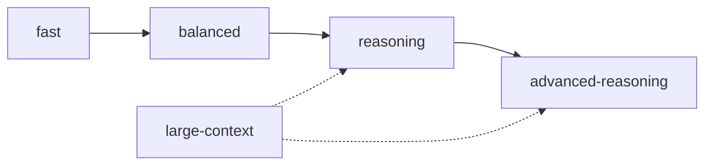

# Mapeamento Central de Capacidades de Modelos

Este documento estabelece o sistema de abstração por **níveis de capacidade de modelo** utilizado por todos os agentes do repositório **EsilvaSoft.SlopStudio**.

Os agentes **não dependem diretamente de nomes específicos de modelos**. Eles solicitam uma capacidade desejada (`Preferred Model Capability`) e uma alternativa (`Alternative Model Capability`). O mapeamento para modelos concretos é resolvido centralmente por esta configuração e pelo `goal-orchestrator`.

---

## 1. Níveis de Capacidade



### 1.1 `fast`
- **Perfil**: Baixa latência, menor custo operacional, alta velocidade de resposta, execução direta de instruções claras e determinísticas.
- **Exemplos de Modelos**:
  - `GPT Luna`
  - `Claude Sonnet` (em modo de menor custo / latência)
- **Casos de Uso Apropriados**:
  - Organização mecânica de arquivos (1 tipo por arquivo).
  - Renomeações de símbolos e ajustes de `using` / namespaces.
  - Geração de boilerplate repetitivo e DTOs simples.
  - Formatação e ajustes cosméticos de código.
  - Documentação básica e atualização de tabelas de índice.
  - Pequenas correções pontuais com escopo isolado.
- **Contra-indicações**:
  - Não utilizar para investigações de concorrência, decisões arquiteturais, alterações em regras de negócio ou refatorações com impacto entre projetos.

### 1.2 `balanced`
- **Perfil**: Equilíbrio sólido entre capacidade analítica, velocidade e custo. Compreensão precisa de contexto intermediário e fidelidade estrita a regras e contratos.
- **Exemplos de Modelos**:
  - `Claude Sonnet`
  - `GPT Luna` (com maior capacidade de raciocínio, quando disponível)
- **Casos de Uso Apropriados**:
  - Implementação de funcionalidades e casos de uso (`Application`).
  - Criação e manutenção de testes de unidade e integração NUnit.
  - Refatorações moderadas dentro de um único componente ou projeto.
  - Criação de ViewModels e Views Avalonia com bindings compilados.
  - Escrita de adaptadores de infraestrutura (MongoDB, LiteDB, Jint).
  - Manutenção de documentação técnica detalhada e catálogo funcional.

### 1.3 `reasoning`
- **Perfil**: Raciocínio lógico aprofundado, decomposição de problemas não-triviais, análise causal e ponderação entre alternativas técnicas.
- **Exemplos de Modelos**:
  - `GPT Sun`
  - `Claude Sonnet`
- **Casos de Uso Apropriados**:
  - Definição de arquitetura de componentes e design de contratos.
  - Investigação e resolução de bugs complexos e intermitentes.
  - Análise de concorrência, deadlocks, cancelamento com `CancellationTokenSource` e ciclo de vida assíncrono.
  - Decisões entre alternativas técnicas e criação de ADRs.
  - Refatorações estruturais com impacto em múltiplos módulos.
  - Planejamento detalhado de implementação de metas.

### 1.4 `advanced-reasoning`
- **Perfil**: Máxima profundidade analítica, visão sistêmica abrangente, rigor extremo na detecção de falhas conceituais e auditoria de riscos críticos.
- **Exemplos de Modelos**:
  - `Claude Opus`
  - `GPT Astro`
- **Casos de Uso Apropriados**:
  - Arquitetura de sistemas complexos e fronteiras de subsistemas críticos.
  - Auditoria de segurança, integridade BSON e proteção contra vazamento de credenciais.
  - Revisão final de grandes metas antes de merge ou release.
  - Diagnóstico de falhas sistêmicas em múltiplos componentes interdependentes.
  - Decisões estruturais envolvendo persistência (LiteDB), drivers de banco e runtime de scripts.
  - Arbitragem de conflitos contratuais entre agentes especializados.

### 1.5 `large-context`
- **Perfil**: Capacidade de absorver, processar e correlacionar volumes maciços de informação (dezenas ou centenas de arquivos de documentação, código e especificações).
- **Exemplos de Modelos**:
  - `GPT Astro`
  - `Claude Opus`
- **Casos de Uso Apropriados**:
  - Análise integral da solução para diagnóstico global.
  - Auditoria de conformidade entre código-fonte e toda a pasta `docs/`.
  - Correlação cruzada de catálogo funcional, ADRs e inventário de implementação.
  - Leitura extensiva de rastros de execução, logs e históricos de alteração.
  - Consolidação e síntese de conhecimento disperso na base de código.

---

## 2. Matriz de Mapeamento de Modelos

| Nível de Capacidade | Modelos Principais Sugeridos | Modelos Alternativos / Contingência |
| :--- | :--- | :--- |
| `fast` | GPT Luna | Claude Sonnet (menor custo) |
| `balanced` | Claude Sonnet | GPT Luna (maior raciocínio) |
| `reasoning` | GPT Sun | Claude Sonnet |
| `advanced-reasoning` | Claude Opus | GPT Astro |
| `large-context` | GPT Astro | Claude Opus |

> [!NOTE]
> Esta matriz é um ponto central vivo de configuração. Ela pode ser ajustada conforme novos modelos sejam disponibilizados no mercado, os custos variem, provedores sofram indisponibilidade temporária ou determinados modelos apresentem melhor desempenho para linguagens específicas (como C# .NET 10).

---

## 3. Estratégia de Seleção pelo Orquestrador

O `goal-orchestrator` aplica o **Princípio da Menor Capacidade Suficiente**:
> *Sempre selecione o menor nível de capacidade capaz de executar a tarefa corretamente com qualidade e segurança.*

Ao avaliar uma tarefa decomposta, o orquestrador pondera:
1. **Complexidade Algorítmica/Estrutural**: Tarefas com lógica simples começam em `fast`; lógica com ramificações em `balanced`; algoritmos complexos ou invariantes em `reasoning`.
2. **Impacto e Risco de Regressão**: Se a tarefa mexe em persistência direta, concorrência assíncrona ou credenciais, a capacidade mínima de execução/revisão é `reasoning`.
3. **Volume de Contexto**: Se a tarefa exige compreender múltiplos projetos (`Core` + `Infrastructure` + `Desktop` + documentação), pode demandar `large-context` na etapa analítica.
4. **Velocidade e Custo**: Evitar alocar `advanced-reasoning` para tarefas de digitação mecânica, movimentação de arquivos ou geração de testes repetitivos.

### Exemplos Práticos de Seleção:
- **Extrair classes de um arquivo monolítico em 1 arquivo por tipo**: `fast` (GPT Luna).
- **Implementar suporte a novo operador de agregação no pipeline**: `balanced` (Claude Sonnet).
- **Projetar isolamento assíncrono de execução de abas com CTS e snapshots**: `reasoning` (GPT Sun).
- **Revisão final de integridade de segurança, LiteDB e BSON serialization antes de tag release**: `advanced-reasoning` (Claude Opus).
- **Auditar toda a pasta `docs/` contra o código C# implementado**: `large-context` (GPT Astro).

---

## 4. Protocolo de Escalonamento de Modelo

Caso um agente não consiga concluir com sucesso uma tarefa utilizando a capacidade inicialmente designada, o orquestrador aciona o **escalonamento progressivo**.

```text
fast ───────► balanced ───────► reasoning ───────► advanced-reasoning
      falha             falha               falha
```

### Gatilhos de Escalonamento:
1. **Falha de Implementação**: O agente introduziu erros de compilação ou warnings que não conseguiu sanar após 1 tentativa de feedback.
2. **Inconsistência Conceitual**: O resultado viola contratos públicos, introduz acoplamento proibido ou altera comportamento observável sem permissão.
3. **Incapacidade de Contextualização**: O agente demonstra não compreender o fluxo assíncrono ou as dependências entre camadas.
4. **Falha de Testes**: Testes de regressão falham e a correção proposta pelo agente quebra outras partes do sistema.
5. **Risco Crítico Revelado**: Durante a execução descobre-se que a tarefa envolve um componente crítico sensível (ex: migração LiteDB ou concorrência assíncrona).

### Regras de Escalonamento:
- O escalonamento **nunca é automático para todas as tarefas**; ele é acionado caso a caso com justificativa registrada no progresso da meta (`Tasks Requiring Escalation`).
- Antes de escalonar, o orquestrador analisa se a instrução enviada ao agente estava clara e suficiente; se o problema for falta de contexto ou restrição mal comunicada, o orquestrador corrige a instrução antes de elevar a capacidade.
- Uma vez concluída a tarefa escalonada, as tarefas subsequentes voltam a ser avaliadas a partir do seu nível de capacidade natural (não há propagação artificial de capacidade alta para tarefas mecânicas seguintes).
