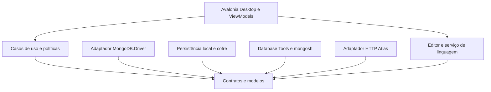
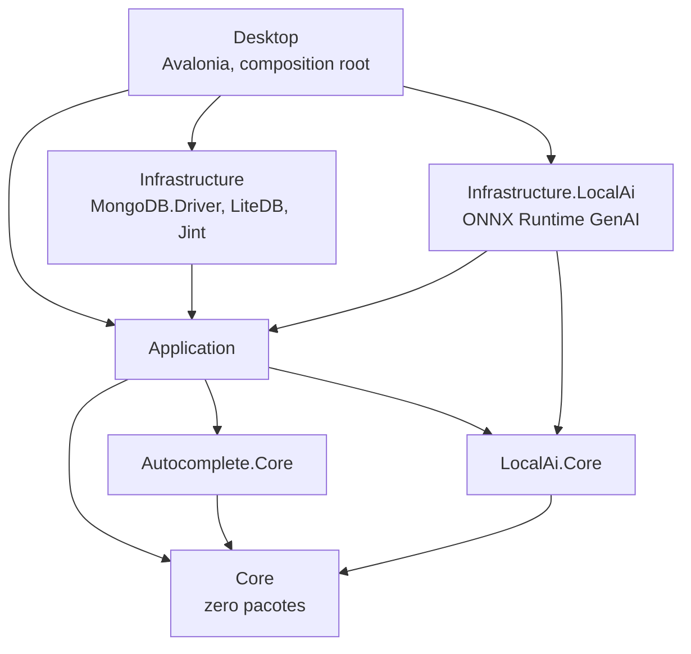

# Arquitetura proposta

## Organização

Aplicação desktop modular, MVVM, operações assíncronas e injeção de dependências. Não há necessidade inicial de servidor web, microserviços ou broker. `BsonDocument` será o modelo de documentos MongoDB; a biblioteca `MongoDB.Bson` pode fazer parte dos contratos especializados sem carregar o cliente de rede no domínio.



As setas representam dependências de código. O composition root no desktop registra as implementações e as injeta nos casos de uso; somente os adaptadores fazem I/O externo.

## Solução atual e extensão prevista

```text
EsilvaSoft.SlopStudio.slnx
global.json
Directory.Build.props
Directory.Packages.props
src/
  EsilvaSoft.SlopStudio.Core/                 # domínio Mongo, workspace, update, UUID, Extended JSON
  EsilvaSoft.SlopStudio.Autocomplete.Core/    # núcleo determinístico de completion e highlighting
  EsilvaSoft.SlopStudio.LocalAi.Core/         # contratos e políticas puras de IA local
  EsilvaSoft.SlopStudio.Application/          # casos de uso e orquestração
  EsilvaSoft.SlopStudio.Infrastructure/       # LiteDB, MongoDB.Driver, console Jint, mongosh, update
  EsilvaSoft.SlopStudio.Infrastructure.LocalAi/ # ONNX Runtime GenAI, adaptadores e fonte remota de modelos
  EsilvaSoft.SlopStudio.Atlas/                # planejado no backlog sem versão
  EsilvaSoft.SlopStudio.Desktop/              # Avalonia MVVM e composition root
tests/
  EsilvaSoft.SlopStudio.UnitTests/
  EsilvaSoft.SlopStudio.Benchmarks/
  EsilvaSoft.SlopStudio.IntegrationTests/     # planejado
  EsilvaSoft.SlopStudio.UiTests/              # planejado
  EsilvaSoft.SlopStudio.ArchitectureTests/    # planejado
  Fixtures/
tools/
  BrandAssets/
docs/
eng/                                          # scripts de build/test/package
```

A solução implementada tem nove projetos: `Core`, `Autocomplete.Core`, `LocalAi.Core`, `Application`, `Infrastructure`, `Infrastructure.LocalAi`, `Desktop`, `UnitTests` e `Benchmarks` (`tools/BrandAssets` fica fora da slnx). Todos têm alvo `net10.0`; APIs específicas ficam em adaptadores de plataforma. A decomposição adicional de `Infrastructure` em adaptadores de plataforma, editor e Atlas ocorrerá quando cada contrato tiver implementação e teste próprios.

### Grafo de projetos



As setas apontam para a dependência. O grafo não tem ciclo: `Core` não referencia nenhuma camada superior, `Application` não referencia `Infrastructure` nem `Desktop`, e as duas `Infrastructure` não se referenciam.

| Projeto | Responsabilidade | Não pode conter |
| --- | --- | --- |
| `Core` | Modelos e contratos de domínio: MongoDB, workspace/preferências, atualização, UUID, Extended JSON | Qualquer pacote NuGet e qualquer I/O |
| `Autocomplete.Core` | Completion determinístico: lexer/parser tolerante a erros, contexto, ranking, snippets, contratos de cache de schema, syntax highlighting, política de privacidade do contexto | MongoDB.Driver, LiteDB, Avalonia, ONNX Runtime, acesso a arquivo ou rede |
| `LocalAi.Core` | Contratos e políticas puras de IA local: serviço de modelo, catálogo, runtime, tokenizer, construtor de prompt, estados, riscos e exceções | Regras de MongoDB, persistência, UI e qualquer runtime de inferência |
| `Application` | Casos de uso, validações, serviços de linguagem e orquestração de IA (implementações concretas), barra de operações, caminhos do workspace | Referência a `Infrastructure`, `Infrastructure.LocalAi` ou `Desktop` |
| `Infrastructure` | Adaptadores MongoDB.Driver, proprietário único LiteDB, console Jint, runner mongosh, atualização por GitHub Releases | ONNX Runtime e qualquer tipo de Avalonia |
| `Infrastructure.LocalAi` | Adaptadores ONNX Runtime GenAI, adaptadores por arquitetura de modelo, catálogo/metadados locais, download Hugging Face, seleção de provider | MongoDB.Driver, LiteDB e qualquer tipo de Avalonia |
| `Desktop` | Apresentação Avalonia MVVM e composition root (`AddSlopStudioInfrastructure` + `AddSlopStudioLocalAiInfrastructure`) | Uso direto de driver concreto de banco |

O isolamento é verificado pelo compilador, não por convenção: o autocomplete determinístico não tem como alcançar metadados reais, persistência ou inferência, e o runtime de IA não tem como alcançar `MongoDB.Driver`. Consulte [ADR-040](10-decisoes-arquiteturais.md) para a decisão completa e os desvios aceitos.

## Responsabilidades e contratos

| Contrato proposto | Responsabilidade |
| --- | --- |
| IConnectionProfileStore / ISecretStore | Configuração persistente e segredo por referência |
| IMongoClientRegistry | Ciclo de vida de clientes por configuração efetiva |
| ICapabilityService | Decisão e explicação de suporte |
| IQueryService / IDocumentService | Consultas, CRUD, conflitos e resultados parciais |
| ICollectionService / IIndexService | Metadados, DDL e índices |
| IAggregationService / IExplainService | Pipelines e diagnósticos |
| ILanguageService / ISchemaSampler | Parser, completion, inferência e cache |
| IJobCoordinator | Concorrência, progresso, cancelamento e estado |
| ITransferService / IExternalToolRunner | Streaming e processos controlados |
| IScriptExecutionService / IScriptResultReader | Execução JavaScript + JSON via mongosh, contexto, eventos e resultados BSON |
| IAdministrationService / IAtlasAdminClient | Comandos e APIs administrativas distintas |
| IAuditSink / IRedactor | Eventos locais e remoção de segredos |

Não construir um `IRepository<T>` genérico de CRUD para todas as operações. Contratos refletem consultas, índices, sessões, pipelines e administração. `OperationContext` fixa perfil, revisão do perfil, namespace, correlation ID, deadline e política de acesso. Objetos de resultado transportam tipo BSON, contagens, diagnósticos e status de certeza.

## Dependências propostas

| Finalidade | Candidato | Decisão de fundação (ver inventário atual) |
| --- | --- | --- |
| UI | Avalonia, Avalonia.Desktop, Fluent theme | Avalonia 12.1.2 fixada; grid dedicado será avaliado quando a visualização virtualizada entrar no plano |
| MVVM | CommunityToolkit.Mvvm | Source generators e bindings compilados |
| MongoDB | MongoDB.Driver / MongoDB.Bson | MongoDB.Driver 3.11.1 fixado; linha 3.x atual revisada |
| Editor | AvaloniaEdit; TextMate opcional | Provar combinação com Avalonia e validar licenças de gramáticas |
| Infraestrutura | Microsoft.Extensions.DependencyInjection/Logging/Options | Sem host de servidor obrigatório |
| Persistência | LiteDB | LiteDB 5.0.21 fixado para perfis locais e migrações futuras |
| Runtime de scripts | mongosh externo em Windows/Linux | Runner existente; consolidar JS + JSON, autenticação e transporte de resultados na v0.8.0 |
| Testes | NUnit, NUnit3TestAdapter, Microsoft.NET.Test.Sdk, NUnit.Analyzers | Fixar e comprovar discovery em .NET 10 |
| UI tests | Avalonia.Headless.NUnit | Manter versão alinhada com UI |
| Integração | Docker/Testcontainers ou fixture equivalente | Replica set real configurado, não apenas container standalone |

AvaloniaEdit já oferece infraestrutura de edição e completion; a semântica de MongoDB será implementada pelo projeto. Não presumir que uma gramática TextMate forneça inferência de schema. [AvaloniaEdit](https://github.com/AvaloniaUI/AvaloniaEdit).

## Conexões, concorrência e memória

Reutilizar clientes MongoDB por identidade de perfil e configuração, não criar cliente por clique. Mudanças de TLS, credenciais ou topologia configurada geram nova revisão; operações existentes mantêm seu contexto ou são encerradas explicitamente. A política de liberação usará as APIs da versão efetivamente escolhida. [MongoClient](https://www.mongodb.com/docs/drivers/csharp/current/connect/mongoclient/).

Consultas usam cursor em lotes e um adaptador de streaming; UI recebe páginas no dispatcher. Proposta inicial: 100 documentos por página, máximo de 1.000 carregados por aba antes de ação explícita, lote sujeito ao tamanho em bytes. Filas limitadas impedem que uma exportação ou change stream esgote memória. UI não pode chamar `.Result` ou `.Wait()` em I/O.

Política inicial: quatro tarefas interativas e uma transferência por conexão, configurável. Transações usam uma sessão exclusiva com operações sequenciais. Jobs de manutenção possuem exclusões adicionais por namespace/topologia. Esses valores são metas iniciais de produto, não limites MongoDB.

## Persistência local

LiteDB guardará as coleções `ConnectionProfiles`, `Folders`, `SavedQueries`, `WorkspaceTabs`, `JobDefinitions`, `JobRuns`, `AuditEvents` e `SchemaCache`, além de um registro de versão/migrações do armazenamento. A implementação atual já usa `ConnectionProfiles`, `queryHistory`, `scriptHistory`, `savedQueries` e `auditEvents`; esta última registra somente metadados de alterações administrativas, sem URI ou conteúdo BSON. `savedQueries` guarda o texto da consulta, o perfil/contexto associado e o favorito; não há um conjunto paralelo de campos de filtro, ordenação e destino para reconstruir a consulta. `scriptHistory` guarda apenas o caminho absoluto e o momento de acesso aos arquivos `.js`. A expansão das demais coleções segue as fases do plano. Documentos terão identificador estável, versão de schema, timestamps UTC e política de retenção. `SavedQueries` registra modo JSON/script e texto editável. Perfis guardam a URI configurada, com credenciais diretas opcionais ou referências. A coleção adicional `environmentVault` guarda um documento `current`, JSON de versão 1, ambiente ativo e dicionários por ambiente, no mesmo proprietário LiteDB. `OperationEnvironment` captura valores para a operação; helpers BSON usam contexto assíncrono isolado e o runner recebe o mesmo contrato. Histórico e rascunhos podem conter dados sensíveis: oferecer modo sem persistência e proteção por chave do cofre para conteúdos persistidos sensíveis.

Usar uma instância `LiteDatabase` por arquivo de workspace, em modo `Direct`, com um único processo proprietário. Uma segunda instância encaminha a abertura à existente ou usa workspace distinto. O modo `Shared` depende de coordenação entre processos e não será requisito da baseline. [Conexões LiteDB](https://www.litedb.org/docs/connection-string/).

O adaptador Persistence executa I/O síncrono do LiteDB em worker dedicado com fila limitada; transações são curtas, sem `await` entre suas operações, e não atravessam chamadas MongoDB. Criar índices para IDs de perfil, favoritos, namespace/histórico e datas de retenção conforme as consultas locais. A futura agenda com worker externo acessará o dono do arquivo por IPC, ou usará armazenamento separado; não abrirá simultaneamente o mesmo arquivo `Direct`.

`LiteDB.BsonDocument` e `MongoDB.Bson.BsonDocument` são tipos distintos. O mapper local persiste DTOs próprios da IDE. Conteúdos BSON MongoDB que precisem ser recuperados serão armazenados como payload BSON original ou Extended JSON canônico, com formato/versão explícitos e codec MongoDB. Não converter tipos MongoDB para tipos LiteDB por semelhança de nomes. Payloads grandes terão armazenamento separado/segmentado e limites homologados; cache local não é réplica das coleções remotas. [Modelo LiteDB](https://www.litedb.org/docs/).

O arquivo fica em diretório de dados do usuário: LocalApplicationData no Windows e XDG_DATA_HOME (ou fallback da convenção XDG) no Linux. Migrações de documentos serão transacionais quando suportadas pela operação escolhida. Antes de migração/rebuild, suspender jobs locais, fechar o banco corretamente e criar cópia consistente; testar recuperação após interrupção e recusar downgrade incompatível. Aplicar gravação atômica a arquivos de queries e manifestos. O perfil portátil exporta metadados sem segredos por padrão. Não há banco local anterior implementado a migrar nesta etapa.

Criptografia de arquivo LiteDB poderá ser habilitada com chave guardada no cofre, após homologação da versão e recuperação; ela não substitui a separação de credenciais. Nunca persistir a senha de abertura ao lado do arquivo. [Criptografia LiteDB](https://www.litedb.org/docs/encryption/).

## Jobs e falhas

Estados: `Queued`, `Running`, `CancelRequested`, `Succeeded`, `Failed`, `Canceled`, `PartiallySucceeded`, `OutcomeUnknown`, `Interrupted`. Cancelar a espera do cliente não garante reversão no servidor. Jobs mantêm bytes/documentos processados, etapa, logs saneados e próximos passos.

Não implementar retry universal. Usar comportamento documentado do driver, limitar reconexão com backoff e tratar escritas de resultado incerto como necessidade de verificação. Um job retomável deve declarar chave ordenável, checkpoint e política de idempotência. Uma coleção heterogênea sem ordenação estável pode não oferecer retomada segura.

## Distribuição

Publicação self-contained para **Windows (`win-x64`) e Linux (`linux-x64`)**; `win-arm64` e `linux-arm64` após validação das dependências nativas. CI e testes de instalação cobrem ambos os sistemas. Fixar versões mínimas de Windows e distribuições Linux homologadas antes de declarar suporte na release. Assinatura de instaladores e artefatos depende das credenciais de distribuição que ainda serão fornecidas na implementação. Native AOT e trimming ficam fora da baseline até prova com serialização, UI e criptografia.

Release exige pacote, checksum, inventário de componentes/SBOM, notas de compatibilidade, licença e procedimento de atualização/rollback. Atualização automática só aceitará artefatos de origem confiável com verificação de integridade/autenticidade.

## Revisão desktop — contexto isolado (10/09/2026)

O shell é coordenado por WorkspaceViewModel; WorkspaceTabViewModel mantém cada edição/execução, ExplorerNodeViewModel carrega a árvore sob demanda e ConnectionsViewModel controla a modal. As views tratam janelas, foco e seletores nativos. MainWindowViewModel continua como adaptador das ferramentas existentes em uma janela contextual proprietária, sem compartilhar a seleção global com as abas. A consulta usa um editor textual único com autocomplete; a seleção do explorer apenas fornece o contexto inicial da aba.

Execuções capturam perfil/banco/coleção/conteúdo antes do await. Parâmetros da consulta são lidos do texto validado pelo editor, e não de controles duplicados. Há um CancellationTokenSource por execução de aba. O contrato IScriptExecutionService.ExecuteAsync recebe `database` antes do CancellationToken; WorkspaceService o encaminha ao mongosh, que inicializa `db` por literal JSON seguro, sem mudar a URI de autenticação.

IWorkspaceSessionRepository usa o proprietário LiteDB existente e uma coleção adicional versionada. Preferências e rascunhos possuem DTOs sem resultados nem credenciais. Autosave é serializado, com debounce de 750 ms. Sessão ilegível permanece intacta. Consulte [as decisões completas](17-design-system-ui-ux.md).

## Console próprio — 11/09/2026

ConsoleRequest/ConsoleOperation/ConsoleResultSet explicitam contexto e dados. IConsoleRuntime usa Jint e parser Acornima; proxies JavaScript encaminham somente operações permitidas a IConsoleDatabaseSession. ConsoleDatabaseSession cria clientes sob demanda, aplica routing e usa MongoDB.Driver com cancellation token. Views não acessam o driver.

ConsoleAutocompleteService lê catálogos através de WorkspaceService; view descarta respostas antigas. IConsoleHistoryRepository é implementado pelo proprietário LiteDB já registrado. SourceProfile é metadado apenas em memória, ignorado pela serialização JSON; histórico/drafts não incluem a URI. [ADR-026](10-decisoes-arquiteturais.md) e [guia](20-console.md).

## Autocomplete local opcional — 11/09/2026

IAutocompleteService independente da UI, providers básico/IA, runtime ONNX GenAI isolado, tokenizer nativo/FIM e catálogo de modelos externos. Desde a [ADR-040](10-decisoes-arquiteturais.md) o núcleo determinístico vive em `Autocomplete.Core`, os contratos de IA local em `LocalAi.Core` e o runtime ONNX em `Infrastructure.LocalAi`; o restante do fluxo continua em `Application`/`Desktop`. Uma sessão de completion por editor descarta respostas antigas; um gate global limita inferências; sessão de modelo lazy/reutilizável. Preferências versionadas são aditivas no proprietário LiteDB. [Contrato e limites](21-autocomplete-local.md).
