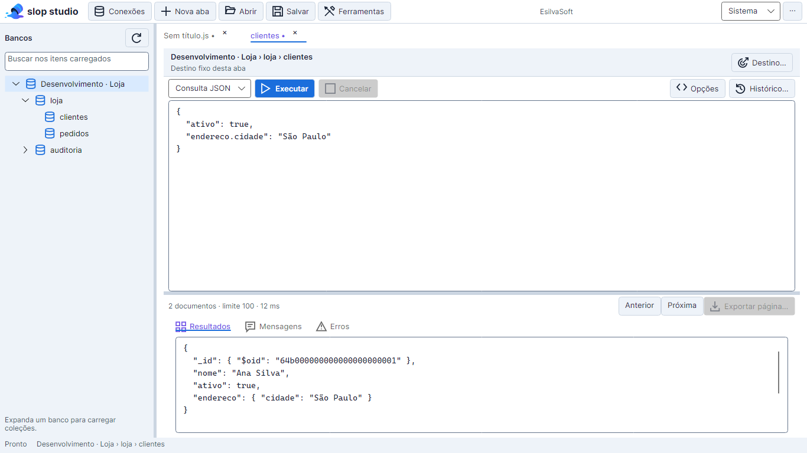
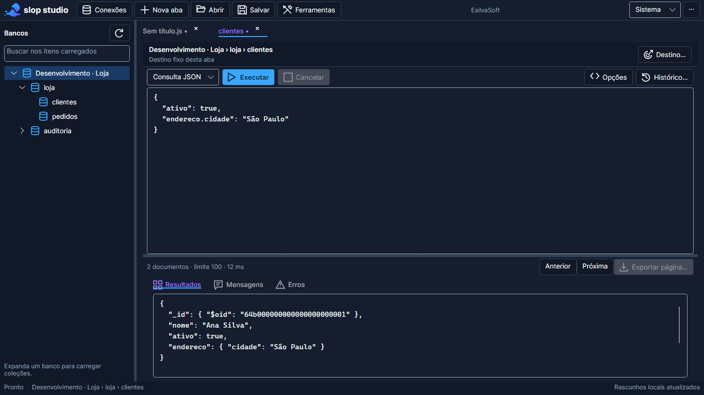
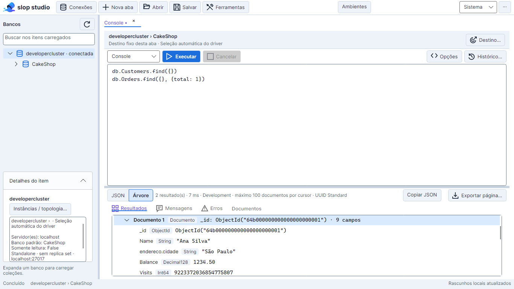
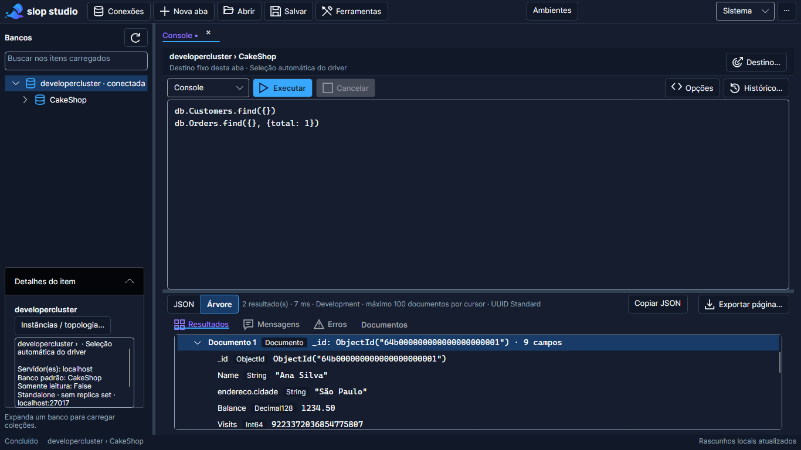

# Design system e revisão de UI/UX

## IA local: consentimento, prévia e proposta — Fase 5, 22/09/2026

O Assistente IA exige opt-in global desligado por padrão e uma permissão independente por conexão. Input JSON tem opt-in adicional próprio. O primeiro envio manual mostra uma prévia scrollável do snapshot de contexto e não chama o modelo; instrução, editor, alvo/conexão ou política alterados invalidam esse snapshot. Botões **Enviar à IA local** e **Editar** deixam explícita a confirmação ou renovação da revisão. A prévia lista os campos de contexto nos quatro idiomas e usa o mesmo padrão semântico de cartão, superfície, código monoespaçado e rolagem do painel do assistente.

Propostas permanecem em cartão revisável com diff, aplicação explícita e dismiss; operações de risco pedem confirmação adicional e a inserção continua undoável. Screenshot Headless/Skia foi gerado para proposta e contexto nos quatro idiomas e temas claro/escuro. Inspeção em 1120×760 confirmou legibilidade das amostras pt-BR claro/escuro, en claro/escuro, es claro/escuro e zh-CN claro/escuro; conteúdo longo é rolável no painel. Isso não comprova leitor de tela nem layouts nativos, que permanecem na Fase 9. [ADR-052](10-decisoes-arquiteturais.md#adr-052--consentimento-local-e-prévia-do-contexto-de-chat-22092026).

## Preferências de autocomplete expostas — lote W2c, 18/09/2026

`AutocompleteSettingsWindow` ganha controles para as seis opções que já existiam em `AutocompleteSettings` mas só eram editáveis pelo JSON: `InlineEnabled`, `InlineUseTraditional`, `InlineUseAi`, `CompletionAutoOpenOnTrigger`, `CompletionEnterAccepts` e o rótulo do atraso já exposto. As três primeiras são anuláveis para distinguir "ausente" de "false explícito"; cada uma vira um CheckBox de dois estados ligado a um valor efetivo mais um botão **Usar padrão** visível só quando há override — tocar o CheckBox materializa o valor explícito, e apenas o botão devolve o campo ao estado ausente. Nenhum desses controles reescreve a sessão ao abrir a janela. Com a sugestão automática desligada, as duas opções de origem ficam desabilitadas sem perder o valor salvo, com texto explicando a dependência; outro texto esclarece que a IA automática só atua com modelo já carregado (LoadedOnly). Evidência: 18 PNGs `autocomplete-settings-*` (já existentes, regenerados) e novos `autocomplete-settings-inline-overrides-<tema>.png` em `AutocompleteUiTests`; inspeção em 660×680 claro/escuro confirmou contraste e alinhamento dos botões condicionais e a preservação do valor da IA local ao desabilitar visualmente. [Detalhe e limites](21-autocomplete-local.md).

## Consultas avançadas — incremento de 14/09/2026

O menu existente de Ctrl+Espaço passa a mostrar campos derivados dos stages anteriores, com dica **Campo conhecido no contexto do pipeline**; nenhuma nova região ou cor. Teste com o editor real confirmou inserção no cursor e undo de `$total` produzido por `$group`, sem execução ou leitura remota. A inferência respeita campos locais/estrangeiros de `$lookup` e ramos de `$facet`; limites estão em [27](backlog/27-consultas-avancadas.md).

Histórico passa a identificar **Console e Agregação — execuções**. A abertura cria nova aba no modo registrado; o seletor exibe modo e coleção, com dica do destino completo. Sem nova superfície ou mudança de medidas. Capturas reais `aggregation-history-*` nas três dimensões e escalas; inspeção de 600 claro e 720 escuro confirmou legibilidade, ações acessíveis e rolagem local.

Opções do editor recebe **Validar sintaxe** (todos os modos) e **Analisar pipeline (explain)** (Agregação). Validação funciona offline sobre seleção ou documento, publica diagnóstico no painel Erros e seleciona o trecho; sucesso vai para Mensagens. Explain exige destino conectado e usa Mensagens, preservando Resultados. Mesmo estilo neutro, recursos semânticos e rolagem do menu existente. Evidência: 18 PNGs `aggregation-diagnostic-*`; inspeção de 960 claro e 1366 escuro confirmou seleção e leitura do erro, com rolagem local na janela mínima. [Comportamento e limites](backlog/27-consultas-avancadas.md).

Decisão vigente em **10/09/2026**, aprovada para implementação. Este documento substitui as propostas anteriores de conexões permanentemente à esquerda, cadastro acima do editor e script/resultados lado a lado. Requisitos relacionados: CON-01/08, EDT-01/02/04/06 e UX-01/02.

## Objetivo e referências

Uma IDE de MongoDB para uso prolongado, com navegação previsível, destino explícito e área de edição prioritária. Não há nova implementação web: o produto permanece .NET 10/Avalonia para Windows e Linux.

- [Fluent 2: cores](https://fluent2.microsoft.design/color) e [tipografia](https://fluent2.microsoft.design/typography): papéis semânticos e hierarquia compacta. Os tamanhos abaixo são decisões deste produto, não medidas prescritas por essas fontes.
- [WCAG 2.2: contraste](https://www.w3.org/WAI/WCAG22/Understanding/contrast-minimum.html): referência quantitativa aplicada aos controles desktop; não constitui certificação completa de acessibilidade.
- [Avalonia: variantes de tema](https://docs.avaloniaui.net/docs/styling/theme-variants): recursos dinâmicos e alternância em tempo de execução.

## Localização, acessibilidade e CJK

Os textos de produto usam um catálogo único, com chaves estáveis e atualização em execução. Os códigos suportados são `pt-BR`, `en`, `es` e `zh-CN`; `pt-BR` é o idioma inicial e `en` é o fallback para códigos inválidos ou chaves sem tradução. Uma chave ausente também no inglês aparece como `[[chave]]`, evitando silêncio. O seletor usa os nomes nativos dos idiomas e permanece acessível por teclado e automação.

A troca de idioma não altera rascunhos, resultados, credenciais ou identificadores MongoDB/BSON; ela atualiza rótulos, dicas, acessibilidade, estados, mensagens e exemplos iniciais gerados pelo produto. O layout deve ser verificado nos dois temas com textos longos e caracteres chineses; a evidência corrente é a matriz de 64 PNGs descrita no acompanhamento. Este documento e os demais `docs/**/*.md` continuam em português.

## Composição e medidas

```text
Conexões | Nova aba | Abrir | Salvar | Ferramentas   Ambientes   [Atualizar] | Tema | …
────────────────────────────────────────────────────────────────
Bancos                  │ Abas de script/consulta/agregação
Buscar / Atualizar      │ Conexão › Banco › Coleção | Contexto
                        │ Editor textual | Executar | Cancelar
Conexão aberta          │ Editor
 └ Banco                │
    └ Coleções          ├───────────────────────────────────────
                        │ Quantidade / limite / duração / exportar
                        │ Resultados | Mensagens | Erros
────────────────────────────────────────────────────────────────
Estado | Origem                          Estado do rascunho local
```

Todas as medidas são unidades lógicas, escaladas pelo Avalonia:

| Elemento | Decisão |
| --- | --- |
| Janela inicial / mínima | 1440 × 900 / 960 × 620 |
| Barra superior / status | 40 / 36 (revisão MVP abaixo) |
| Explorer | Inicial 260; ajuste entre 200 e 420 |
| Editor / resultados | Inicial 60% / 40%; painéis mínimos 180 / 140 |
| Divisores | 5; posições persistidas |
| Modal de conexões | 800 × 560, limitada à janela proprietária; conteúdo com rolagem |
| Controles / linhas do explorer | 32 / 28 |
| Espaçamento / cantos | Múltiplos de 4 / raio 4 |

A área central não usa rolagem global. Editor e saídas possuem rolagem independente. Consultas não abrem um popup de opções nem exibem campos separados para filtro, ordenação, banco ou limite: todos esses elementos são escritos no editor textual, com autocomplete e diagnóstico contextual. Ferramentas menos frequentes ficam em uma janela contextual proprietária. Formulários administrativos extensos mantêm rolagem local; docking complexo permanece fora desta entrega.

## Cores e tipografia

A identidade usa as referências locais de docs/ui: superfícies frias, azul para ação/foco e violeta para marca e títulos de abas selecionadas. O símbolo vetorial simplifica o recipiente inclinado com líquido azul/roxo. Veja o [manual de identidade](18-identidade-visual.md). Verde, âmbar e vermelho indicam estados acompanhados de texto. Cor personalizada de ambiente não substitui o nome do destino ou determina a cor do texto operacional.

| Token | Claro | Escuro |
| --- | --- | --- |
| WorkspaceBackground | #F7F9FC | #0B1020 |
| PanelBackground | #FFFFFF | #151D2E |
| SecondaryBackground | #EEF3F9 | #111827 |
| PrimaryText | #162033 | #F1F5F9 |
| SecondaryText | #475569 | #94A3B8 |
| AccentBrush | #1B6EDC | #38A8FF |
| OnAccentBrush | #FFFFFF | #0F172A |
| SelectionBrush | #D9EAFE | #193B67 |
| SuccessBrush | #166534 | #3DDC97 |
| WarningBrush | #92400E | #FBBF24 |
| ErrorBrush | #B91C1C | #FB7185 |
| DividerBrush | #CBD5E1 | #334155 |
| ControlBorderBrush | #64748B | #94A3B8 |
| HoverBrush | #E6EEF8 | #26334A |
| AccentHoverBrush | #155EC4 | #60B9FF |
| AccentPressedBrush | #124FA6 | #2589E8 |
| BrandAccentBrush | #7357E8 | #9B7BFF |

Texto comum e placeholders: contraste mínimo 4,5:1. Foco e limites necessários à identificação dos controles: 3:1. Divisores puramente decorativos e controles desabilitados têm papéis diferentes. Em seleção, metadados usam PrimaryText para preservar contraste.

Texto sobre botão primário validado em normal, hover e pressionado nos dois temas (mínimo 4,5:1). O azul claro da referência foi escurecido para #1B6EDC no tema claro; o tema escuro usa texto #0F172A sobre #38A8FF. Estados têm recursos próprios e os adornos de foco do Fluent são preservados.

- Interface: Inter embarcada, 13; metadados: 12; títulos de modal: 16 semibold; abas: 13 medium.
- Código/resultados: 14 e entrelinha 21; ajuste de 12 a 20, com entrelinha proporcional de 1,5.
- Fallback monoespaçado: Cascadia Mono, JetBrains Mono, Consolas, DejaVu Sans Mono, monospace. A fonte de código não é uma nova dependência distribuída.
- Temas Sistema, Claro e Escuro; Sistema é o padrão. Preferência aplicada imediatamente e persistida.
- O controle de texto atual permanece; syntax highlighting foi integrado em 12/09/2026 (revisão abaixo). Folding textual e nova grade BSON não são anunciados como entregues.

## Jornadas e regras de interação

### Conexões e explorer

Conexões abre modal com busca por nome/host/pasta/ambiente, favoritos e edição completa. A lista mostra somente o host; usuário, senha e query string não aparecem no resumo. Nova conexão permite preencher a partir da URI, revisar e salvar. Testar valida o perfil selecionado. Abrir conexão carrega bancos e fecha a modal somente no sucesso; falha fica na modal.

O explorer lista todos os perfis cadastrados; bancos aparecem sob as conexões abertas. Expandir banco busca suas coleções; atualizar permite repetir após falha. A busca filtra apenas nós já carregados. Selecionar navega; Enter ou duplo clique em coleção abre/ativa o Console com `db.getCollection("colecao").find({}).limit(100)`, sem executar. Conexão/banco formam o contexto; a coleção fica no script.

Editar/remover um perfil invalida o explorer antigo e exige reabrir sua conexão antes de executar novamente. Isso impede reutilizar um banco listado de outro host ou uma política de acesso antiga. Os rascunhos continuam disponíveis.

### Workspace local e painel lateral

Uma barra vertical acessível organiza dois painéis tratados como abas: **Conexões** primeiro e **Arquivos** segundo. **Abrir pasta** (`Ctrl+Shift+O`) escolhe uma única raiz, abre o workspace local e seleciona automaticamente **Arquivos**; trocar ou fechar a pasta preserva as abas de documentos abertas. O painel não consulta MongoDB e a seleção da árvore nunca executa conteúdo.

**Arquivos** exibe a raiz, pastas antes de arquivos e filhos carregados sob demanda. Os estados vazio, carregando e erro têm texto e ação de **Atualizar**. Enter ou duplo clique abre/ativa o arquivo como texto; abrir o mesmo caminho novamente reutiliza a aba. O menu contextual oferece **Novo arquivo**, **Nova pasta**, **Renomear** e **Excluir**. Nomes duplicados, caminhos fora da raiz e alterações na própria raiz são bloqueados. A exclusão usa a lixeira do sistema e informa a falha quando ela não está disponível.

Arquivos vazios e extensões desconhecidas são válidos. O serviço preserva UTF-8 (com ou sem BOM), UTF-16/UTF-32 com BOM, quebras de linha e bytes na gravação; conteúdo binário ou codificação não reconhecida produz erro recuperável. Documento sem caminho usa **Salvar como**. Alteração externa oferece recarregar, sobrescrever explicitamente ou cancelar, e buffers abertos viram documentos sem arquivo quando o item é excluído.

### Abas e execução

Nova aba cria um editor. Cada aba possui ID, contexto, texto, arquivo, estado de alteração, resultados, mensagens, erros e cancelamento próprios. O contexto muda somente por ação explícita ou por carregar uma consulta da própria conexão; não há um modo paralelo de campos para montar a consulta.

Uma execução por aba; abas diferentes podem executar simultaneamente. O executor captura os parâmetros antes do primeiro await. Retornos fora de ordem atualizam apenas a aba originária. Scripts recebem o banco explicitamente: o runner inicializa `db` por `getSiblingDB` com literal serializado, mantendo URI e authSource. O próprio script ainda pode escolher outro banco explicitamente.

Resultados permanecem em Extended JSON, separados de stdout/stderr; consultas mantêm paginação e exportação da página. Agregação também usa o editor textual e o painel inferior. Quantidade, limite efetivo e duração aparecem junto à saída, sem transformar esses dados em campos obrigatórios do editor. Scripts sem documentos indicam o console. Erros não provocam nova execução de outro trecho.

| Atalho | Comportamento |
| --- | --- |
| F5 | Executar conteúdo completo da aba |
| Ctrl+Enter | Console: seleção ou statement no cursor; Script/Agregação: seleção ou conteúdo completo |
| Ctrl+Espaço | Abre a lista contextual de sugestões; não abre com seleção ativa nem aplica resultado de texto/destino antigo. Desde 18/09/2026 é o único gatilho padrão — `Ctrl+.` saiu dos padrões (ver limitação de IME abaixo) |
| ↑ / ↓ | Navega a lista aberta |
| Tab | Aceita item da lista, avança placeholder do snippet ou aceita o ghost (conforme o estado ativo) |
| Shift+Tab | Volta ao placeholder anterior do snippet |
| Enter | Aceita item da lista, se `CompletionEnterAccepts` (padrão habilitado) |
| Esc | Fecha a lista, encerra o snippet ou descarta o ghost (conforme o estado ativo) |
| Ctrl+T / Ctrl+O / Ctrl+S | Criar aba / abrir arquivo / salvar arquivo |
| Ctrl+Shift+S / Ctrl+Shift+O | Salvar como / abrir ou trocar pasta do workspace |
| Ctrl+Tab / Ctrl+Shift+Tab | Alternar abas |
| Ctrl+W | Fechar aba com tratamento de alterações e execução |
| F6 | Alternar foco entre editor e explorer, permitindo sair do editor que aceita Tab |
| Escape | Fechar modal; no workspace, cancelar operação da aba ativa |

Ao fechar uma aba executando: interromper e aguardar ou cancelar o fechamento. Cancelamento informa que efeitos no servidor não são revertidos e podem ser incertos. Abas alteradas oferecem salvar, descartar ou cancelar. Confirmações destrutivas, auditoria e bloqueios de somente leitura continuam nas ferramentas existentes.

Os atalhos do editor usam `EditorKeyBindings` persistido: a preferência substitui os gestos padrão de cada comando dentro do mesmo `EditorCommandScope` (Global/List/Snippet/Inline); o mesmo gesto pode continuar sendo o padrão de comandos diferentes em escopos diferentes. Uma tecla nomeada (`Tab`, `Enter`, `Esc`, setas) casa por identidade de tecla; pontuação (`.`, `;`) casa pelo símbolo produzido pelo layout ativo e, sem símbolo, pela tecla física como fallback — assim um símbolo diferente nunca dispara pelo código físico US. **Limitação conhecida:** desde que `Ctrl+.` saiu dos padrões, `Ctrl+Espaço` é o único gatilho padrão do autocomplete básico e colide com a troca de IME em Windows e Linux; não há tela de edição de atalhos nesta entrega, então o contorno é um override manual salvo em `EditorKeyBindings` (um valor `Ctrl+.` já salvo continua funcionando e nunca é reescrito). Detalhe em [auto-complite/editor-integration.md](auto-complite/editor-integration.md#atalhos) e [AC-08](auto-complite/decisions.md#ac-08--atalhos).

### Recuperação e privacidade

Coleção LiteDB adicional `workspaceSession`, documento `current`, JSON de versão 2. O mesmo repositório continua proprietário da conexão LiteDB; a migração da versão 1 é aditiva. A sessão pode guardar raiz da pasta, painel selecionado e metadados dos documentos, mas nunca resultados ou credenciais. Contratos: `IWorkspaceSessionRepository`, `WorkspaceSession`, `WorkspacePreferences`, `WorkspaceDraft`, `ITextFileService` e `IWorkspaceFileService`.

Autosave após 750 ms sem edição e no encerramento. Recuperar ordem, aba ativa, texto, contexto e arquivo; não recuperar resultados, credenciais ou conexões abertas. A entrada JSON só entra no snapshot mediante a opção Persistir entrada. Preferências de histórico são independentes do autosave.

Recuperação ligada por decisão do usuário, desativável globalmente e por conexão em Preferências. A política também é aplicada no repositório. Descartar aba remove seu rascunho. Falha de gravação permanece visível e conserva o conteúdo em memória; sessão ilegível não é sobrescrita por defaults. Texto SQL/MQL/JavaScript digitado pelo usuário pode conter dados sensíveis: o armazenamento de rascunhos não é um cofre nem promete remover segredos arbitrários do código.

## Validação e limites

Testes cobrem isolamento, resposta fora de ordem, seleção sem fallback, cancelamento, somente leitura, perfil alterado, migração aditiva, autosave, opt-in de entrada, recuperação, descarte e falhas de persistência. Renderização Avalonia Headless/Skia usa controles reais e dados de teste em 960 × 620, 1366 × 768 e 1920 × 1080, escalas 100%, 150% e 200%, nos dois temas.

As imagens ficam em `ui-evidence` no diretório de execução dos testes, excluído do controle de versão. Build, contagem final por sistema e pendências estão na [matriz de validação](15-matriz-de-validacao.md) e no [acompanhamento](12-acompanhamento-da-implementacao.md).

Homologação contra MongoDB/mongosh real, leitor de tela, diálogos nativos de arquivo e gerenciadores de janela reais continuam separadas da renderização automatizada. Não declarar suporte integral a essas jornadas apenas com testes simulados. Tabela tabular, editor avançado, cofre nativo e virtualização de documentos permanecem no backlog; a árvore de inspeção da página foi acrescentada na revisão Database Explorer abaixo.

## Prévias da implementação

Renderização automatizada com dados sintéticos, 1366 × 768, escala 100%.






## Ambientes e credenciais — revisão de 10/09/2026

Até 17/09/2026 a barra superior oferecia **Ambientes**, abrindo a modal proprietária de ambientes. Desde 18/09/2026 esse botão e o botão **Ferramentas** foram removidos da barra ([ADR-042](10-decisoes-arquiteturais.md)); a modal permanece implementada, intitulada **Ambientes locais**, sem ponto de entrada. A descrição a seguir documenta o layout preservado. Seletor de ambiente, criação customizada, lista de chaves e editor com valor mascarado; controles tipados e recursos semânticos compartilhados. **Salvar e ativar ambiente** é explícito; selecionar para editar não altera o ambiente de execução. Erros de leitura/gravação ficam visíveis. Escape fecha apenas a modal e descarta o formulário não salvo. Layout inicial 760 × 540, mínimo 600 × 420, com rolagem local; evidência em 600 × 420, 760 × 540 e 900 × 650, escalas 100/150/200%, claro/escuro.

Conexões aceita URI direta com senha ou interpolação opcional. Campos de usuário/senha são opcionais; valores digitados são codificados para URI, sem converter referências já existentes. O rótulo de ambiente no perfil não escolhe o conjunto de valores ativo. Salvar ambientes invalida destinos explorados e requer reabertura; textos e operações em andamento são preservados. O estado do ambiente ativo aparece na modal. A interface informa armazenamento local sem criptografia nativa, sem confundir esse módulo com CSFLE.


## Database Explorer — revisão de 10/09/2026

O explorer passa a listar todos os perfis, inclusive desconectados, e inclui Documentos/Índices sob cada coleção. Estados de conexão/carga/erro têm texto. Botão direito e Shift+F10 dão acesso a menus específicos. **Detalhes do item** ocupa uma região recolhível de até 240 unidades, com conteúdo rolável; o restante da árvore conserva sua própria rolagem. Mantida a janela mínima 960 × 620 e o editor acima dos resultados.

A saída ganha **Documentos**, com lista da página à esquerda, campos estruturados à direita e ações compactas em WrapPanel. Resultados JSON, mensagens e erros continuam separados. Editor de documento em modal proprietária de 760 × 560 (mínimo 600 × 420), destino visível, confirmação explícita e bloqueio de fechamento durante operação. Seleção de instância é uma modal contextual com host/papel e explicação de capacidade; a aba identifica seleção automática, direta na URI ou host explícito.

Evidência: 18 PNGs de explorer/documentos (claro/escuro × 960/1366/1920 × 100/150/200%), editor de documento nos dois temas, menus reais e encaminhamento às ferramentas testados. Não houve modificação de golden files. [Guia e prévias](19-database-explorer.md).

## Console — revisão de 11/09/2026

Console é o modo inicial da aba e substitui Consulta JSON na seleção. Cabeçalho conexão › banco; Destino… permite trocar ambos. Coleção não é campo obrigatório. Os comandos de consulta ficam no texto; Opções contém apenas limites de segurança do Console e preferência de histórico.

Resultados mostram expressões numeradas e a conexão/namespace quando conhecidos. Documentos oferece seletor do conjunto e conserva a origem para edição. Mensagens recebe console.log/warn/error. Confirmação de escrita é uma modal proprietária com contexto real; Escape nega o envio e cancelamento/timeout fecha a confirmação.

Ctrl+Enter usa seleção ou statement identificado pelo parser; F5 executa tudo. Autocomplete obtém metadados assincronamente e descarta sugestões se texto/destino mudar. Rascunho JSON convertido fica alterado, sem execução automática. Renderização e teclado são verificados em controles reais, nos 18 cenários de tema/tamanho/escala. [Console](20-console.md).

## Autocomplete local — revisão de 11/09/2026

Preferências contém Autocomplete…, modal proprietária 660 × 680, mínimo 520 × 420, conteúdo rolável e ações/status no rodapé. Campos tipados usam o catálogo em pt-BR, en, es e zh-CN: modo, diretório externo, modelos encontrados, hardware, contexto/geração/atraso. Estados do runtime e falhas de gravação são textuais. Recursos semânticos dos temas existentes; nenhum indicador apenas por cor.

TextBox preservado. Ghost text no cursor, com fonte/entrelinha do código e SecondaryText; contexto existente conserva PrimaryText. Projeção visual recortada ao viewport, incluindo múltiplas linhas e sufixo, sem alterar documento. Tab avança por partes lógicas, Escape descarta antes de cancelar consulta e Ctrl+Espaço conserva menu com metadados. F6 continua saindo do editor. Preferências oferece opções independentes para dicionário, Input, campos dos Resultados, contexto ampliado e Tab incremental. Renderização em 18 combinações do workspace e 18 da modal, com controles reais, escalas 100/150/200% e dois temas. [Especificação e limites](21-autocomplete-local.md).

## UUID/GUID — revisão de 11/09/2026

Preferências passa a ter largura 560 (mínimo 460 × 420, altura máxima 760) e conteúdo rolável; Escape fecha. **Representação UUID padrão** fica após as opções de rascunho. O editor de conexão recebe **Representação UUID desta conexão**, com **Usar preferência global**, abaixo de Favorita/Somente leitura. Os dois usam `UuidRepresentationPanel`: seletor tipado, prévia do UUID `00112233-4455-6677-8899-aabbccddeeff` nas quatro formas em fonte de código 13, subtype e bytes em metadados. A linha efetiva recebe semibold e o texto “Selecionada”, sem depender só de cor. O literal ocupa a largura inteira da linha e não é truncado. Status de gravação usa ErrorBrush apenas junto de mensagem textual.

A métrica dos resultados acrescenta “UUID <representação>” e a contagem de legados de origem desconhecida; o texto trunca com reticências e mantém a dica completa. A árvore de Documentos exibe UUID binário como folha com o construtor. Evidência: 18 PNGs para cada superfície (Documentos 960/1366/1920, Preferências 460×420/560×680/900×760, conexão 600×420/800×560/900×650; claro/escuro; 100/150/200%) em `ui-evidence/uuid-*.png`.

## Resultados JSON e árvore — revisão de 11/09/2026

O cabeçalho da saída recebe o seletor segmentado **JSON | Árvore** antes das métricas: `RadioButton.segment`, altura 32, opção ativa com SelectionBrush, borda AccentBrush e semibold, sem depender só de cor. **Copiar JSON** age no documento selecionado e explica por dica quando não há seleção. Escolher uma visualização traz Resultados à frente. Visualização, seleção e expansão ficam por aba, apenas em memória.

- **JSON:** TextBox somente leitura, fonte de código configurável, rolagem horizontal e vertical. Indentação de 2; wrappers Extended JSON (`$oid`, `$date`, `$binary`, `$numberLong`…) em uma linha e tokens copiados sem conversão. No Console, cada conjunto recebe o comentário `// [n] conexão › banco › coleção · método · N documento(s) · limitado · projeção parcial`. O cursor seleciona o documento; seleção feita na árvore ou em Documentos reposiciona o cursor.
- **Árvore:** TreeView com PanelBackground e borda ControlBorderBrush. Cada linha tem nome (semibold em conjunto e documento), chip de tipo (metadata 12 sobre SecondaryBackground; PrimaryText quando selecionada) e valor em fonte de código, truncado em 240 caracteres com dica completa. Console agrupa por conjunto; demais modos listam documentos. Filhos são criados ao expandir; o primeiro conjunto com documentos e um documento único abrem por padrão. Avisos são linhas de texto: sem documentos, resultado limitado, projeção parcial, agregação e JSON inválido.
- **Menu do documento:** botão direito, Shift+F10 e tecla Menu, na árvore (item apontado ou selecionado) e no JSON (documento no cursor; o clique direito move o cursor). Legenda com documento e `_id`; **Visualizar documento em JSON**, **Abrir documento para edição** com motivo textual quando indisponível e **Copiar JSON**; no JSON também **Copiar texto selecionado**. Fechar o menu devolve o foco.
- **Visualização JSON:** modal proprietária 760 × 560, mínimo 600 × 420; título 16 semibold, aviso de somente leitura, origem, conexão › banco › coleção, identidade e apresentação UUID; TextBox somente leitura; **Copiar JSON** primário, **Fechar** e Escape.
- **Edição:** a modal de documento existente ganha linha de política, texto indentado sem quebra e **Salvar…**, desabilitado com dica em conexão somente leitura ou fechada.

Evidência: 72 PNGs (JSON e árvore em 960 × 620, 1366 × 768 e 1920 × 1080; modais em 600 × 420, 760 × 560 e 900 × 650; claro/escuro; 100/150/200%) em `ui-evidence/results-*.png` e `ui-evidence/result-document-*.png`.






## Syntax highlighting — revisão de 12/09/2026

TextBox.syntax conserva edição/undo e usa SyntaxTextPresenter. Recursos Syntax.* nos dois temas diferenciam propriedades/strings, valores, operadores/stages, tipos BSON e namespaces conhecidos. Delimitadores junto do cursor recebem cor e sublinhado; ghost text usa recurso próprio e conserva as cores do texto existente. Resultados, modais, árvores e ferramentas reutilizam o mecanismo. Classificação em worker, cache por linha e spans do viewport protegem documentos extensos; o layout nativo do TextBox ainda não é virtualizado. Contraste mínimo 4,5:1 sobre PanelBackground e matrizes de PNGs reais de workspace/modal. [Arquitetura e limites](22-syntax-highlighting.md).

## Identificadores — revisão de 12/09/2026

Preferências mostram primeiro **Representação padrão de identificadores** e depois **Representação UUID · Binary BSON**. O seletor de modo usa os rótulos “Standard · ObjectId + UUID v4”, “ObjectId · MongoDB ObjectId” e “UUID v4 · BSON subtype 4”; abaixo vêm a explicação do modo selecionado (texto quebrável) e o card **Prévia do modo selecionado**, com as seções **ObjectId** (construtor, hex e UUID equivalente; cada linha com rótulo `metadata`, código em CodeFont 13 e detalhe) e **UUID** (UUID v4 na representação atual). Standard mostra as duas seções; ObjectId oculta a seção UUID e troca a comparação das quatro formas por uma frase; UUID v4 oculta a seção ObjectId. O status de gravação usa a mesma cor de erro do painel UUID. A árvore de Resultados acrescenta “· UUID …” (o UUID equivalente) ao valor do ObjectId somente em UUID v4, curto o bastante para a coluna de valor de 720 px; a dica mantém o texto integral; a métrica passa a “IDs <modo> · UUID <representação>”. O menu do documento ganha **Copiar _id**, **Copiar consulta por _id** e, em UUID v4, **Copiar UUID equivalente do _id**. Nas Ferramentas, **Gerar identificador** e a linha **Interpretar** ficam na aba Documentos, com rótulo truncável e dica. Evidência: `ui-evidence/identifier-results-*.png` (960/1366/1920) e `identifier-preferences-<modo>-*.png` (460×420, 560×680, 900×760), claro/escuro, 100/150/200%.

## IA ONNX compartilhada — revisão de 13/09/2026

A composição do editor e do Assistente IA permanece. Preferências → Autocomplete seleciona modelo e CPU/GPU para ambas as jornadas. O status identifica o provider efetivo e o fallback GPU → CPU; modo básico no chat é explicitamente identificado. Propostas ONNX exigem revisão e confirmação existentes; resposta incompleta ou contexto acima do limite gera erro textual. O pacote SlopCoder é FIM, com fidelidade a instruções de chat ainda não homologada. [Uso e limites](23-onnx-slopcoder.md).


## IA local multimodelo — revisão de 13/09/2026

A modal passa a se chamar Autocomplete e IA local, mantendo 660 × 680, mínimo 520 × 420, conteúdo rolável e ações no rodapé. Ordem: opções do autocomplete e do Assistente, modo, diretório de modelos (placeholder com o padrão, Procurar…), modelo (lista pelo nome da pasta ou do metadata, Atualizar, Outra pasta…), detalhes e pastas ignoradas em texto metadata, hardware com dispositivos detectados, perfil de estimativa com os sete tiers pré-carregados, orçamentos, estado do modelo e resultado do teste. O tier detectado seleciona o perfil correspondente e preenche contexto/geração automaticamente, respeitando janela, teto de saída e overhead do modelo. Os orçamentos são ComboBox editáveis: sugestões e livre digitação para contexto e geração; os campos exibem somente dígitos, sem ponto de milhar. Valores maiores continuam digitáveis quando o modelo suporta, enquanto a memória orienta a recomendação. O rodapé mostra só a última mensagem (até três linhas) e os botões; estado e relatório longos ficam no conteúdo rolável para não ocupar a janela mínima. Perfis manuais são apenas estimativas e não alteram o provider real.

Hardware ausente aparece como "GPU — indisponível" e fica desabilitado na lista; nenhum estado depende só de cor. Estados de modelo, fallback e falha de provider são frases com motivo e alternativa. A carga usa a barra inferior global existente. Relatório de teste é selecionável para cópia. [Especificação](26-ia-local-multimodelo.md).

## Datas BSON — revisão de 13/09/2026

Resultados, árvore, visualização, edição e cópias apresentam datas como `ISODate("2024-12-30T20:56:44.999Z")`, com data, hora, segundos, milissegundos e timezone UTC explícito. BSON não conserva o fuso original; entradas com offset são normalizadas para o instante UTC equivalente. Strings comuns permanecem strings; valores fora do intervalo do .NET conservam Extended JSON na saída textual e milissegundos na árvore. Mesmos tokens de código e layout. PNGs reais da modal de documento inspecionados em claro/escuro, 760 × 560, 100%.

## Enquadramento de entrega e editor atual — 13/09/2026

✅ Implementado: estrutura desktop, temas, navegação sem consulta automática, contexto fixo e cancelamento por aba. A v0.5.0 consolida o fluxo básico; v0.6.0 revisa produtividade; v1.0.0 exige acessibilidade e integração nativas. IA permanece opcional/experimental na v0.9.0. [Roadmap](09-plano-de-implementacao.md).

O checkout atual utiliza MongoTextEditor derivado de AvaloniaEdit.TextEditor e LongLineElementGenerator. Descrições datadas de TextBox/TextPresenter acima são históricas e não descrevem a base atual do editor. A presença de linhas visuais virtualizadas não encerra a homologação de arquivos extensos, folding ou acessibilidade. Esta revisão documental não altera medidas, temas, atalhos, navegação ou sessão e não gera nova evidência visual; testes/PNGs anteriores conservam sua data e limites.


## Polimento do MVP — 13/09/2026

A barra inferior passa a ter 36 unidades para comportar a ação Cancelar com alvo de 28. Apresenta estado textual, progresso de 100 unidades (indeterminado quando não há total), percentual separado quando conhecido, descrição truncável com dica completa e quantidade de operações adicionais. Rascunho local continua visível à direita. Sem overlay global: abas e Explorer permanecem navegáveis. Prioridade Alta para consulta manual, conexão, exportação e escrita; Normal para carga/metadados; Baixa para sugestões locais. Estados terminais duram seis segundos quando não há operação ativa.

Os botões do editor usam quebra de linha na largura mínima, evitando sobreposição com Opções/Histórico. Opções contém Formatar JSON/query/script: seleção ou conteúdo completo, sem execução e com Ctrl+Z. Exportar página oferece JSON e CSV; a dica explicita página e proteção de fórmulas. Árvores carregam campos em grupos de 256, com Próximos campos…, sem cortar o JSON/exportação. Textos enormes são apresentados por trecho visual próximo ao cursor, mantendo o documento e a seleção completos.

Evidência de controles reais: `MvpPolishUiTests`, 18 PNGs `mvp-status-<tema>-<largura>-<escala>.png`, nas três larguras/alturas e escalas do sistema. Inspeção revelou e corrigiu sobreposição da ProgressBar e da barra do editor. A fixture da barra usa operações sintéticas para tornar progresso e concorrência reproduzíveis; não é uma captura de produção. A matriz e a auditoria registram execução e limites.

## Atualização do aplicativo — 14/09/2026

A barra superior ganha a ação **Atualizar** entre Ambientes e Tema. Ela só aparece com versão nova ou pacote pronto; sem atualização, a composição anterior não muda. Botão `primary` (AccentBrush/OnAccentBrush), ícone de download 16, altura 32 e alvo mínimo 28. Rótulos curtos por estado: Atualizar, Baixando N%, Reiniciar. A dica e o HelpText trazem versão, motivo de falha e consequência (instalação ao fechar). Abaixo de 1100 de largura, a classe `compact` oculta o texto e mantém o ícone: em 960 o rótulo sobrepunha Ambientes a Ferramentas. Progresso e cancelamento reutilizam a barra inferior; Reiniciar pede confirmação (Reiniciar agora/Depois) e segue o fechamento normal.

Evidência: `AppUpdateUiTests`, 36 PNGs `update-<available|downloading>-<tema>-<largura>-<escala>.png`. Inspeção de 960 claro/escuro (escala 1 e 2), 1366 escuro e 1920 claro confirmou ausência de sobreposição e contraste do rótulo no tema escuro. A fixture usa um serviço de atualização sintético; não é captura de download real.

## Download de modelos — 14/09/2026

Na modal Autocomplete e IA local, abaixo de Modelo, a seção **Baixar modelo** repete o padrão seletor + ações: ComboBox `<variante> · <tamanho>` (sufixo "— instalado"), **Baixar** e **Atualizar lista**. Durante o download, **Cancelar** ocupa a coluna de Baixar, sem deslocar o seletor. Abaixo ficam ProgressBar de 6 com MinWidth 0 e percentual separado; metadata com pasta, tamanho, licença e destino completo; estado textual do download (sem depender de cor); e o aviso de fonte, licença e continuidade após fechar a janela. Nenhuma cor nova e nenhum botão primário adicional: Salvar continua sendo a única ação primária.

Evidência: `ModelDownloadUiTests`, 18 PNGs `model-download-<tema>-<largura>-<escala>.png` em 520 × 420, 660 × 680 e 900 × 760. Inspeção de 520 claro, 660 escuro e 900 claro a 150% sem sobreposição das ações; em 520 × 420 o progresso fica abaixo da dobra da área rolável. Fixture com fonte remota sintética.

**Revisão de nomes e pasta — 14/09/2026.** Os seletores Modelo e Baixar modelo usam o mesmo padrão de item: primeira linha "família — hardware precisão" (ex.: `SlopCoder-Mongo-1.5B-full — GPU DirectML FP16`); segunda linha `metadata` com tamanho e dica de uso no download, ou parâmetros, arquitetura e pasta na seleção. A caixa fechada mostra só a primeira linha (`SelectionBoxItemTemplate`) e, quando truncada na largura mínima, o nome completo fica na dica. A segunda linha do item escolhido para download aparece logo abaixo da linha de ações, com "GPU não detectada nesta máquina" quando aplicável — texto, não cor. **Ver detalhes do modelo no Hugging Face** é um `HyperlinkButton` sem padding, abaixo do destino. **Abrir pasta** entra como terceira ação do Diretório de modelos, depois de Procurar…, com o mesmo estilo neutro. Inspeção: 660 escuro sem sobreposição e com hierarquia título/metadata legível; em 520 claro o título da caixa trunca ("… GPU Di…"), motivo da dica.


## Revisão do plano de autocomplete — 15/09/2026

Contrato futuro (histórico, revisto pelo lote W0 abaixo): lista Ctrl+. (alias Ctrl+Espaço), IA explícita Ctrl+;, ghost tradicional e IA usando um presenter com arbitragem previsível; padrão híbrido não troca ghost tradicional visível. Tab/Esc/Enter/F6, foco/IME, recursos semânticos e evidência de 18 combinações mantidos. Correção antes do cursor fica na lista até prévia representável. Schema Learning não bloqueia resultados e informa falha persistente discretamente. Nada disso altera layout/atalhos atuais nesta revisão; não gerados novos PNGs. [Plano revisado](auto-complite/README.md), [tarefas por agente](auto-complite/execution-plan.md) e [schema learning](auto-complite/schema-learning.md).

## Política de atalhos do autocomplete (W0) — implementada em 18/09/2026

O produto decidiu remover `Ctrl+.` dos padrões: `Ctrl+Espaço` passou a ser o único gatilho padrão da lista básica explícita, revisando o contrato futuro acima. `Ctrl+;` é reconhecido para IA explícita, mas sem runtime ainda — a aba só informa indisponibilidade de forma discreta. A tabela de atalhos desta seção e a arbitragem de teclado foram atualizadas para refletir os doze comandos por escopo (`EditorCommandScope { Global, List, Snippet, Inline }`); nenhum layout novo ou PNG foi gerado, pois não há mudança visual. Build 0 avisos; suíte 1170 aprovados, 0 falhas. **Limitação registrada, não resolvida:** `Ctrl+Espaço` colide com troca de IME em Windows e Linux; sem tela de edição de atalhos, o contorno é um override manual em `EditorKeyBindings`. Homologação em layouts físicos reais, IME real e leitor de tela seguem pendentes. Detalhe em [auto-complite/editor-integration.md](auto-complite/editor-integration.md#arbitragem-de-teclado), [AC-08](auto-complite/decisions.md#ac-08--atalhos) e [estado da Fase 2](auto-complite/phases/phase-2-traditional-autocomplete.md#estado-da-implementação).

## Chat nativo de agentes (lote 6) — implementação parcial, 24/09/2026

Implementados `AgentChatPanel` (UserControl, mínimo 320 de largura), `AgentApprovalWindow` (modal proprietária 760 × 560, mínimo 600 × 420) e `AgentSettingsWindow` (660 × 560, mínimo 520 × 420), com `AgentChatViewModel`, `AgentApprovalViewModel` e `AgentSettingsViewModel`. Consomem só `IAgentRuntime`/`IAgentContextProvider` e portas de apresentação do Desktop (`Desktop/Agents/AgentChatPorts.cs`: catálogo de providers por capability, detalhes confiáveis de aprovação e gravação explícita de chave). Desde 25/09/2026 o painel está hospedado na janela principal (subseção abaixo); detalhes de aprovação seguem sem fonte confiável de produção e a aprovação permanece fail-closed.

- **Cabeçalho:** título, chip textual **Local/Externo**, Configurar…, seletores de provider (rótulo "Nome · Externo" ou "· Indisponível") e modelo, e linha metadata "Contexto fixo da aba: conexão › banco › coleção", derivada do snapshot da aba; o Explorer nunca a altera.
- **Status:** cartão com frase para cada estado (indisponível, sem provider, sem chave, credencial expirada, cofre indisponível, pronto, revisando, conectando, gerando, aguardando ferramenta/aprovação, cancelando, concluído, cancelado sem rollback, resultado incerto, tempo esgotado, falha com código seguro). ErrorBrush só acompanha texto; região `LiveSetting=Polite`, sem anunciar cada token.
- **Histórico:** ListBox virtualizada; mensagens com papel e "gerando…"; cartões de ferramenta com nome canônico, estado, duração e código; cartão de aprovação com borda WarningBrush, estado textual e **Revisar aprovação…**. A rolagem acompanha o stream só se o leitor já estava no fim; streaming não move foco. Convite vazio só aparece quando é possível conversar.
- **Envio:** escopo explícito (**Nenhum** padrão, **Somente metadados**, **Seleção do editor**); consentimento externo por sessão, desmarcado por padrão e zerado ao trocar provider — configurar conta/chave não consente. **Revisar envio** captura a aba antes de qualquer await e mostra a prévia (destino, escopo, namespace e contexto em fonte de código 14/21); mensagem, escopo, provider, modelo ou contexto da aba alterados descartam a prévia. **Enviar** só usa o pacote revisado. Trocar provider cria nova sessão, limpa a conversa visível e informa que nada foi transferido.
- **Teclado:** Enter quebra linha; Ctrl+Enter revisa/envia somente com foco no compositor; Escape no compositor descarta a prévia e nunca cancela turno; Tab chega a **Cancelar execução** (explícito, com dica de que não há rollback).
- **Aprovação:** ferramenta, destino, filtro/identidade, mudança, limite, risco textual (Destrutiva em ErrorBrush + texto), contagem regressiva e mensagem. **Rejeitar** recebe o foco inicial; Enter ativa o botão focado, Escape e fechar rejeitam; **Aprovar uma vez** (primário) fica desabilitado sem detalhes verificados, após expirar, ao encerrar pelo runtime ou sem digitar exatamente o nome da coleção em ação destrutiva. Texto do modelo nunca aprova.
- **Configurações:** providers com destino, métodos oficiais (só **Chave de API** ou **Sem conta (local)**; não há login de assinatura), estado da credencial, modelos e capabilities; chave em entrada mascarada, **Salvar chave no cofre**/**Remover chave** explícitos, status fixo sem ecoar a chave, campo limpo ao salvar/fechar. Abrir não autentica. **Ressalva de estado atual (25/09/2026):** esta descrição reflete o que está implementado hoje (lote 6). O login de assinatura pelo modo Claude Code é planejado, não implementado; sua especificação de UI (botão **"Entrar pelo Claude Code…"**, terminal visível, avisos fixos) está nas linhas 315/319 abaixo e não substitui esta seção até ser entregue.

Evidência: `AgentChatUiTests`, 42 PNGs `agent-chat-*`, `agent-approval-*` e `agent-settings-*` (claro/escuro; painel 400 × 720 em cinco estados, 360 × 620 e 480 × 768 em 100/150/200%; aprovação 760 × 560 e 600 × 420; configurações 660 × 560 e 520 × 420), com fixtures sintéticas. A inspeção corrigiu convite/compositor ativos no estado indisponível, "sem mudança (leitura)" exibido quando os detalhes não foram verificados e texto sob a barra de rolagem a 520. Limites: sem integração à janela principal nem medida do painel docked em 960/1366/1920; duração de ferramenta sintética (0 ms); alvo da ferramenta não aparece no cartão porque `AgentEvent` não o transporta; idiomas en/es/zh-CN traduzidos, sem PNG próprio. Leitor de tela, IME e diálogos nativos Windows/Linux permanecem pendentes.

### Hospedagem na janela principal (P7-L06-HOST) — 25/09/2026

- **Entrada:** botão **Agente IA** (ícone de mensagem + rótulo; só ícone abaixo de 1100, com dica e nome acessível) na barra superior e atalho **Ctrl+Shift+A**. Revisão de conflitos: não colide com F5, Ctrl+Enter, Ctrl+Espaço, Ctrl+;, Ctrl+T/O/S/W/Tab, Ctrl+Shift+S/O, F6 nem com os comandos de `EditorKeyBindings`; Ctrl+Shift sozinho (troca de layout no Windows) não é afetado. Painel fechado abre e foca o compositor; com foco no painel recolhe e devolve o foco ao editor; com o painel aberto e foco fora dele, move o foco para o chat.
- **Disposição:** recolhido ao iniciar (sem persistência de largura/estado nesta entrega). Encaixado à direita com divisor de 5, largura inicial 380 (mín. 320, máx. 560) enquanto a área de abas mantém ao menos 690 — a largura que tem na janela mínima —, para o editor nunca ficar mais estreito que na janela mínima. Abaixo disso (ex.: 960 × 620, 1366 com explorer largo) o painel vira **superfície própria** no lugar da área de abas, com o botão textual **Voltar ao editor**; o Explorer permanece. Encaixado, o botão é "×" com nome acessível "Recolher o painel Agente IA (Ctrl+Shift+A)".
- **Contexto e isolamento:** um `AgentChatViewModel` por aba, criado na primeira abertura do painel; o painel mostra sempre o chat da aba ativa e voltar à aba restaura sua conversa. O snapshot vem só da aba (perfil, banco, coleção fora do modo Console, revisão do texto e seleção do editor), capturado de forma síncrona antes de awaits; seleção no Explorer não altera o contexto e nada executa consulta. Mudança explícita do destino da própria aba atualiza o contexto fixo e descarta a prévia. Fechar a aba encerra o turno e a sessão daquele chat; as demais continuam.
- **Foco/teclado:** com foco no painel, F5, Ctrl+Enter e Escape nunca executam nem cancelam a operação da aba (Ctrl+Enter só revisa/envia a mensagem); F6 na superfície própria volta ao editor.
- **Sem provider/credencial:** abrir o app não resolve runtime, cofre nem rede; os serviços do chat são compostos só na primeira abertura do painel e a listagem usa o cache do catálogo. Providers aparecem como **Não verificado**, em texto neutro (não erro), com o botão **Verificar disponibilidade** (lê configuração e presença no cofre, sem rede). Falta de chave tem precedência sobre "indisponível" e aponta **Configurar…**. Salvar/remover chave nas configurações reverifica o status.
- **Status global:** na inicialização a contagem de recuperação pendente de credenciais aparece como operação de baixa prioridade na barra de status (aviso com a contagem, sucesso quando zero, erro com texto fixo), sem bloquear a inicialização.

Evidência: `AgentChatHostUiTests` gerou 22 PNGs `agent-host-{unavailable|not-checked|conversation}-{Light|Dark}-{960x620|1366x768|1920x1080}` e `agent-host-conversation-*-1366x768-{1.5|2}`. Inspeção: 1366/1920 encaixado com editor ≥ 400 e divisor visível; 960 como superfície própria com Explorer preservado; 200% sem corte do compositor ou de **Revisar envio**. A inspeção corrigiu o estado "não verificado" exibido em vermelho e o retorno ao editor apenas como "×" na superfície própria. Observação registrada: o **Assistente IA** local (fase 5, coluna de 240 na aba) coexiste com o painel Agente IA; a unificação é decisão de produto pendente. Leitor de tela, IME e diálogos nativos continuam pendentes.

## Contas próprias — planejamento prioritário em 25/09/2026

O [sublote 7B](phases/phase-07-v0.11.0/10-plano-de-implementacao.md) e o [bloco CL — Integração Claude](phases/phase-07-v0.11.0/23-integracao-claude.md) (substitui o antigo sublote 8B) priorizam conta Codex/ChatGPT e conta Claude pelo modo Claude Code. A configuração atual acima continua sem login de assinatura. Na implementação futura, o descritor habilita a ação de autenticação oficial somente após os gates do respectivo adapter; o Slop não apresenta formulário de senha/código/token nem WebView — para o Claude Code, a ação abre um terminal visível com o comando oficial (ver abaixo), nunca um formulário do Slop. Mostrar estados desconectado, autenticando, cancelado, expirado, cota atingida e indisponível com motivo textual e ação; abrir configurações não inicia login. API Key é alternativa explícita, sem troca automática de cobrança/contexto. Preservar foco ao retornar do fluxo oficial e nunca exibir segredo em status ou capturas. Exigir PNGs nos dois temas e homologação manual separada; esta alteração documental não entrega UI.

### Claude em dois modos — regra de UI planejada em 25/09/2026

Para o [bloco Integração Claude](phases/phase-07-v0.11.0/23-integracao-claude.md): o **modo em uso** aparece sempre em texto (chip "Claude · assinatura" ou "Claude · API" junto de **Externo**, repetido no status e na prévia de envio), nunca só por cor ou ícone. Configurações mostram Provider, Status instalado, Autenticação, Tipo de conta e as ações **Testar conexão**, **"Entrar pelo Claude Code…"** e **Logout**. O botão de entrada não simula um formulário de login do Slop: abre um terminal visível executando `claude auth login` ou, quando isso não for viável na plataforma, exibe o comando exato com um botão **Copiar comando** para o usuário executar por conta própria; a tela aguarda e revalida por `auth status`, sem exibir tokens, chaves ou e-mail completo. **Logout** exige confirmação explícita informando que o efeito é global (encerra a sessão do Claude Code em todo o sistema operacional, inclusive em terminais externos). A marca aparece como texto explicativo ("usa o Claude Code"), não como nome de recurso. O diálogo de permissão das ferramentas nativas reutiliza `AgentApprovalWindow`: **Negar** com foco inicial e ação segura, **Permitir**, **Sempre permitir nesta sessão** (indisponível para destrutivas sem confirmação específica); comando/alvo em fonte de código 14. Exige PNGs nos dois temas; nada implementado.

## Planejamento v0.11.0 — chat nativo de agentes (histórico do plano)

O [plano MCP/agentes](phases/phase-07-v0.11.0/README.md) prevê um painel Avalonia que consome o Agent Runtime. O protótipo local atual continua experimental e seu diff revisável deve ser preservado durante a adaptação. Não abrir ChatGPT/Claude em WebView nem acoplar views ao protocolo de um fornecedor.

A futura UI deve mostrar provider/modelo e **Local** ou **Externo**, autenticação somente quando oficialmente suportada e capabilities disponíveis. Conexão do provider não autoriza envio de dados. Exibir contexto autorizado, destino fixo, estado de sessão, streaming, ferramentas com duração/resultado, aprovação, cancelamento e resultado incerto de escrita. A aprovação mostra alvo, risco e mudança concretos; negar/expirar não executa. Trocar provider não troca o destino silenciosamente nem compartilha cancelamento entre abas.

Preservar tokens, tipografia, atalhos e foco existentes; reservar ações de chat ao seu escopo de foco, com anúncio acessível de progresso sem narrar cada token. Estados obrigatórios: vazio, indisponível, desconectado, autenticando, cancelado, credencial expirada, aguardando aprovação, erro recuperável, cofre indisponível e dados não autorizados. Nenhum estado depende apenas de cor. Não instalar novo atalho global sem revisão de conflitos.

Evidência futura: PNGs reais nos dois temas, tamanhos 960×620, 1366×768 e 1920×1080, escalas 100/150/200%, textos longos/localização e uso completo por teclado. O plano não produz evidência de UI implementada; leitor de tela, login e diálogos/cofres nativos pertencem à homologação real. O workflow fechado continua na [Fase 8/v0.12.0](phases/phase-08-v0.12.0/README.md).
