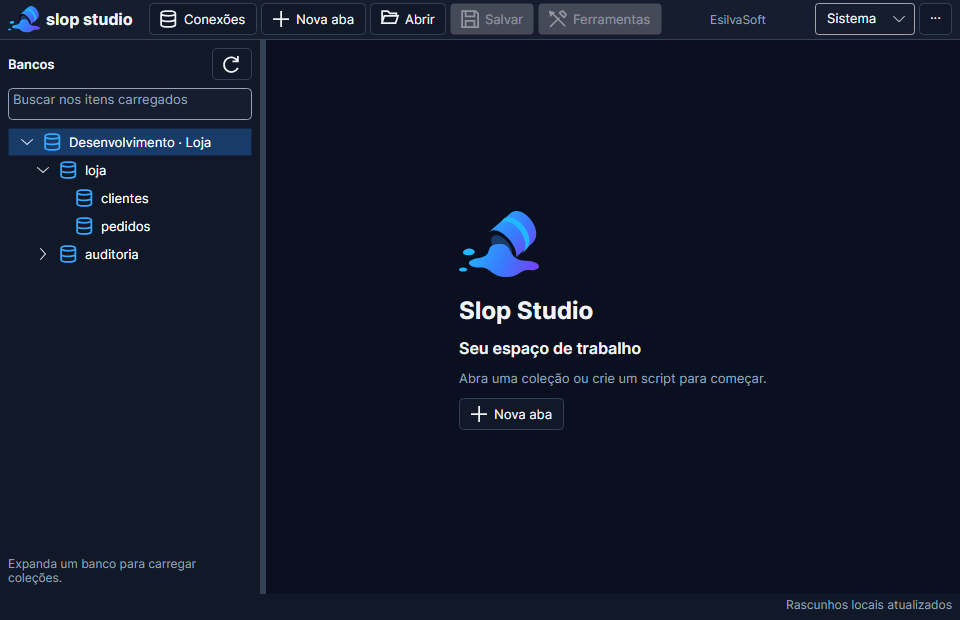

# Identidade visual — Slop Studio

Implementada em 10/09/2026. Nome de produto: **Slop Studio**. Nome técnico e título da janela: **EsilvaSoft.SlopStudio**. Código e assets próprios permanecem sob a licença MIT do repositório.

## Referências e conceito

As imagens originais [logo claro](ui/slopstudio-logo-claro.png), [logo escuro](ui/slopstudio-logo-escuro.png), [IDE clara](ui/ide-clara.png) e [IDE escura](ui/ide-escuro.png) são referências, não capturas da aplicação entregue. Foram preservadas sem alterações.

O símbolo transforma o recipiente inclinado e o líquido das referências em curvas vetoriais simples: corpo cilíndrico, abertura escura, aro ciano e poça azul/violeta. A simplificação elimina brilho e detalhes tridimensionais que se perderiam na barra de 40 unidades. O nome permanece texto legível, separado do símbolo.


## Assets entregues

Diretório: [Assets](../src/EsilvaSoft.SlopStudio.Desktop/Assets/Brand.axaml).

| Asset | Uso |
| --- | --- |
| [slop-symbol.svg](../src/EsilvaSoft.SlopStudio.Desktop/Assets/slop-symbol.svg) | Símbolo escalável com transparência |
| [slop-logo-light.svg](../src/EsilvaSoft.SlopStudio.Desktop/Assets/slop-logo-light.svg) | Assinatura horizontal sobre fundo claro |
| [slop-logo-dark.svg](../src/EsilvaSoft.SlopStudio.Desktop/Assets/slop-logo-dark.svg) | Assinatura horizontal sobre fundo escuro |
| slop-icon-{16,24,32,48,64,128,256,512}.png | Ícones transparentes em pixels físicos |
| [slop-studio.ico](../src/EsilvaSoft.SlopStudio.Desktop/Assets/slop-studio.ico) | Contêiner com sete tamanhos, 16 a 256; executável Windows e Window.Icon |
| [Icons](../src/EsilvaSoft.SlopStudio.Desktop/Assets/Icons/database.svg) | 15 SVGs de comandos, grade de 24, traço 1,75, cor herdada |
| Brand.axaml | Fonte vetorial do símbolo, gradiente e geometrias consumidas pelo Avalonia |

Ícones: banco, nova aba, abrir, salvar, ferramentas, atualizar, executar, cancelar, destino, histórico, exportar, código/opções, resultados, mensagens e alerta. Os botões mantêm rótulos em pt-BR, dicas, nomes acessíveis e comandos existentes. A cor do ícone acompanha o controle, inclusive o texto escuro do botão primário no tema escuro. Ícones desabilitados recebem opacidade reduzida.

## Regras de aplicação

- Gradiente #22B8FF → #397BFF → #7C3AED reservado ao símbolo; botões usam cores sólidas sem efeitos decorativos.
- Logotipo claro com texto #162033; escuro com texto #F1F5F9. SVGs mantêm texto editável com Inter e fallback sans-serif; a IDE usa Inter embarcada.
- Na barra: símbolo em 32 unidades, nome em 16 bold. No estado sem abas: símbolo em 80 e título em 24. Texto operacional continua em 13, metadados 12 e código 14 configurável.
- Preserve proporção e transparência. Área livre recomendada: 1/8 da altura do símbolo. Assinatura horizontal com subtítulo: largura mínima recomendada de 240; em locais menores use símbolo e nome, como na barra.
- Azul comunica ação e seleção; violeta destaca a identidade e os títulos selecionados. Verde, âmbar e vermelho continuam semânticos, acompanhados de texto.
- As paletas de referência permanecem em docs/ui. Os valores operacionais definitivos são os tokens do [design system](17-design-system-ui-ux.md), com ajustes de contraste. #2684FF não é usado como fundo com texto branco; #1B6EDC atende ao mínimo exigido. Metadados claros e cores de estado também preservam os tons acessíveis anteriores.
- Explorer, contexto por aba, execução explícita, cancelamento e persistência mantêm seus contratos. Os mockups não antecipam destaque sintático, tabela BSON ou novas ações.

## Geração e manutenção

O [gerador](../tools/BrandAssets/Program.cs) lê Brand.axaml e exporta SVG, PNG e ICO com SkiaSharp já transitivo no desktop, sem nova biblioteca no produto. Os assets gerados são mantidos no repositório, portanto o build normal não exige executar o gerador.

```powershell
dotnet restore tools/BrandAssets/BrandAssets.csproj --locked-mode
dotnet run --project tools/BrandAssets --no-restore -p:UsedAvaloniaProducts= -- F:/source/SlopDataAdimin
```

O último argumento é a raiz absoluta do checkout; substitua-o no Linux ou em outra pasta. Altere as geometrias em Brand.axaml e regenere. PNG/ICO representam o símbolo, enquanto as duas assinaturas SVG acrescentam nome e descritor. Nenhuma imagem de referência é recortada ou embutida como fundo da interface.

## Evidências e limites

Windows: restore travado, build sem avisos/erros e 244 testes NUnit aprovados. A suíte verifica contraste, geometria de editor/resultados, barra dentro da janela mínima, troca de tema, estado sem abas e carregamento do ícone. Capturas Headless/Skia: dois temas × três tamanhos × três escalas, mais modal, formulário, fonte 20 e estado vazio.




As prévias usam dados sintéticos. Esta revisão não foi revalidada no Linux: o Ubuntu disponível está sem SDK .NET compatível. O resultado Linux anterior pertence à baseline UI/UX, não a esta identidade. Ícone na barra de tarefas, gerenciador de janelas, instalação limpa, leitor de tela e diálogos nativos exigem homologação real; o ICO embutido não comprova sozinho a integração do shell. Empacotamento Linux com arquivo .desktop continua no escopo de distribuição UX-03.
