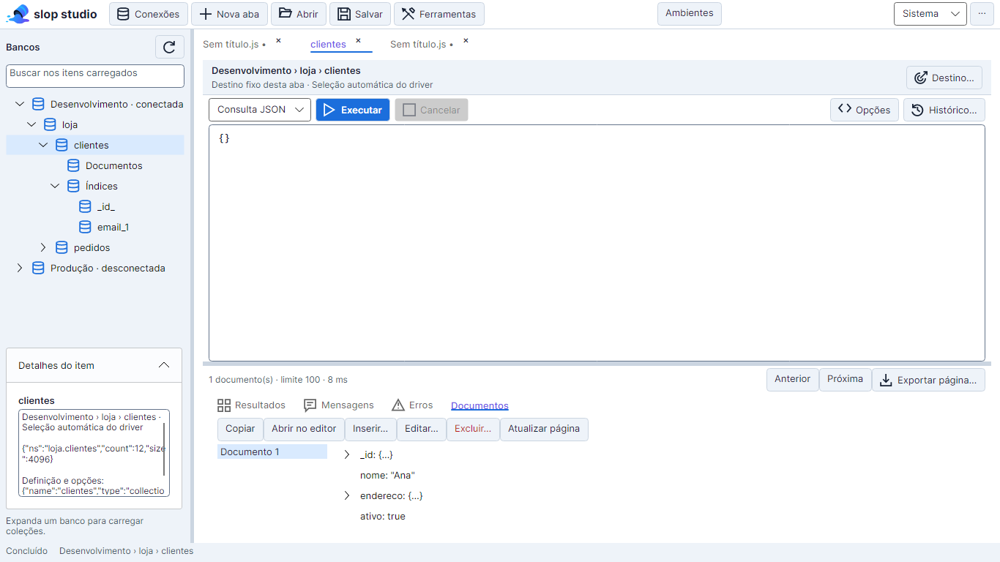
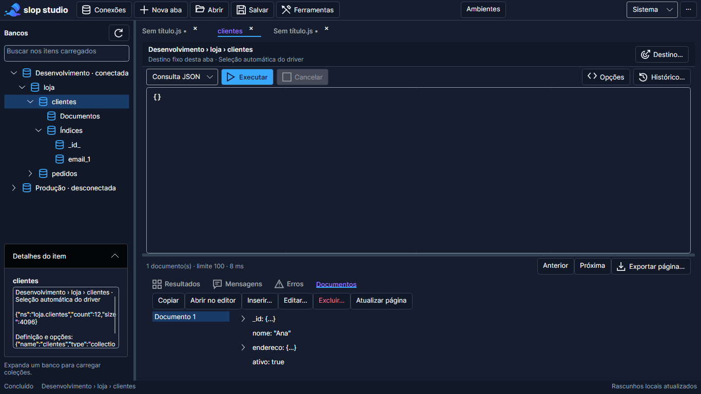

# Database Explorer

Revisão de 10/09/2026. O painel **Bancos** integra as conexões cadastradas, o editor e os ambientes existentes. Ele permanece parte do desktop .NET/Avalonia.

## Navegação

Todas as conexões cadastradas aparecem como raízes, inclusive desconectadas. Reiniciar recupera os perfis e rascunhos permitidos, sem conectar automaticamente. Expandir ou escolher **Conectar** carrega os bancos; expandir um banco carrega suas coleções. Expandir uma coleção apresenta **Documentos** e **Índices**; os índices são consultados somente ao expandir seu grupo ou usar **Ver índices**.

```text
Conexão · conectada / desconectada
 └ Banco
    └ Coleção
       ├ Documentos
       └ Índices
          ├ _id_
          └ índice customizado
```

**Atualizar** no menu de contexto opera sobre o nó indicado. Em um índice, atualiza o grupo de índices; na coleção, preserva os grupos e atualiza os detalhes. Nós que continuam existindo conservam a identidade e expansão durante refresh do pai; itens removidos são invalidados. Respostas atrasadas de nós desconectados são descartadas. A busca considera somente a estrutura já carregada.

Enter ou duplo clique em coleção/Documentos abre ou ativa uma aba de consulta. Não executa uma consulta automaticamente. A seleção carrega somente metadados no painel de detalhes; nunca muda o destino das abas abertas. **Desconectar** bloqueia novas execuções dessas abas e invalida a árvore carregada. Operações já iniciadas mantêm seus próprios cancelamentos e podem ser interrompidas na aba; desconexão não promete rollback.

## Menus e detalhes

Botão direito abre ações do item apontado. Shift+F10 ou a tecla de menu abre as ações do item selecionado pelo teclado.

| Item | Ações |
| --- | --- |
| Conexão | Conectar, desconectar, atualizar, shell/script, detalhes/topologia, informações da instância e ferramentas |
| Banco | Atualizar, estatísticas nos detalhes, criar coleção, shell/script e scripts administrativos |
| Coleção / Documentos | Abrir consulta/documentos, ver índices, estatísticas e definição, ferramentas de documentos/índices e scripts CRUD |
| Índices | Atualizar a lista e acessar as ferramentas de índices |
| Índice | Definição completa, script equivalente de criação, remover com confirmação e copiar definição |

**Detalhes do item** é uma região recolhível com rolagem independente. Conexões mostram destino, roteamento, perfil e resposta `hello`; **Informações da instância** consulta `serverStatus`. Bancos exibem `dbStats`; coleções exibem `collStats` (incluindo contagem/tamanho quando fornecidos) e a definição retornada por `listCollections`, incluindo opções e validadores. Índices mostram sua definição completa: ordem dos campos, direção/tipo, unique, sparse, TTL, filtro parcial, collation e opções adicionais. Permissão insuficiente ou falha aparece na região, sem iniciar consultas de documentos.

## Instâncias e roteamento

No nó de conexão, **Instâncias / topologia…** atualiza os membros anunciados pelo servidor e oferece **Seleção automática** ou **Usar instância**. Primary, membros e árbitros são identificados a partir de `hello`; a resposta não é um monitor contínuo de saúde e um membro anunciado pode estar indisponível. Árbitros não são destinos de documentos. Load balancing e topologias mongos sem membros de dados selecionáveis conservam o roteamento do driver, com explicação na interface.

Escolher um membro cria um contexto de execução explícito, sem modificar a URI persistida. O adaptador usa `directConnection=true` e leitura `nearest` para consultar o membro escolhido; escritas dependem do papel/permissões do servidor e podem ser rejeitadas em um Secondary. Autenticação, replica set e TLS da configuração são mantidos. Em URIs SRV, a resolução DNS/TXT ocorre de forma assíncrona antes da aplicação do host explícito, pelo [resolver do driver](https://mongodb.github.io/mongo-csharp-driver/3.10.0/api/MongoDB.Driver/MongoDB.Driver.MongoUrl.ResolveAsync.html).

O destino e o modo de roteamento aparecem na aba e nas confirmações. Abas anteriores conservam seu destino, ficam desconectadas quando a árvore troca de instância e só mudam por ação explícita em **Destino…**. O host explícito faz parte do rascunho, mas não a URI nem credenciais. Reinício nunca reconecta sozinho. Salvar ambientes invalida o explorer; cada operação já iniciada conserva os valores de `ENV.get()` capturados antes dos awaits.

## Documentos

Uma coleção abre o editor de consulta existente. Escreva o filtro, ajuste sort/projection/limit nas opções disponíveis e execute. **Anterior**, **Próxima** e **Atualizar página** reutilizam o contexto da aba; o limite continua entre 1 e 1000. A aplicação não materializa a coleção inteira.

**Resultados** alterna entre **JSON** formatado e **Árvore** de conjuntos, documentos, objetos e arrays, com menu por documento para visualizar, editar a cópia ou copiar ([guia](14-guia-de-uso.md#resultados-json-e-árvore)). **Documentos** apresenta a página como lista e os campos do documento selecionado em árvore, incluindo arrays e representações Extended JSON; a seleção é compartilhada com Resultados. A árvore expande estruturas sob demanda, sem converter Int64, Decimal128, ObjectId ou UUID em tipos de precisão inferior.

- **Copiar** usa o Extended JSON do documento selecionado.
- **Abrir no editor** cria uma aba Console com `EJSON.parse(...)` e uma expressão de resultado. Nada é executado. Essa aba contém dados de resultado e fica excluída da recuperação automática; o usuário pode salvá-la em arquivo explicitamente.
- **Inserir…** abre um editor de novo documento.
- **Editar… / Excluir…** exigem `_id` na página. Antes de apresentar a confirmação, a aplicação relê o documento completo por `_id`, para que uma projeção parcial não cause perda de campos durante substituição. A execução usa `_id` e comparação do documento completo revisado como precondição; se ele mudou ou desapareceu, informa conflito e exige nova leitura.
- A janela mantém o contexto fixo e exige confirmação antes de enviar a operação. Cancelamento não afirma reversão. Depois do sucesso, **Atualizar página** permite consultar o estado atual.

Ferramentas existentes continuam disponíveis pelo menu de contexto para updates por operadores/pipeline, exclusão de múltiplos documentos e inserção em lote. Exclusão múltipla informa explicitamente que afeta todos os correspondentes ao filtro. Proteções de somente leitura, confirmações de remoção de banco/coleção e bloqueio do índice `_id_` permanecem ativos.

## Scripts e índices

O menu **Gerar script CRUD** oferece Find, Insert, Update, Delete, Create Index e ações administrativas. O banco vem do contexto da aba Console; a coleção usa literal serializado em `db.getCollection()`, aceitando espaços, pontos e aspas sem criar código executável a partir do nome. Os scripts são modelos para revisão; updates/deletes incluem um `_id` de exemplo para substituir, no modo de identificador da IDE e na representação UUID da conexão: `ObjectId("000000000000000000000000")` em ObjectId, `UUID("00000000-0000-4000-8000-000000000000")` (ou `CGUUID`/`JUUID`/`GUUID`) em UUID v4 e, em Standard, o ObjectId com a alternativa UUID em comentário. Gerar não executa, inclusive em perfis somente leitura.

O script de um índice existente conserva chaves e opções em Extended JSON. Campos internos de catálogo, como `v`, `ns` e `buildUUID`, não entram nas opções de recriação. A interface gráfica de criação/remoção é acessível em **Criar / remover índices…**. Remover um índice na árvore exige confirmação com conexão, banco, coleção e nome exatos.

## Arquitetura e validação

`ExplorerNodeViewModel` mantém carga/expansão/cancelamento por nó. `ExplorerDetailsViewModel` descarta respostas de seleções anteriores. `WorkspaceViewModel` coordena conexão e abas. `ResultDocumentViewModel` oferece inspeção de JSON sem driver; `DocumentMutationViewModel` captura a operação confirmada. Views cuidam de menus, foco, clipboard e janelas.

`IExplorerMetadataService` fornece topologia, definições de índices e coleção; seu adaptador reutiliza `IMongoWorkspaceService`. `ConnectionRouting` e `OperationEnvironment` ficam na infraestrutura, compartilhados pelo driver e runner mongosh. A persistência continua usando o proprietário LiteDB registrado em DI; os campos opcionais de destino/privacidade são aditivos ao snapshot versão 1.

Evidência automatizada inclui árvore lazy, múltiplas raízes, refresh/expansão, resposta atrasada após desconexão, troca de seleção, índices compostos, roteamento com auth/TLS, escaping de scripts, UUID/Int64 e edição de projeção com conflito. O teste de UI abre o menu real, gera script sem executar e renderiza árvore/documentos nos dois temas, três tamanhos e três escalas. Contagens e logs finais estão na [matriz](15-matriz-de-validacao.md). MongoDB/mongosh reais, DNS/topologias reais, leitor de tela e validação nativa Linux continuam sendo homologações separadas; testes simulados não as substituem.

## Prévias com dados sintéticos




