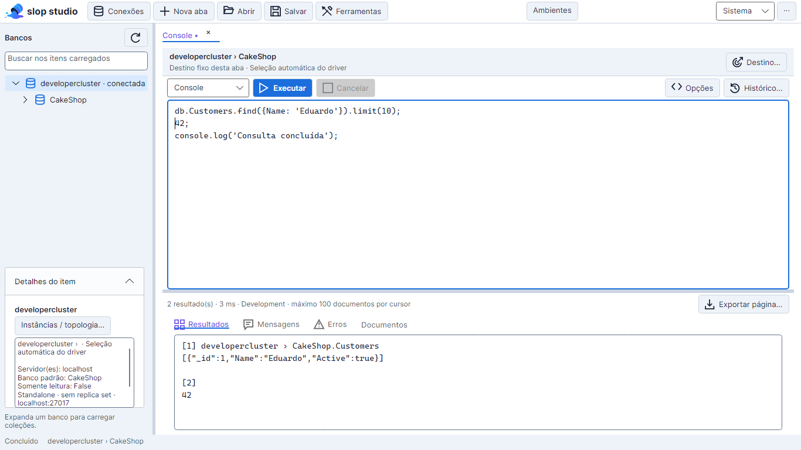
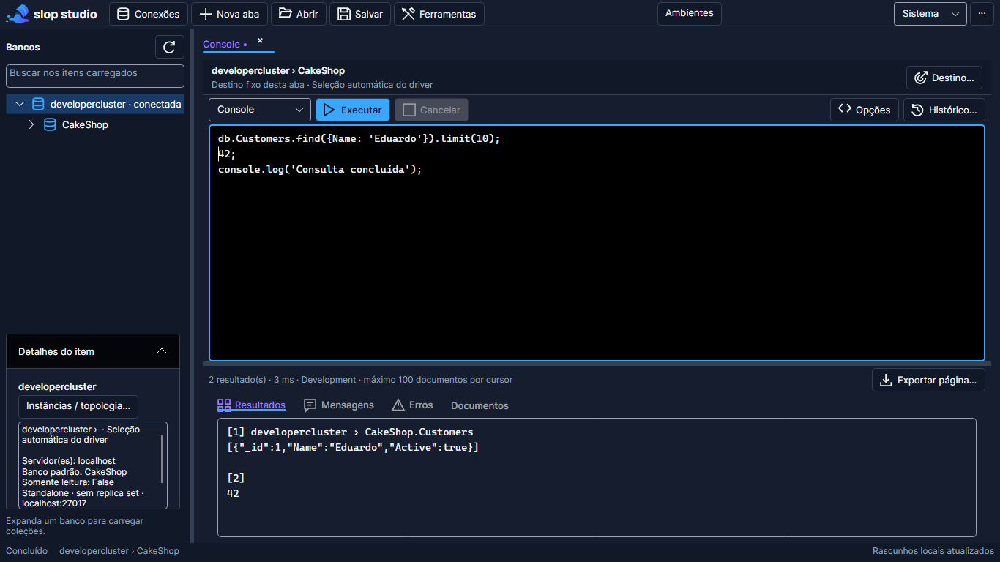

# Console JavaScript

O **Console** substitui **Consulta JSON** como modo principal do editor. Usa um runtime próprio com Jint e o driver .NET; não requer mongosh. O modo **Script**, que delega ao executável `mongosh`, **está desativado no seletor de modos** desde 18/09/2026: o requisito foi para o [backlog](backlog/bkl-03-script-engine-entre-conexoes.md). Sua implementação, proteções e limites permanecem íntegros em `MongoshScriptExecutionService` e continuam cobertos por testes; apenas não há como selecioná-lo na interface. **Console é o único modo oferecido.** Este documento descreve os dois executores: o Console, ativo, e o modo Script, preservado e desativado.

## Destino e execução

O cabeçalho mostra **conexão › banco**. **Destino…** permite escolher outra conexão aberta e outro banco. `db` representa esse banco, sem exigir coleção fixa. Abrir uma coleção no Explorer cria `db.getCollection("colecao").find({}).limit(100)`, sem executar. Mudar a seleção do Explorer não redireciona abas existentes.

- **F5 / Executar:** script completo.
- **Ctrl+Enter:** seleção existente; sem seleção, statement no cursor identificado pelo parser JavaScript. Erro de sintaxe não causa execução do texto completo como fallback.
- **Ctrl+Espaço:** sugestões contextuais assíncronas. O resultado é descartado se texto ou destino mudar.
- **Cancelar / Escape:** cancela a execução daquela aba e propaga o token ao driver. Não desfaz operações já enviadas. Escape numa confirmação fecha somente a modal.

Cada execução cria um escopo JavaScript novo. Variáveis vivem durante o script, sem estado implícito herdado da execução anterior. Para executar um statement que dependa de `const` anteriores, selecione também suas declarações ou execute o script completo.

```javascript
db.Customers.find({ Name: "Eduardo" })

const customers = db.getCollection("customer-history")
customers.find({ Active: true }).sort({ Name: 1 }).skip(20).limit(20).project({ Name: 1 })
```

## Múltiplas conexões

```javascript
getConnection("developercluster")
    .getDatabase("CakeShop")
    .getCollection("Customers")
    .find({ Name: "Eduardo" })

ConnectionPool.developercluster.CakeShop.Customers.find({ Name: "Eduardo" })

ConnectionPool["Production Cluster"]["Company-Db"]["customer-history"].find({})

const dev = getConnection("Development").getDatabase("CompanyDb").getCollection("Customers")
const prod = getConnection("Production").getDatabase("CompanyDb").getCollection("Customers")
const devCustomers = dev.find({}).limit(10)
const prodCustomers = prod.find({}).limit(10)
devCustomers
prodCustomers
```

`ConnectionPool` tem essa grafia; `ConnectionPull` e aliases PascalCase não são APIs. Nomes de conexão são exatos e sensíveis a maiúsculas. Nomes duplicados geram erro de ambiguidade. Use os métodos explícitos para nomes que coincidam com membros da API, como uma coleção chamada `getCollection`.

Perfis e valores de ambiente são capturados para a execução. Clientes são criados quando utilizados e reutilizados durante o script; uma conexão extra não precisa estar expandida no Explorer. A conexão principal mantém seu destino explícito de instância; outras conexões usam a configuração cadastrada. Falha de uma URI não utilizada não impede consultar outra conexão.

## API inicial

| Objeto | Métodos |
| --- | --- |
| Banco | `getCollection`, `getSiblingDB`, `getName`, `createCollection`, `dropDatabase`, `stats` |
| Leitura de coleção | `find`, `findOne`, `countDocuments`, `estimatedDocumentCount`, `distinct`, `aggregate`, `stats` |
| Escrita de coleção | `insertOne`, `insertMany`, `updateOne`, `updateMany`, `replaceOne`, `deleteOne`, `deleteMany`, `drop` |
| Índices | `createIndex`, `dropIndex` |
| Cursor | `sort`, `skip`, `limit`, `project`, `toArray` |
| Opções adicionais de find | `hint`, `collation`, `comment`, `batchSize`, `maxTimeMS` |

`find()` e `aggregate()` retornam cursores lazy: atribuir um cursor a uma variável não consulta documentos. `toArray()` ou uma expressão de cursor no nível superior materializa uma página limitada. `limit(0)` usa o limite de segurança, nunca significa carregar tudo.

```javascript
db.Orders.aggregate([
    { $match: { Status: "Completed" } },
    { $group: { _id: "$CustomerId", Total: { $sum: "$Total" } } }
])

db.Customers.updateMany({ Active: false }, { $set: { Archived: true } })
db.Customers.deleteOne({ _id: ObjectId("64b000000000000000000001") })
```

O Console não implementa toda a API do mongosh: não expõe `runCommand`, clientes CLR, arquivos, rede JavaScript ou imports .NET. `$out` e `$merge` são rejeitados no cursor de leitura, inclusive em pipelines aninhados. Opções de update suportadas: `upsert` e `arrayFilters`; replace suporta `upsert`. APIs novas devem passar pelo contrato de operação e pelo adaptador, mantendo validação explícita.

## Resultados, tipos e mensagens

Expressões no nível superior produzem resultados numerados na aba **Resultados**, em **JSON** formatado ou **Árvore** agrupada por expressão ([guia](14-guia-de-uso.md#resultados-json-e-árvore)). Documentos de find, findOne e aggregate conservam a ordem de campos devolvida pelo driver; se o script alterar o valor antes de exibi-lo, vale a saída do script. Projeções são sinalizadas e impedem abrir a cópia para edição. A aba **Documentos** permite escolher o conjunto e inspecionar/copiar/exportar documentos. Resultados de coleções mostram sua conexão e namespace de origem; editar/excluir relê o documento completo nesse destino e usa a precondição contra conflito existente.

`console.log`, `console.warn` e `console.error` escrevem em **Mensagens**, separadamente dos resultados e dos erros que interrompem a execução. Uma falha conserva os resultados já produzidos; não há rollback de escritas anteriores.

Extended JSON conserva Int64, Decimal128, ObjectId e UUIDs/subtipos binários. Há `EJSON.parse/stringify`, `ObjectId(texto)`, `NumberLong(texto)`, `NumberDecimal(texto)`, `ISODate(texto)` e os construtores `UUID`, `CGUUID`, `JUUID` e `GUUID`, que exigem texto e também são aceitos dentro de `EJSON.parse`, assim como `ObjectId("…")`. Datas exibidas usam `ISODate("yyyy-MM-ddTHH:mm:ss.fffZ")`: o `Z` explicita UTC, pois BSON conserva o instante em milissegundos e não o fuso original. Resultados e Documentos exibem ObjectId como `ObjectId("…")` e UUIDs conforme a preferência da conexão de origem; o modo de identificador não altera o tipo gravado; veja [UUID/GUID](06-editor-bson-e-uuid.md#representação-configurável--implementada-em-11092026). Datas e expressões regulares JavaScript são serializadas para BSON. Use texto para números fora da precisão segura do JavaScript. Int64 grande usa BigInt quando convertido para aritmética; Decimal128 exige conversão explícita e permanece exato no transporte.

## Ambientes, segurança e histórico

## Assistente IA do Console (removido em 25/09/2026)

> Painel removido pela [ADR-055](10-decisoes-arquiteturais.md#adr-055--remoção-do-assistente-ia-por-aba-25092026); o chat da aba é o **Agente IA** (Ctrl+Shift+A). O texto abaixo é histórico.

O painel **Assistente IA** fica fixo à direita de cada aba e mantém conversa, cancelamento e proposta separados por `WorkspaceTabViewModel`. O autocomplete preditivo continua sendo uma entrada independente: ele sugere continuações curtas durante a edição e pode ser aceito com Tab; o chat recebe instruções mais longas.

Cada solicitação envia um snapshot transitório com `instruction`, `header`, `editorContent`, `language`, `dialect`, `database`, `collection`, `operationType` e `additionalContext`. O snapshot é limitado e não é persistido. A resposta contém explicação, código proposto e diff. A proposta fica somente na prévia até **Aplicar proposta**; se o editor, destino ou modo mudar durante a análise, a resposta é descartada.

Escritas, exclusões, alterações em massa, `drop`, `bulkWrite`, `$out` e `$merge` recebem alerta textual e exigem confirmação adicional. Confirmar a aplicação insere o código no editor, sem executar a consulta, alterar a seleção do Explorer ou redirecionar outra aba. A substituição usa o caminho normal do editor para manter foco e desfazer quando suportado pelo controle.

Estados visíveis do painel: análise em andamento, erro, cancelamento, ausência de contexto, resposta vazia e proposta pronta. O contrato `IAiChatService` permite conectar um provedor conversacional; o serviço local incluído oferece a transformação segura demonstrada mesmo sem modelo de chat instalado.

```javascript
db.Customers.find({ CustomerId: ENV.get("CUSTOMER_ID") })
```

`ENV.get()` usa o ambiente ativo capturado antes da execução, com fallback de processo compatível. URIs continuam aceitando credenciais diretas ou referências opcionais; nenhum secret é migrado automaticamente. Valores resolvidos e URIs não são expostos nos objetos de conexão do Console.

Cada escrita exige confirmação do destino efetivamente chamado, inclusive uma conexão acessada por variável. Perfis somente leitura bloqueiam escrita antes do driver. Filtros vazios para update/replace/delete, destinos de sistema e remoção de `_id_` ou de todos os índices permanecem protegidos. Auditoria registra intenção e conclusão sem payloads. Cancelamento de confirmação não envia a operação.

O histórico em `consoleHistory` versão 1 usa o mesmo proprietário LiteDB. Guarda timestamp, conexão/banco principais, ambiente, script original, duração, status, destino explícito e IDs das conexões usadas. Mantém as 500 execuções mais recentes; a preferência de persistência é visível em **Histórico** e **Opções**. Falhas de gravação são exibidas. Não grava resultados, URI ou valores resolvidos de ENV; texto digitado pode conter dados sensíveis. Abas abertas a partir de resultados continuam excluídas do histórico automático e dos rascunhos.

Histórico abre uma nova aba sem executar nem ativar o ambiente antigo. Rascunhos/consultas salvas do antigo modo JSON são convertidos para Console preservando filtro e opções; rascunhos convertidos ficam alterados, desconectados após recuperação. O arquivo original não é sobrescrito automaticamente.

## Limites e arquitetura

Padrões: 100 documentos por cursor, máximo configurável 1000; 30 segundos por execução, máximo 300 segundos. Até 100 resultados e 8 MB de saída total; página BSON limitada a 4 MB; mensagens até 1 MB, script até 1 MB e insertMany até 1000 documentos. `toArray()` também respeita os limites. Jint limita instruções, recursão e alocações; seus limites são cooperativos, não substituem isolamento de processo contra código hostil. O runner mongosh separado mantém seus limites próprios.

`ConsoleRuntime` interpreta JavaScript em thread de trabalho; `ConnectionProxy`, `DatabaseProxy`, `CollectionProxy` e `CursorProxy` são closures/proxies JavaScript que encaminham operações tipadas a `IConsoleDatabaseSession`. O adaptador `ConsoleDatabaseSession` valida novamente e usa MongoDB.Driver, tokens e clientes por execução. `ENV` e `console` são objetos congelados. O parser Acornima identifica statements e expressões; não há divisão ingênua por ponto e vírgula.

Dependências adicionadas: [Jint 4.16.0](https://github.com/sebastienros/jint), BSD-2-Clause, e Acornima 1.7.0, BSD-3-Clause. EsilvaSoft.SlopStudio continua MIT. [Avisos de terceiros](../THIRD-PARTY-NOTICES.md).

## Verificação

Testes cobrem interpretação JavaScript, as três sintaxes de acesso, duas conexões, cursores, ambiente estável, opt-out de histórico, cancelamento, proteção de escrita, escaping, autocomplete assíncrono, conversão de rascunho, atalhos e confirmação real Avalonia. O teste `ConsoleMongoIntegrationTests` inicia dois processos MongoDB Community descartáveis ligados apenas a `127.0.0.1`, sem serviços instalados ou conexões do usuário. Nesta revisão foi usado MongoDB 8.0.30 Windows, ZIP oficial, SHA-256 `e2f8c977faadd15572fda5d16bfd9370a017504e3081f76af504ec69fc7bf509`.

Para repetir a integração, defina `SLOP_CONSOLE_MONGOD` para o executável MongoDB Community ou disponibilize-o em `.cache/console-mongo/server`. Sem binário, o teste registra integração ignorada; isso não é aprovação real. Execute `dotnet test EsilvaSoft.SlopStudio.slnx --no-build --no-restore --filter FullyQualifiedName~ConsoleMongoIntegrationTests`. Dados e logs sintéticos ficam em `console-real-*` no diretório de execução dos testes; processos são encerrados ao terminar.

PNGs reais nos dois temas, três tamanhos e três escalas ficam em `ui-evidence/console-*.png`. Contagens e evidência final: [matriz](15-matriz-de-validacao.md). Linux nativo, leitor de tela, TLS/autenticação e topologias distribuídas não são provados pela fixture standalone local.




