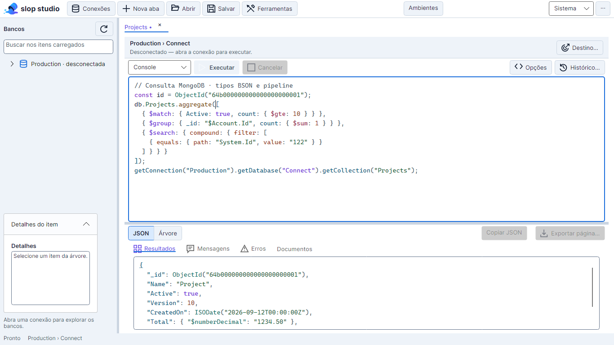
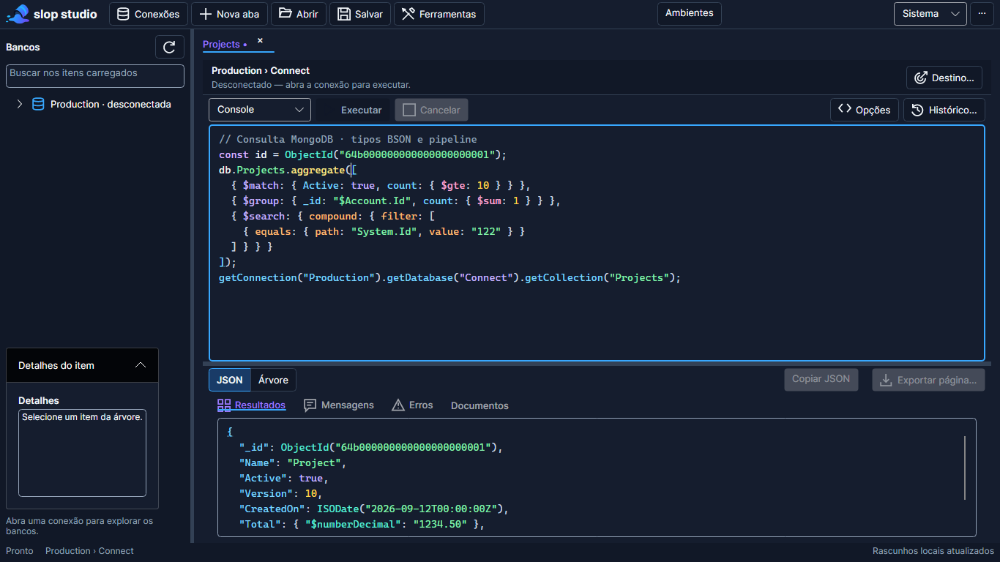

# Syntax highlighting MongoDB

Registro da implementação de 12/09/2026, com atualização documental em 13/09/2026. Escopo: JSON, Extended JSON/BSON textual, JavaScript usado no Console/mongosh, Query API, pipelines, Atlas Search e DSL local. Não adiciona linguagens genéricas, dependências, execução ou validação MongoDB.

## Relação com o autocomplete tradicional

O `MongoLexer` é compartilhado pelo highlighting e pelo autocomplete tradicional; a lista usa `Ctrl+.` com `Ctrl+Espaço` como alias e não reinterpreta o texto com um segundo lexer. A captura de documento do editor usa `AvaloniaTextSnapshot`; a medição completa de UI por tecla permanece pendente.

## Arquitetura

✅ O checkout atual usa [MongoTextEditor](../src/EsilvaSoft.SlopStudio.Desktop/SyntaxHighlighting/MongoTextEditor.cs), derivado de AvaloniaEdit.TextEditor, com documento, seleção, undo e linhas visuais do AvaloniaEdit. LongLineElementGenerator trata linhas longas e a classificação semântica é aplicada pelo adaptador. As descrições de TextBox/TextPresenter e medições de 12/09 nas seções históricas abaixo correspondem à implementação anterior; não homologam a migração atual. 🚧 Folding, acessibilidade e performance integral exigem validação própria. Consolidação na v0.6.0 e estabilidade na v1.0.0; ver [inventário](24-inventario-roadmap.md).

`Autocomplete.Core/SyntaxHighlighting` contém contratos sem dependência visual: `ISyntaxHighlightingService`, `SyntaxHighlightingService`, `SyntaxSnapshot`, `SyntaxToken`, `SyntaxContext`, `SyntaxNamespace`, `SyntaxLanguage`, `SyntaxTokenType`, `MongoSyntaxVocabulary` e `SyntaxHighlightingOptions`. Desde a ADR-040 (17/09/2026), esses tipos vivem em `EsilvaSoft.SlopStudio.Autocomplete.Core` (antes em `Application/SyntaxHighlighting`); ver [ADR-040](10-decisoes-arquiteturais.md). O serviço é sem estado compartilhado. Cada presenter mantém seu snapshot e cancelamento próprios, separados dos cancelamentos de consulta e autocomplete. Texto, linguagem e metadados são capturados antes dos awaits. Uma edição, troca de contexto ou detach cancela a classificação anterior; respostas antigas não substituem o texto atual.

Os modos Json, MongoScript, Aggregation e AtlasSearch compartilham o lexer e variam na classificação contextual. Não foram criadas quatro gramáticas duplicadas. `SyntaxStyles` transforma os tokens em recursos do tema e sobrepõe seleção e par de delimitadores. `SyntaxTextBlock` usa o mesmo lexer nos valores da árvore e nos campos da aba Documentos; a expansão continua no modelo lazy existente.

## Tokens e vocabulário

| Grupo | Tokens |
| --- | --- |
| Texto | Default, PropertyName (`Syntax.Property`), String, Number, Boolean, Null |
| Script | Identifier, Keyword, Function, Method, Operator, Punctuation, Comment, Regex |
| MongoDB | MongoOperator, MongoStage, MongoFunction, MongoType, AtlasSearchOperator |
| Contexto conhecido | Connection, Database, Collection, Index |
| Estados e adornos | Error, Warning, Success, GhostText, MatchingBracket, UnmatchedBracket, SearchMatch |

Strings simples/duplas e templates, escapes, comentários de linha/bloco e regex são reconhecidos sem executar código. O lexer conserva estados de strings e comentários entre linhas. Propriedades recebem estilo diferente de valores, inclusive propriedades entre aspas. Números negativos, decimais e expoentes não são convertidos para tipos numéricos; os dígitos de Int64/Decimal128 permanecem intactos. Interpolação `${...}` dentro de templates é apresentada como parte da string, sem análise de expressões embutidas.

`MongoSyntaxVocabulary` centraliza Functions, Operators, AggregationStages, AtlasSearchOperators, ExtendedJsonTypes, Keywords, DslFunctions e DslRoots. Inclui operações find/findOne/aggregate, contagem, distinct, CRUD, bulkWrite e índices; operadores conhecidos e fallback visual para `$...`; stages como `$match`, `$group`, `$lookup`, `$facet`, `$merge` e `$out`. `$set`/`$unset` em update são operadores; em um pipeline são stages. `$sum` permanece operador.

Os construtores ObjectId, ISODate, NumberLong, NumberInt, NumberDecimal, UUID/CGUUID/JUUID/GUUID, BinData, Timestamp, MinKey e MaxKey usam MongoType. Wrappers como `$oid`, `$date`, `$numberLong`, `$numberDecimal`, `$binary` e `$regularExpression` também. O texto original não é desserializado nem normalizado pelo highlighting.

`$search` e `$searchMeta` são stages. Dentro de sua estrutura, compound/must/mustNot/should/filter, text/autocomplete/equals/range/near/phrase/regex/wildcard/exists/embeddedDocument/moreLikeThis/queryString e propriedades auxiliares recebem AtlasSearchOperator. Fora desse contexto, campos como `text` e `filter` continuam propriedades comuns. Esse reconhecimento é visual e tolerante a texto incompleto, não um parser ou validador de Atlas Search.

## DSL e metadados

A DSL executável usa `ConnectionPool` e `getConnection(...).getDatabase(...).getCollection(...)`. O alias textual `ConnectionPull` e a grafia `GetDatabase` são reconhecidos visualmente para os exemplos; isso **não** acrescenta aliases ao runtime. A execução continua aceitando apenas os comandos documentados no [Console](20-console.md).

O workspace fornece nomes dos perfis cadastrados e namespaces já carregados no explorer, com conexão/banco/coleção/índice separados. A aba acrescenta seu próprio destino. Nomes recebem cor semântica somente em posições de namespace e quando confirmados pelo snapshot de metadados; uma string de documento que coincida com o nome de uma conexão permanece String. Nomes iguais em bancos diferentes são filtrados pelo caminho conhecido. Carregar metadados notifica as abas, sem executar consultas e sem mudar seus destinos. Não se enviam URI, credenciais, valores de ENV ou dados de documentos ao lexer como contexto de namespace.

Não há busca de metadados por tecla. Um nome desconhecido mantém a classe lexical normal. O reconhecimento não resolve variáveis JavaScript arbitrárias, aliases locais, acesso dinâmico calculado ou nomes escapados como um interpretador completo faria.

## Superfícies integradas

- Console, Script, Agregação e scripts gerados de conexão/banco/coleção, CRUD e índices: editor compartilhado da aba, selecionando o modo da aba.
- Input, opções BSON de projeção/sort/hint/collation e Resultados JSON: mesmo presenter, modo Json.
- Modal de visualização e modal de edição de documento: modo Json; somente leitura e confirmação de gravação continuam intactas.
- Árvore de resultados e campos de Documentos: mesmo lexer para valores, preservando a expansão existente.
- Ferramentas: filtros, explain, distinct, pipelines e resultados, edição/validação de documentos, bulk insert, chaves/opções/resultados de índices e definições de views/coleções.
- Detalhes textuais do explorer: inclui definições JSON de índices.

URIs, senhas, nomes simples de formulários, mensagens operacionais e relatórios de importação/exportação não são tratados como scripts. Não existem editores novos só para corresponder a nomes conceituais da especificação: os scripts gerados reutilizam a aba existente.

## Temas, autocomplete e delimitadores

Todas as cores estão nos ThemeDictionaries Light/Dark de `App.axaml`, sob `Syntax.*`. Os controles não fixam cores. `SyntaxStyles.ResourceKey` mapeia PropertyName para `Syntax.Property`; demais nomes correspondem ao enum. A mudança de tema invalida o layout dos presenters abertos e reutiliza os tokens; não requer reabrir aba, recarregar resultados ou reconectar. As paletas têm testes de contraste de texto de pelo menos 4,5:1 sobre PanelBackground nos dois temas.

Ghost text conserva o documento sem alterações, usa `Syntax.GhostText` e projeta prefixo/sufixo com o mesmo snapshot de tokens quando disponível. Aceitar Tab continua sendo uma edição normal e recebe a classificação atualizada. Escape, Ctrl+Espaço, F6 e cancelamento isolado seguem os contratos anteriores. O vocabulário é público para reutilização futura pelo autocomplete; não substitui nesta entrega suas regras de sugestões.

Os pares `()`, `{}` e `[]` são indexados fora de strings, comentários e regex. Ao posicionar o cursor junto de um delimitador, ambos os membros recebem MatchingBracket e sublinhado; um delimitador sem par recebe UnmatchedBracket e sublinhado. Esses adornos não prometem validade sintática. SearchMatch tem recurso reservado; não foi criado um subsistema de busca nesta entrega.

## Documentos extensos

As decisões internas ficam em `SyntaxHighlightingOptions`: debounce de 80 ms, destaque integral até 64 Ki caracteres, até 12.000 spans visuais por layout, cache de até 100.000 linhas e contexto estrutural limitado a 512 níveis. São orçamentos de apresentação, não limites que removem conteúdo ou alteram consulta/exportação.

A tokenização roda em Task de trabalho e verifica cancelamento. O cache compara texto e estado de entrada por linha, alinha o sufixo depois de inserções/remoções e reutiliza linhas até mesmo após deslocamento. Alterações de aspas/comentários propagam o estado nas linhas seguintes. Construir o índice de linhas e pares ainda percorre o snapshot no worker; não se promete atualização sublinear de toda a estrutura.

Acima de 64 Ki caracteres, só se criam spans para as linhas do viewport com margem. O índice de linhas evita varrer o documento na UI, e busca binária localiza o primeiro token visível. Texto sem spans usa Syntax.Default e continua disponível para edição/cópia. Valores de árvore têm classificação síncrona limitada ao mesmo orçamento de caracteres, sobre a apresentação já limitada da árvore.

**Limite do componente:** o TextBox nativo ainda mede o documento inteiro; esta implementação não virtualiza seu armazenamento nem seu layout. A proteção evita retokenização integral e criação de spans ilimitados na UI, mas não garante latência constante para arquivos arbitrariamente grandes, uma linha gigantesca ou milhões de linhas. A árvore lazy continua sendo a alternativa existente para explorar resultados extensos. Folding textual permanece fora do componente atual; o highlighting não interfere em collapse/expand da árvore.

## Extensão e validação

Para acrescentar função, operador, stage ou tipo, altere o conjunto correspondente de `MongoSyntaxVocabulary` e adicione um cenário de classificação. Para nova classe visual, adicione SyntaxTokenType e recursos Light/Dark, mantendo os testes de contraste. Novos campos de código aderem a `Classes="syntax"` e `SyntaxSettings.Language`; normalmente também usam a classe `code`. Não copie lexer ou listas de palavras para views.

`SyntaxHighlightingTests` cobre JSON/Extended JSON, exemplos MongoDB, Atlas contextual, DSL com e sem metadados, índices, delimitadores, cancelamento e reutilização de cache com comentários multilinha. `SyntaxHighlightingUiTests` cobre troca de tema sem retokenização, contraste, seleção, undo, documento extenso, cancelamento de trabalho obsoleto e viewport. Os PNGs reais ficam em `ui-evidence/syntax-*.png`: workspace e modal de documento nos dois temas, três tamanhos e escalas 100/150/200%. Regressões de autocomplete, resultados e demais jornadas continuam na suíte existente. Evidência consolidada na [matriz](15-matriz-de-validacao.md).

Headless/Skia não comprova IME nativo, leitor de tela, Linux ou MongoDB/mongosh real. O highlighting não muda permissões, auditoria, precondições de escrita, snapshots de sessão ou bytes BSON.

## Prévias

