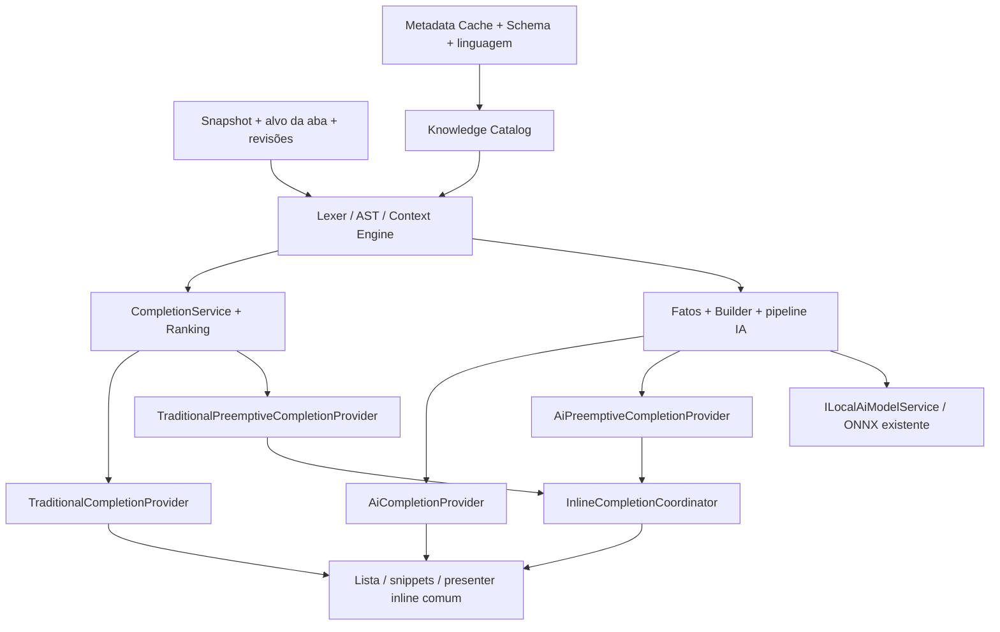

# Autocomplete MongoDB — arquitetura e plano revisados

**Revisão: 15/09/2026 · Código analisado: `b082d4a`.** Fase 1: base implementada, aceite parcial. Fases 2–5: planejamento; nenhum provider novo ou atalho foi implementado nesta revisão.

## Resultado da revisão

O catálogo, cache, schema, métricas e benchmarks já existem. O editor ainda usa o menu Ctrl+Espaço e ghost lexical/IA legados. A [nova análise](current-state.md) substitui o inventário anterior à Fase 1 e inclui a inferência de agregação já entregue.

Quatro modalidades, duas formas de geração e infraestrutura comum:

| Modalidade | Disparo | Geração | Apresentação |
| --- | --- | --- | --- |
| Traditional Manual Completion | Ctrl+. / Ctrl+Espaço | Determinística | Lista e snippets |
| AI Manual Completion | Ctrl+; | ONNX local | Prévia rica |
| Traditional Preemptive Completion | Edição elegível | Determinística contextual | Ghost curto |
| AI Preemptive Completion | Edição + pausa elegível | ONNX local opcional | Ghost validado |

Preemptivo tradicional não depende de IA, modelo ou disponibilidade de hardware. Ambos automáticos têm controles independentes. O padrão híbrido tenta tradicional primeiro e só usa IA quando insuficiente; não troca ghost tradicional já visível. [Comparação e justificativa](preemptive-autocomplete.md#53-hybrid-preemptive-strategy).

## Arquitetura proposta

Contratos, chave de cache e cancelamento: [architecture.md](architecture.md). Namespaces existentes são preservados; tipos nos esboços não justificam duplicar CatalogModel, runtime, tokenizer ou schema.

## Problemas e encaminhamento

| Achado | Decisão |
| --- | --- |
| Inventário dizia que catálogo/benchmarks não existiam | Corrigir estado e preservar evidência histórica |
| Contexto fragmentado, inclusive inferência de agregação | Reusar lexer e fixtures; parser tolerante incremental por etapa |
| Query pode agendar cargas; catálogo não é lock-free | Peek explícito no automático/refiltro; cargas limitadas e medidas |
| Mescla de uma entrada, limite só por quantidade, escrita tardia | Gerações por chave, limites de bytes/nós e testes multiaba |
| Contexto só por versão/cursor não basta | Identidade da aba/alvo e revisões de catálogo/configuração/modelo |
| Ready na UI não impede carga tardia | LoadedOnly validado dentro do serviço central |
| Scores tradicional/IA não comparáveis | Híbrido sequencial; extensão concorrente é experimento |
| Ghost só insere; chave com ponto exige correção anterior | Lista pode inserir aspas; automático se abstém quando não consegue representar edição |
| IA explícita usaria renderer entregue só na Fase 5 | Presenter comum prototipado na Fase 2 |

Riscos detalhados e evidências de código em [current-state.md](current-state.md).

## Fases e dependências

| Fase | Estado / entrega | Dependências |
| --- | --- | --- |
| [1 — Dados tradicionais](phases/phase-1-data-traditional.md) | Base existe; consolidar corridas/limites e entregar aprendizado persistente de find | Contratos revisados |
| [2 — Tradicional explícito](phases/phase-2-traditional-autocomplete.md) | Parser/contexto, ranking, lista, snippets, atalhos e presenter comum | 1 consolidada |
| [3 — Dados IA](phases/phase-3-data-ai.md) | Contrato v1 preservado, seleção e orçamento | Contexto estável de 2 |
| [4 — IA explícita](phases/phase-4-ai-autocomplete.md) | Pipeline compartilhado, Ctrl+;, streaming, LoadedOnly no runtime para consumidor futuro | 3 + presenter de 2 |
| [5.1 — Tradicional preemptivo](phases/phase-5-preemptive.md#51-traditional-preemptive-completion) | Provider determinístico, confiança, coordinator, ghost | 2; não espera 3/4 |
| [5.2 — IA preemptiva](phases/phase-5-preemptive.md#52-ai-preemptive-completion) | Provider Background, gating, deadline | 4 + coordinator de 5.1 |
| [5.3 — Híbrido](phases/phase-5-preemptive.md#53-hybrid-preemptive-strategy) | Arbitragem, configurações e evidências de ambos | 5.1 + 5.2 |

Mantidos números para rastreabilidade; ordem é um grafo, não 1→2→3→4→5 obrigatório. 5.1 pode avançar junto de 3 após contratos/presenter de 2. Performance e Testing acompanham cada entrega, não só o fim. [Tarefas pequenas, dependências e aceite](execution-plan.md).

## Schema Discovery / Schema Learning

[Plano detalhado](schema-learning.md): reutilizar resultados find, fila limitada sem bloquear entrega/UI, extrair estrutura probabilística com origem conexão/banco/coleção, mesclar deltas e persistir via proprietário LiteDB existente. Prefixos continuam em memória. Projeções/derivados não contam como observações completas, e repetições não são chamadas de documentos únicos. Tarefas L11–L16 ampliam a Fase 1 e alimentam os quatro modos.

## Agentes especializados

Dez perfis reutilizáveis criados em [agents/README.md](agents/README.md), com objetivo, limites de edição, entradas/saídas, dependências, testes e critérios. São instruções para implementação futura; não iniciam dez implementações simultâneas. Architecture revisa contratos e integração; cada arquivo compartilhado tem um responsável por lote.

## Documentos

| Documento | Conteúdo |
| --- | --- |
| [current-state.md](current-state.md) | Nova inspeção e mapa de reuso/riscos |
| [architecture.md](architecture.md) | Quatro providers, infraestrutura e concorrência |
| [knowledge-catalog.md](knowledge-catalog.md) | Metadados, schema, cache, capacidades e fontes |
| [context-engine.md](context-engine.md) | Parser, cursor, alvo, shapes e incrementalidade |
| [ranking.md](ranking.md) | Qualidade, filtros e confiança automática |
| [traditional-autocomplete.md](traditional-autocomplete.md) | Lista explícita, faixas e snippets |
| [editor-integration.md](editor-integration.md) | Presenter, teclado, foco e temas |
| [ai-context.md](ai-context.md) | Relevância, privacidade, tokens e contratos |
| [ai-autocomplete.md](ai-autocomplete.md) | IA explícita e pipeline compartilhado |
| [onnx-strategy.md](onnx-strategy.md) | Runtime/modelos/hardware, LoadedOnly e experimentos |
| [preemptive-autocomplete.md](preemptive-autocomplete.md) | Tradicional, IA e estratégia híbrida |
| [schema-learning.md](schema-learning.md) | Aprendizado probabilístico contínuo de find e persistência LiteDB |
| [configuration.md](configuration.md) | Defaults, flags, precedência e migração |
| [performance.md](performance.md) | Baseline histórico, metas e protocolo |
| [testing.md](testing.md) | Matriz automatizada e homologação real |
| [research.md](research.md) | Fontes primárias e implicações da pesquisa |
| [decisions.md](decisions.md) | Decisões revistas e relação com ADRs |
| [execution-plan.md](execution-plan.md) | Backlog por agente, dependências e aceite |
| [agents/README.md](agents/README.md) | Perfis e orquestração |

## Fluxo principal Ctrl+.

Capturar snapshot/alvo/revisões antes de await → obter contexto no worker → consultar catálogo em memória → ranking → lista → conferir stamp ao publicar e aceitar. Refresh explícito de escopo pode enriquecer lista ainda válida; digitar/refiltrar não dispara novas leituras MongoDB. Um resultado nunca muda outra aba ou executa consulta.

## Manutenção e validação

Após editar, executar `node scripts/build-docs-index.cjs`. Estado implementado continua nos guias 21/27 e matriz 15. Novas decisões são de plano; não anunciar Ctrl+./Ctrl+; ou preemptivo contextual como disponíveis. Restore/build/test seguem AGENTS.md durante implementação; esta entrega documental valida links, consistência e índice offline. Evidências reais de UI/MongoDB/modelos continuam separadas.
