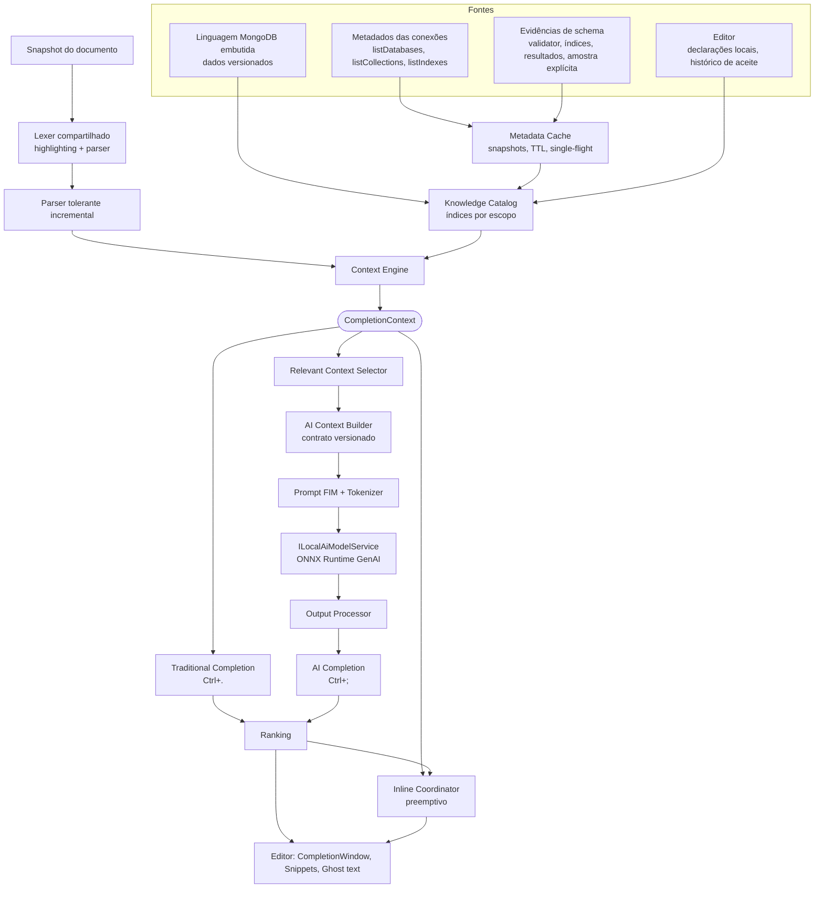
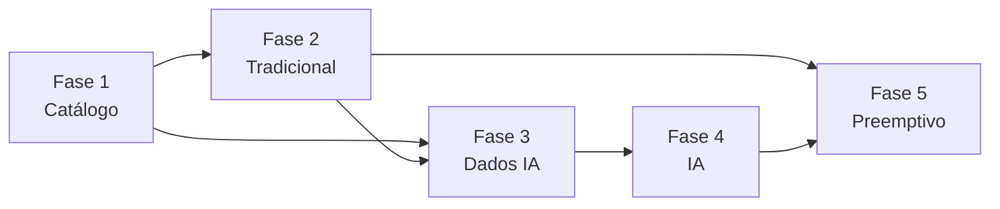

# Autocomplete MongoDB — padrão, arquitetura e plano

> Referência: 14/09/2026 · Checkout analisado: `d23787e` (branch `master`) · Estado: ✅ **Fase 1 implementada** · 📋 Fases 2–5 especificadas.
> A [Fase 1](phases/phase-1-data-traditional.md#estado-da-implementação) (catálogo de conhecimento, Metadata Cache, schema, métricas e benchmarks) foi implementada em 14/09/2026; nenhum comportamento visível do autocomplete mudou. Números marcados como *provisórios* seguem hipóteses até cada fase medir sua implementação.

## Objetivo

Definir um padrão único para as três modalidades de autocomplete MongoDB da IDE:

1. **Tradicional/contextual** — lista explícita (`Ctrl+.`), determinística, sem IA.
2. **Assistida por IA** — conclusão mais rica sob demanda (`Ctrl+;`), com modelos ONNX locais.
3. **Preemptiva/inline** — ghost text automático durante a digitação.

As três se apoiam na mesma base: um **Knowledge Catalog** independente da UI, um **Context Engine** que interpreta o cursor uma única vez por versão do documento e **providers** que consomem esse contexto estruturado. O autocomplete tradicional funciona integralmente sem IA; a IA enriquece e nunca é dependência do editor.

## Situação atual (resumo)

Detalhes, evidências e inventário em [current-state.md](current-state.md).

- **Editor:** [`MongoTextEditor`](../../src/EsilvaSoft.SlopStudio.Desktop/SyntaxHighlighting/MongoTextEditor.cs), derivado de AvaloniaEdit 12.0.0, com lexer tolerante próprio ([`SyntaxHighlightingService`](../../src/EsilvaSoft.SlopStudio.Application/SyntaxHighlighting/SyntaxHighlightingService.cs)) executado em worker.
- **Três entradas de sugestão já existem:** ghost text preditivo automático ([`CompletionSession`](../../src/EsilvaSoft.SlopStudio.Application/CompletionSession.cs) → [`AutocompleteService`](../../src/EsilvaSoft.SlopStudio.Application/AutocompleteService.cs) → dicionário ou IA); menu `Ctrl+Espaço` (`MenuFlyout` que concatena [`MqlAutocompleteService`](../../src/EsilvaSoft.SlopStudio.Application/MqlAutocompleteService.cs), [`ConsoleAutocompleteService`](../../src/EsilvaSoft.SlopStudio.Application/ConsoleAutocompleteService.cs) e uma sugestão IA/básica); e o chat, fora do escopo, que compartilha o modelo.
- **IA:** base sólida e reaproveitável — [`ILocalAiModelService`](../../src/EsilvaSoft.SlopStudio.Application/ILocalAiModelService.cs) com fila por prioridade, `ILocalModelRuntime` sobre ONNX Runtime GenAI 0.15.2, `IModelAdapter` por família (Qwen/DeepSeek), seleção NPU → GPU → CPU e catálogo de modelos por diretório.
- **Metadados:** não há catálogo na Application. A árvore do Explorer (Desktop) é o único cache de bancos, coleções e índices; campos vêm apenas dos resultados carregados na aba.

## Problemas identificados

| ID | Problema | Consequência |
| --- | --- | --- |
| P-01 | Interpretação do cursor fragmentada em seis mecanismos (regex, scanners de caracteres, varredura de tokens) | Cada modalidade relê o texto; regras divergentes; difícil estender |
| P-02 | Vocabulário MongoDB duplicado em sete lugares, sem vínculo com a superfície real do runtime do Console | Sugestões de métodos que o Console não executa; descrições inconsistentes |
| P-03 | Sem catálogo de metadados fora da UI; schema, validator e índices não alimentam sugestões | `db.` só conhece coleções de nós expandidos; campos só após executar |
| P-04 | Menu `Ctrl+Espaço` sem ranking, filtro incremental, tipos, snippets com placeholders ou faixa de substituição precisa | Sugestões MQL substituem o texto do início do documento até o cursor |
| P-05 | Trabalho síncrono na UI a cada tecla **e a cada movimento de cursor** (re-lex do prefixo, inferência de campos, regex de privacidade, cópias do documento) | Custo cresce com o documento; precisa de medição |
| P-06 | Inferência sem reuso de KV cache, tokenização do contexto completo antes do corte e decodificação da sequência inteira a cada token | TTFT dominado por prefill repetido |
| P-07 | Contexto de IA é texto plano, sem seleção por relevância — e é o contrato de treino dos pacotes SlopCoder | Mudar formato quebra modelos ajustados; requer versionamento |
| P-08 | Ghost text por sobreposição que redesenha o sufixo (até 32 KiB) sobre o editor, fora do layout do AvaloniaEdit | Custo de layout e riscos de desalinhamento |
| P-09 | Atalhos codificados nos handlers; não existe sistema de keybindings | Atalhos não configuráveis; conflito de layout de teclado |
| P-10 | Diagnóstico limitado a `Trace`; sem benchmarks nem metas medidas | Não há como provar latência, qualidade ou regressão |

## Arquitetura proposta

Detalhes em [architecture.md](architecture.md) e justificativas em [decisions.md](decisions.md).



### Componentes

| Componente | Responsabilidade | Camada | Documento |
| --- | --- | --- | --- |
| Linguagem embutida | Métodos, operadores, stages, expressões, Atlas Search, tipos BSON, keywords, snippets e **shapes** MQL como dados versionados | Application | [knowledge-catalog.md](knowledge-catalog.md) |
| Metadata Cache | Snapshots imutáveis por conexão com TTL, stale-while-revalidate, single-flight e invalidação | Application (+ fonte driver em Infrastructure) | [knowledge-catalog.md](knowledge-catalog.md) |
| Knowledge Catalog | Consulta por tipo, escopo e prefixo sobre fontes combinadas, sem I/O no caminho da tecla | Application | [knowledge-catalog.md](knowledge-catalog.md) |
| Lexer + parser tolerante | Tokens compartilhados com highlighting; árvore com recuperação de erro, reparse por statement | Application | [context-engine.md](context-engine.md) |
| Context Engine | Produz `CompletionContext`: papel do cursor, símbolos esperados, alvo, escopos, faixa de substituição | Application | [context-engine.md](context-engine.md) |
| Completion Service | Seleciona fontes pelo contexto, gera itens, snippets e resolve tardio | Application | [traditional-autocomplete.md](traditional-autocomplete.md) |
| Ranking | Filtros rígidos + pontuação explicável por correspondência, contexto, escopo, evidência, uso e tipo | Application | [ranking.md](ranking.md) |
| Relevant Context Selector / AI Context Builder | Seleciona fatos relevantes sob orçamento de tokens e serializa por contrato versionado | Application | [ai-context.md](ai-context.md) |
| AI Completion Provider / Output Processor | Geração explícita, limpeza, validação contra catálogo, fallback | Application | [ai-autocomplete.md](ai-autocomplete.md) |
| Runtime ONNX (existente) | Modelo, tokenizer, providers, fila, cancelamento — genérico, sem regra MongoDB | Application/Infrastructure | [onnx-strategy.md](onnx-strategy.md) |
| Inline Coordinator | Gatilhos, debounce adaptativo, camadas determinística e IA, typeahead sobre o ghost | Application | [preemptive-autocomplete.md](preemptive-autocomplete.md) |
| Integração com editor | `CompletionWindow`, snippets do AvaloniaEdit, ghost text nativo, despacho de atalhos | Desktop | [editor-integration.md](editor-integration.md) |

## Fluxo principal (`Ctrl+.`)

```mermaid
sequenceDiagram
  participant U as Usuário
  participant V as Editor (UI thread)
  participant CE as Context Engine (worker)
  participant KC as Knowledge Catalog
  participant MC as Metadata Cache
  participant R as Ranking
  U->>V: Ctrl+.
  V->>V: captura snapshot, cursor e destino da aba (O(1))
  V->>CE: BuildContext(snapshot, caret, alvo, token)
  CE-->>CE: reutiliza tokens/árvore da versão; reparse do statement alterado
  CE->>KC: Query(tipos esperados, escopo, prefixo)
  KC->>MC: snapshot atual (sem I/O)
  MC-->>KC: dados frescos ou stale
  MC--)MC: refresh em segundo plano se stale/ausente
  KC-->>CE: candidatos + completude
  CE->>R: candidatos + contexto
  R-->>V: CompletionList (versão)
  V->>V: descarta se versão/cursor mudaram; senão abre CompletionWindow
  MC--)V: CatalogChanged → reconsulta a lista aberta (isIncomplete)
```

## As três modalidades

| | Tradicional | IA | Preemptivo |
| --- | --- | --- | --- |
| Disparo | Explícito: `Ctrl+.` (alias `Ctrl+Espaço`) | Explícito: `Ctrl+;` | Automático, após gatilho e debounce |
| Resultado | Lista ordenada de alternativas com tipos e snippets | Conclusão rica (multilinha) como prévia inline; lista tradicional como fallback | Uma sugestão inline curta, sem interromper |
| Fontes | Context Engine + catálogo | Context Engine + seleção de fatos + modelo | Camada 0 determinística (catálogo, histórico) + camada 1 IA opcional |
| Prioridade | Imediata, worker | `Interactive` na fila do modelo | `Background`, preemptível |
| Sem modelo/GPU | Funciona integralmente | Abre lista tradicional + motivo | Mantém apenas a camada determinística |

## Fases e dependências

| Fase | Entrega | Depende de | Roadmap |
| --- | --- | --- | --- |
| [1 — Dados para autocomplete tradicional](phases/phase-1-data-traditional.md) ✅ | Linguagem embutida, Metadata Cache, catálogo indexado, baseline de desempenho, métricas | — | v0.6.0 (EDT-02) |
| [2 — Autocomplete tradicional reformulado](phases/phase-2-traditional-autocomplete.md) | Parser tolerante, Context Engine, ranking, `CompletionWindow`, snippets, atalhos | 1 | v0.6.0 (EDT-02) |
| [3 — Dados para IA](phases/phase-3-data-ai.md) | Seleção de fatos, contratos de contexto versionados, orçamento de tokens, harness de avaliação | 1, 2 | v0.9.0 |
| [4 — Autocomplete por IA reformulado](phases/phase-4-ai-autocomplete.md) | `Ctrl+;`, provider, output processor, fallback, streaming, experimento de prefix cache | 3 | v0.9.0 |
| [5 — Autocomplete preemptivo](phases/phase-5-preemptive.md) | Inline Coordinator, camadas, ghost nativo, gatilhos medidos | 2 (camada 0), 4 (camada 1) | v0.9.0 |



O ghost text existente continua funcionando durante as fases 1–4; a Fase 5 o substitui sem período sem autocomplete. O mapeamento para o roadmap segue [09 — Plano](../09-plano-de-implementacao.md) e [ADR-035](../10-decisoes-arquiteturais.md).

## Respostas objetivas

| Pergunta | Resposta | Onde |
| --- | --- | --- |
| De onde vêm os dados? | Linguagem MongoDB embutida (dados versionados); metadados de conexão via driver (`listDatabases`/`listCollections` nameOnly, `listIndexes`, `options.validator`); evidências de schema (validator, índices, resultados da aba, amostra explícita só com nomes e tipos); declarações locais e histórico de aceite | [knowledge-catalog.md](knowledge-catalog.md) |
| Como são armazenados? | Snapshots imutáveis em memória por conexão/escopo, com índices ordenados por nome; valores de documentos nunca são guardados; persistência em LiteDB é opcional e posterior | [knowledge-catalog.md](knowledge-catalog.md#cache) |
| Como são atualizados? | Carga sob demanda para a conexão conectada da aba, TTL com stale-while-revalidate, single-flight, invalidação por eventos (Explorer, DDL, perfil, desconexão) e atualização manual | [knowledge-catalog.md](knowledge-catalog.md#invalidação) |
| Como o cursor é interpretado? | Lexer compartilhado → parser tolerante → nó sob o cursor → papel (chave, valor, membro, argumento, elemento) | [context-engine.md](context-engine.md) |
| Como o contexto é determinado? | Caminhada de *shapes*: assinatura do método → shape do argumento → regras de chave/valor até o cursor, com alvo resolvido e escopos | [context-engine.md](context-engine.md#caminhada-de-shapes) |
| Como sugestões são filtradas? | Filtros rígidos por dialeto, papel, shape, versão do servidor e chaves já presentes; depois correspondência de prefixo/fuzzy | [ranking.md](ranking.md) |
| Como são ordenadas? | Pontuação ponderada e explicável; pesos calibrados por conjunto-ouro (MRR, top-1, top-5) | [ranking.md](ranking.md) |
| Como MongoDB é representado semanticamente? | `SymbolKind` + `DialectSet` + shapes (mini-sistema de tipos da MQL) + tipos BSON + escopos | [knowledge-catalog.md](knowledge-catalog.md#modelo-semântico) |
| Como o tradicional funciona? | `Ctrl+.` → contexto → fontes relevantes → ranking → `CompletionWindow` com snippets e resolve tardio | [traditional-autocomplete.md](traditional-autocomplete.md) |
| Como o contexto de IA é construído? | Fatos selecionados por relevância sob orçamento, janela sintática em torno do cursor, serialização por contrato do modelo | [ai-context.md](ai-context.md) |
| Quais informações vão ao modelo? | Nomes e tipos (alvo, subconjunto de campos, operadores válidos, assinatura, índices), trecho do editor e, opcionalmente, um statement similar; nunca valores de resultados, URI, credenciais ou ENV resolvido | [ai-context.md](ai-context.md#política-de-dados) |
| Como ONNX é usado? | Pelo serviço central existente; runtime genérico, adapters por família; extensões para prompt pré-tokenizado, streaming e prefix cache | [onnx-strategy.md](onnx-strategy.md) |
| Como CPU/GPU/NPU são selecionados? | `AiProviderSelector` existente: Automático NPU → GPU → CPU com fallback; escolha explícita sem fallback; política de latência por modalidade | [onnx-strategy.md](onnx-strategy.md#hardware) |
| Como funciona o fallback? | Degradação em camadas: IA → determinístico → lista tradicional; falhas nunca bloqueiam o editor | [architecture.md](architecture.md#degradação-graciosa) |
| Como solicitações são canceladas? | Escopo de requisição por editor e modalidade: versão monotônica + CTS; carga de modelo desacoplada; aplicação só na versão atual | [architecture.md](architecture.md#concorrência-e-cancelamento) |
| Como o preemptivo funciona? | Coordinator por editor: gating barato, camada 0 imediata, camada 1 IA com debounce adaptativo, typeahead sobre o ghost | [preemptive-autocomplete.md](preemptive-autocomplete.md) |
| Como performance será medida? | `System.Diagnostics.Metrics` local, projeto BenchmarkDotNet com matriz de escala, testes Explicit para modelos reais | [performance.md](performance.md) |
| O que é reutilizado? | Serviço de modelos, runtime, adapters, seleção de hardware, lexer, resolução de alvo, inferência de campos, privacidade, sessão de completion | [current-state.md](current-state.md#inventário-reutilizar-refatorar-substituir) |
| O que é refatorado/substituído? | Menu `MenuFlyout`, `MqlAutocompleteService` (sugestões), `ConsoleAutocompleteService`, `AggregationCompletionContext`, overlay de ghost, handlers de atalho | [current-state.md](current-state.md#inventário-reutilizar-refatorar-substituir) |
| Qual a sequência? | 1 → 2 → 3 → 4 → 5, com camada determinística do preemptivo possível após a 2 | [Fases](#fases-e-dependências) |

## Documentos

| Documento | Conteúdo |
| --- | --- |
| [current-state.md](current-state.md) | Análise do repositório, achados, premissas corrigidas, inventário de reuso |
| [research.md](research.md) | Pesquisa técnica e fontes |
| [architecture.md](architecture.md) | Camadas, componentes, fluxos, concorrência, degradação, privacidade |
| [knowledge-catalog.md](knowledge-catalog.md) | Modelo semântico, fontes, cache, invalidação, indexação |
| [context-engine.md](context-engine.md) | Parser tolerante, papéis do cursor, shapes, `CompletionContext` |
| [ranking.md](ranking.md) | Estratégia de ordenação e calibração |
| [traditional-autocomplete.md](traditional-autocomplete.md) | Provider, itens, snippets, UX da lista |
| [editor-integration.md](editor-integration.md) | AvaloniaEdit, atalhos, arbitragem de teclado, ghost text |
| [ai-context.md](ai-context.md) | Seleção de fatos, formatos, janela de contexto, política de dados |
| [ai-autocomplete.md](ai-autocomplete.md) | Provider de IA, `Ctrl+;`, output processor, fallback |
| [onnx-strategy.md](onnx-strategy.md) | Runtime, modelos, hardware, otimizações |
| [preemptive-autocomplete.md](preemptive-autocomplete.md) | Autocomplete inline automático |
| [performance.md](performance.md) | Metas, instrumentação, benchmarks |
| [testing.md](testing.md) | Estratégia de testes por nível |
| [decisions.md](decisions.md) | Decisões propostas (AC-01…) e divergências em relação à meta |
| [phases/](phases/) | Planos de implementação das cinco fases |

## Manutenção

- Após editar estes arquivos, execute `node scripts/build-docs-index.cjs` para atualizar o leitor offline.
- As decisões em [decisions.md](decisions.md) estão **propostas**. Ao serem aprovadas, devem ser promovidas a [10 — ADRs](../10-decisoes-arquiteturais.md), com revisão explícita das ADR-007, 023, 027, 030, 031 e 037 afetadas.
- Ao implementar cada fase, atualizar também [21 — Autocomplete local](../21-autocomplete-local.md), [17 — Design system](../17-design-system-ui-ux.md) (atalhos), [24 — Inventário](../24-inventario-roadmap.md) e a [matriz de validação](../15-matriz-de-validacao.md), conforme `AGENTS.md`.
