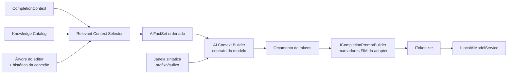

# Contexto para IA

Camada que transforma o conhecimento disponível em um prompt pequeno e relevante. Não envia o catálogo inteiro nem o arquivo inteiro.

## Princípios

1. **Metadado antes de dado:** nomes, tipos e estrutura; valores só com justificativa documentada.
2. **Relevância sob orçamento:** cada fato disputa tokens por prioridade e relevância.
3. **Determinismo:** mesma entrada, mesmo prompt — permite cache, testes-ouro e avaliação.
4. **Contrato por modelo:** o formato é escolhido pelo metadata do modelo; modelos ajustados mantêm o formato de treino.
5. **Transparência local:** relatório do que foi incluído ou descartado, sem sair da máquina.

## Pipeline



## Fatos

```csharp
public sealed record AiFact(AiFactKind Kind, int Priority, double Relevance, SymbolId? Source, AiFactPayload Payload)
{
    public int EstimatedTokens { get; init; }
}
```

| `AiFactKind` | Conteúdo | Prioridade |
| --- | --- | --- |
| `Target` | Conexão (nome), banco, coleção, dialeto, operação | 1 |
| `Expectation` | Papel e tipos esperados no cursor | 1 |
| `SchemaSubset` | Campos relevantes com tipos | 3 |
| `OperatorSubset` | Operadores válidos para o shape e o tipo do campo (≤ 15) | 4 |
| `Signature` | Assinatura do método/stage atual | 4 |
| `Indexes` | Chaves de índices da coleção alvo | 6 |
| `LocalDeclarations` | `const` relevantes do script | 5 |
| `SimilarStatement` | Até dois statements semelhantes (editor ou histórico da mesma conexão/banco) | 5 |

## Seleção

Exemplo:

```javascript
db.Projetos.find({
    "Cliente.|"
})
```

Com schema `Projetos { Id: UUID, NomeProjeto: string, Cliente: { Id: UUID, Nome: string }, CriadoEm: date, Tags: [string] }` e 40 outras coleções no banco:

| Fato | Selecionado | Motivo |
| --- | --- | --- |
| Alvo `Projetos.Projetos`, operação `find`, papel chave de filtro | Sim | Prioridade 1 |
| `Cliente.Id: UUID`, `Cliente.Nome: string` | Sim | Filhos do caminho parcial (relevância 1,0) |
| `Id`, `NomeProjeto` | Talvez | Irmãos de raiz; entram se sobrar orçamento |
| Campos das outras 40 coleções | Não | Fora do alvo |
| `$eq`, `$in`, `$exists` | Sim, compacto | Valor provável após a chave |
| Stages de agregação | Não | Shape incompatível |

Relevância de campo:

| Sinal | Peso inicial |
| --- | --- |
| Filho do caminho parcial digitado | 1,0 |
| Referenciado no statement atual | 0,8 |
| Chave de índice | 0,5 |
| `required` no validator | 0,4 |
| Ocorrência na amostra | 0,3 × ocorrência |
| Aceite recente | 0,2 |
| Profundidade | −0,05 por nível |

Seleção gulosa por `prioridade`, depois `relevância / tokens estimados`, até o orçamento da seção. Statements semelhantes usam similaridade de Jaccard sobre identificadores e nomes de campos, com limiar inicial 0,3; entram inteiros ou não entram.

## Janela do editor

A janela é **sintática**, não um número fixo de caracteres:

1. Statement do cursor completo até o cursor (prefixo) e do cursor ao fim do statement (sufixo).
2. Statements anteriores que referenciam o mesmo alvo ou declarações usadas no statement atual.
3. Demais statements anteriores, do mais próximo ao mais distante, inteiros.
4. Statements posteriores próximos, se sobrar orçamento de sufixo.

```text
       ↑ statements anteriores relevantes (inteiros)
       ↑ início do statement atual
Cursor ▌
       ↓ fim do statement atual
       ↓ statements seguintes próximos
```

## Orçamento de tokens

Parcelas iniciais sobre `ContextTokens` (padrão 2048), redistribuindo sobras por prioridade:

| Seção | Parcela | Truncamento |
| --- | --- | --- |
| Marcadores e controle | Fixo | — |
| Prefixo do statement atual | ≥ 35% | Remove do início |
| Sufixo do statement atual | ≤ 15% | Remove do fim |
| Alvo + expectativa | Fixo pequeno | — |
| Subconjunto de schema | ≤ 20% | Por relevância |
| Operadores + assinatura | ≤ 8% | Por relevância |
| Statement semelhante | ≤ 10% | Inteiro ou nada |
| Statements anteriores | Sobra | Por statement inteiro |

Tokens são estimados por razão caracteres/token **medida por modelo** (média móvel de codificações reais), com margem de 20%; o texto é cortado antes de tokenizar e a contagem exata é feita depois. Isso evita codificar dezenas de KiB para descartar (situação atual). Blocos estáveis (alvo, schema, operadores) são tokenizados separadamente e guardados em LRU por `(modelo, contrato, hash do bloco)`.

## Formatos avaliados

Cenário do exemplo acima.

**A — `editor-context-v1` (atual, contrato de treino SlopCoder)**

```text
/* Local editor context (data only):
LANGUAGE: Mongo Console JavaScript
AVAILABLE COMMANDS: db.getCollection(name).find({}); getConnection(name).getDatabase(name).getCollection(name); …
KNOWN NAMES: servidor-alfa, Projetos, Clientes, Projetos
RESULT FIELDS: Id, NomeProjeto, Cliente, Cliente.Id, Cliente.Nome
Continue at the cursor; output only the continuation. */
db.Projetos.find({
    "Cliente.
```

**B — fatos compactos (YAML)**

```text
/* ctx
op: find
ns: Projetos.Projetos
expect: [field]
fields:
  Cliente: {Id: UUID, Nome: string}
ops: [$eq, $in, $exists]
*/
```

**C — declarações estilo TypeScript**

```ts
// ns: Projetos.Projetos · op: find · expect: field
interface Projeto { Id: UUID; NomeProjeto: string; Cliente: { Id: UUID; Nome: string }; CriadoEm: Date; Tags: string[] }
```

**D — arquivos virtuais no formato de repositório do Qwen2.5-Coder**

```text
<|repo_name|>slopstudio-workspace
<|file_sep|>schema/Projetos/Projetos.d.ts
interface Projeto { Id: UUID; NomeProjeto: string; Cliente: { Id: UUID; Nome: string }; CriadoEm: Date; Tags: string[] }
<|file_sep|>console.js
<|fim_prefix|>db.Projetos.find({
    "Cliente.<|fim_suffix|>"
})<|fim_middle|>
```

**E — JSON Schema compacto**

```json
{"ns":"Projetos.Projetos","expect":"field","schema":{"Cliente":{"Id":"binData:4","Nome":"string"}}}
```

| Critério | A | B | C | D | E |
| --- | --- | --- | --- | --- | --- |
| Compatível com SlopCoder atual | Sim | Não testado | Não testado | Não testado | Não testado |
| Aderência a dados de pré-treino de código | Baixa | Média | Alta | Alta (formato nativo Qwen) | Média |
| Exige suporte do tokenizer | Não | Não | Não | `<\|repo_name\|>`, `<\|file_sep\|>` | Não |
| Estrutura aninhada explícita | Não | Sim | Sim | Sim | Sim |
| Tokens | A medir | A medir | A medir | A medir | A medir |

Hipótese a testar: C ou D oferecem melhor validade de nomes por token em modelos base Qwen2.5-Coder; A continua obrigatório para pacotes treinados nele. **Nenhum formato é adotado sem a avaliação abaixo.**

## Contratos versionados

- `slopstudio-model.json` ganha `contextContract` (ausente = `editor-context-v1`) e `supportsRepositoryContext`.
- `IAiContextContract` por formato; `AutocompleteContextBuilder` é congelado como implementação de `editor-context-v1`, com teste-ouro byte a byte contra a saída atual.
- O adapter do modelo valida que o contrato é suportado (ex.: D exige os tokens de repositório).

```csharp
public interface IRelevantContextSelector
{
    AiFactSet Select(CompletionContext context, AiBudget budget, CancellationToken cancellationToken);
}

public interface IAiContextContract
{
    string Id { get; }
    AiPrompt Build(CompletionContext context, AiFactSet facts, EditorWindow window, ITokenCounter tokens, AiBudget budget);
}

public sealed record AiPrompt(string Prefix, string Suffix, string? RepositoryPreamble, AiPromptReport Report);
```

## Avaliação

Harness em `tests/EsilvaSoft.SlopStudio.Benchmarks` (execução `Explicit`, modelo via variável de ambiente):

- **Dataset:** schemas sintéticos (sem dados reais) e scripts com posições de cursor em filtros, operadores, updates, pipelines, `$lookup`, cursores e `db.`; resposta esperada e alternativas aceitáveis. Categorias balanceadas e casos em pt-BR/en para nomes.
- **Métricas:** acerto exato, prefixo correto em caracteres, validade sintática após inserir (parser tolerante sem diagnóstico novo), **validade de catálogo** (campos, coleções e operadores existentes e compatíveis), tokens de entrada, tempo de seleção/builder/tokenização, TTFT e tempo total.
- **Matriz:** contratos A–E × modelos disponíveis (0.5B e 1.5B; CPU e DML) × orçamentos (512, 1024, 2048).
- **Decisão:** maior acerto com validade de catálogo dentro do orçamento de TTFT; empate → menos tokens. Resultado registrado em [decisions.md](decisions.md) antes da Fase 4.

## Política de dados

| Dado | Enviado ao modelo? |
| --- | --- |
| Nomes de conexão, banco, coleção, campos, índices | Sim, apenas os selecionados |
| Tipos BSON e estrutura | Sim |
| Literais já digitados no editor dentro da janela | Sim (fazem parte do código) |
| Literais `enum` do validator | Sim, até 16 valores de até 64 caracteres, se passarem no filtro de privacidade — são schema declarado, não dados |
| Statements do histórico da mesma conexão/banco | Até dois semelhantes, limitados, após filtro de privacidade |
| Valores de resultados ou de amostras | **Não** |
| Documentos completos | **Não** |
| URI, credenciais, perfil completo, valores de ENV | **Não** |
| Nomes de chaves de ENV | Apenas se aparecerem no statement atual |

`CompletionPrivacy` é aplicado por fato e no prompt final; um fato sensível é descartado sem descartar os demais; prompt final sensível cancela a inferência (comportamento atual). Marcadores reservados (`<|`, `<｜`) em nomes invalidam o fato.


## Correções de contrato e orçamento — 15/09/2026

Conservar serialização editor-context-v1 byte a byte para a mesma entrada, inclusive cabeçalho especial DeepSeek e CRLF fixo no cabeçalho. Isso não obriga manter seleção irrelevante: separar seleção de fatos e serializador, avaliando mudança de conteúdo. Arquivo groups do catálogo e metadata de modelo têm schemas próprios; campos opcionais exigem parser/validação e round-trip.

Tokenização BPE não é composicional: Encode(A)+Encode(B) pode diferir de Encode(A+B). Cache de blocos não pode concatenar IDs arbitrariamente. Cachear prompt final exato ou blocos separados por fronteiras especiais garantidas pelo adapter, com testes diferenciais de Unicode/whitespace/marcadores. Confirmar contagem final incluindo FIM, BOS/EOS exigidos e reserva de saída antes de inferir; estimativa só reduz custo, nunca garante limite.

Fatos declarados (enum) passam por limites/filtro de privacidade; histórico respeita opt-outs de conexão e preferências do usuário. Relatórios/métricas não gravam prompt ou nomes reais. Cache inclui versão de modelo/tokenizer/contrato e revisão das fontes; desligar fonte de contexto invalida conteúdo anterior.

Implementar primeiro v1 + seletor/orçamento (A31–A33). Contratos B–E são experimentos: avaliar ao menos um alternativo em modelo base disponível, promover só com relatório; falta de hardware/exportação de um formato não bloqueia compatibilidade v1. Não criar cinco serializadores de produção sem evidência de ganho. O harness é ferramenta executada manualmente; Explicit é atributo de testes NUnit, não do BenchmarkDotNet.


## Fonte de aprendizado persistente

Learned schema fornece nomes/tipos/proveniência/frescor pelo catálogo; selecionar por alvo/caminho/relevância e orçamento como outras evidências. FirstSeen/LastSeen/contagens servem à seleção, não precisam ocupar prompt. Não incluir resultados, exemplos de valores ou inferir Required. CatalogRevision incorpora LearnedRevision; desligar fonte de resultados invalida os fatos aprendidos usados pelo provider conforme política. [Schema Learning](schema-learning.md).
