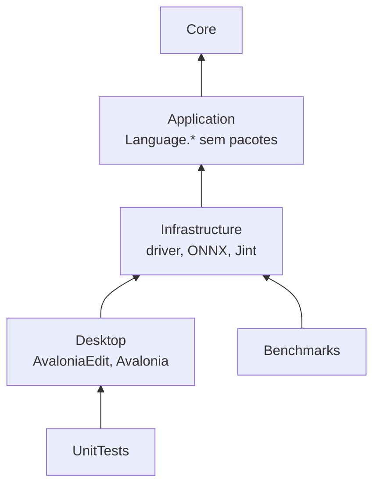
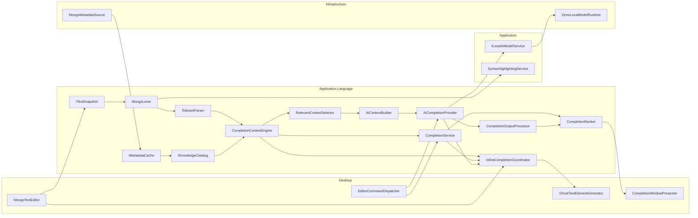
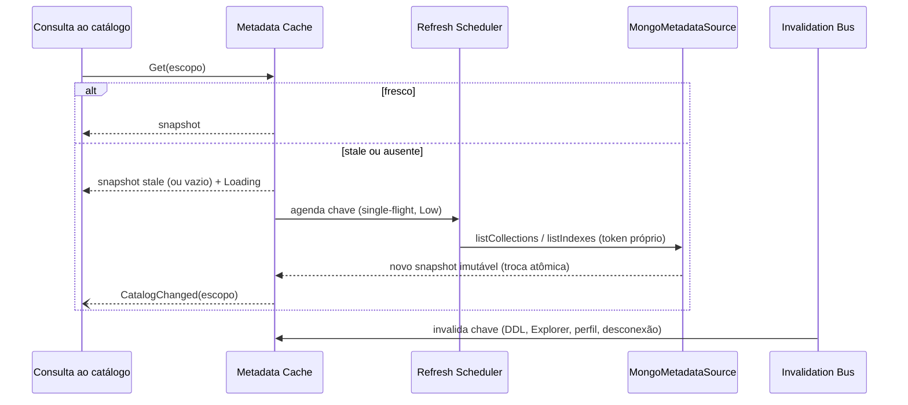

# Arquitetura

Revisada em 15/09/2026 contra `b082d4a`. Estado real em [current-state.md](current-state.md); os contratos abaixo são propostas, salvo indicação. Reutilizar os tipos de `Application.Language` existentes; não mover arquivos apenas para reproduzir o diagrama.

## Providers independentes

| Provider proposto | Geração compartilhada | Disparo / saída | Política |
| --- | --- | --- | --- |
| `TraditionalCompletionProvider` | `CompletionService` + catálogo + ranker | Ctrl+Espaço (override salvo em Ctrl+. continua funcional, sem ser mais o padrão) / lista | Explicit, sem IA |
| `AiCompletionProvider` | Fatos + builder + `AiGenerationPipeline` + output | Ctrl+; / prévia | Interactive, carga permitida |
| `TraditionalPreemptiveCompletionProvider` | Mesmo CompletionService/ranker | Edição / ghost | Peek, prefixo estrito, confiança |
| `AiPreemptiveCompletionProvider` | Mesmo AiGenerationPipeline/output | Edição / ghost | Background, LoadedOnly, prazo curto |

Contrato comum proposto, sem obrigar lista síncrona a simular streaming:

```csharp
public interface ICompletionProvider
{
    CompletionProviderKind Kind { get; }
    ValueTask<CompletionResponse> CompleteAsync(
        CompletionRequest request, CancellationToken cancellationToken);
}
// CompletionRequest: RequestStamp, CompletionContext, orçamento e política capturados.
// CompletionResponse: mesmo stamp, candidatos/edits, origem, estado e completude.
// IA pode implementar adicionalmente IStreamingCompletionProvider; o pipeline é único.
```

`CompletionService` é gerador determinístico, não quinto provider; `InlineCompletionCoordinator` arbitra os dois automáticos, não gera conhecimento. Parser/AST/contexto, schema, cache, ranking, snippets, métricas, escopo de cancelamento e presenter são compartilhados. Não registrar quatro copies desses serviços em DI.

### Chaves e validade

- AST: `(EditorId, DocumentVersion, Dialect)`; contexto: acrescentar Caret, Selection, TargetIdentity/ConnectionGeneration, CatalogRevision, LocalEvidenceRevision, SettingsRevision. Gatilho é política do pedido, não motivo para duplicar AST. Não memoizar contexto só por versão/cursor.
- `RequestStamp`: identidade acima + RequestId monotônico e PresentationGeneration; IA acrescenta ModelRevision/Contract. Mesma versão textual em outra aba não equivale ao mesmo pedido.
- Um escopo de lista, um de IA explícita e um coordinator automático por editor; dentro do último, token filho para cada provider. Todas as apresentações passam pela geração comum de UI. `Ctrl+Espaço` cancela prévia/IA pendente e abre lista; `Ctrl+;` fecha lista e substitui ghost, e desde A42 abre a prévia da IA explícita nessa mesma superfície. Chat preempta Background no serviço de modelo, não cancela CTS arbitrário de outra aba.
- Mesmo refiltro dentro de token cria novo stamp e invalida callbacks anteriores; reutiliza cálculo/candidatos somente quando a cobertura continua válida. Backspace/alargamento de prefixo exige nova consulta se a lista anterior foi limitada.
- Publicar e aceitar são operações no dispatcher com nova conferência do stamp. CTS cooperativo é otimização; guarda de validade é garantia. Edit/undo ABA, cancelamento ignorado e troca de perfil/modelo são testes obrigatórios.

### I/O e concorrência compartilhada

Hoje Query pode agendar cargas e o cache usa locks curtos. Evoluir CatalogQuery com política de acesso propagada a **todos** os Get: automático e refiltro usam Peek; refresh só por intenção explícita de escopo conectado/Explorer. Scheduler compartilhado com fila limitada e single-flight; limites iniciais 2 cargas por conexão/4 globais, a medir. Cancelar um consumidor não mata carga útil aos demais; invalidar geração impede publicação antiga.

Leitura rápida não exige reescrever o cache como lock-free. Medir contenção; limitar trabalhos sob lock e publicar snapshots imutáveis. Correções de write-through, amostra tardia, identidade de ambiente, completude e mesclagem limitada são pré-requisitos de integração, em [execution-plan.md](execution-plan.md).

### Estratégia de entrega

Fase 1 tem base implementada e aceite parcial. Fase 2 entrega infraestrutura comum e protótipo do presenter inline, com paridade antes de remoção. 5.1 pode seguir a 2; Fases 3/4 não são pré-requisitos de 5.1. 5.2 depende da 4; 5.3 integra ambas. Padrão híbrido é sequencial, sem troca automática de sugestão já visível. [Estratégia detalhada](preemptive-autocomplete.md).

## Princípios

1. **UI sempre responsiva.** A UI thread só captura snapshot, cursor e destino (custo limitado e medido) e aplica resultados. Parsing, consulta, ranking e inferência rodam fora dela.
2. **Um entendimento por chave de contexto.** As quatro modalidades reutilizam AST e contexto com as revisões descritas acima.
3. **Conhecimento como dados.** Linguagem MongoDB (métodos, operadores, stages, shapes) vive em dados versionados; adicionar comando não exige novo `if`.
4. **Nenhum I/O no caminho da tecla.** O catálogo responde de snapshots em memória; cargas remotas são assíncronas, deduplicadas e canceláveis.
5. **IA opcional e isolada.** O runtime ONNX permanece genérico; especialização MongoDB fica no Context Engine e no AI Context Builder.
6. **Somente a requisição atual atualiza a UI.**
7. **Metadado antes de dado.** Nomes e tipos são suficientes; valores de documentos não são armazenados nem enviados ao modelo.
8. **Reuso antes de criação.** Serviço de modelos, runtime, adapters, lexer, resolução de alvo e inferência de campos são evoluídos, não duplicados.

## Camadas e projetos

Não se cria novo projeto de domínio nesta meta ([AC-04](decisions.md)). Os componentes ficam em namespaces isolados, verificados por teste de arquitetura.

| Projeto / namespace | Componentes novos ou alterados |
| --- | --- |
| `Core` | `AutocompleteSettings` (campos aditivos), `EditorKeyBindings` (novo, aditivo em `WorkspacePreferences`) |
| `Application.Language.Text` | `ITextSnapshot`, `TextSpan`, `TextSnapshotVersion` |
| `Application.Language.Syntax` | `MongoLexer` (extraído do highlighting), `MongoSyntaxTree`, `TolerantParser`, `SyntaxTreeCache` |
| `Application.Language.Catalog` | `LanguageDefinition` (dados embutidos), `IKnowledgeCatalog`, `ICatalogSource`, `CatalogSymbol`, `NameIndex`, `IMetadataCache`, `CollectionSchema`, `SchemaBuilder`, `IMetadataInvalidationBus` |
| `Application.Language.Context` | `CompletionContextEngine`, `CompletionContext`, `ShapeWalker`, `NamespaceTargetResolver` |
| `Application.Language.Completion` | `CompletionService`, `CompletionItem`, `CompletionRanker`, `SnippetTemplate`, `CompletionUsageTracker`, `EditorRequestScope` |
| `Application.Language.Ai` | `RelevantContextSelector`, `AiContextBuilder`, serializadores de contrato, `AiCompletionProvider`, `CompletionOutputProcessor` |
| `Application.Language.Inline` | `InlineCompletionCoordinator`, fontes das camadas 0 e 1 |
| `Application` (existente) | `ILocalAiModelService`, `PriorityGate`, `ICompletionPromptBuilder`, `ITokenizer`, `CompletionPrivacy`, `IncrementalCompletion` |
| `Infrastructure` | `MongoMetadataSource` (driver), extensões de `OnnxLocalModelRuntime` (prompt pré-tokenizado, `TokenizerStream`, prefix cache), `IModelAdapter` com contratos de contexto |
| `Desktop` | `AvaloniaTextSnapshot`, `CompletionWindowPresenter`, `SnippetInserter`, `GhostTextElementGenerator`, `EditorCommandDispatcher` |
| `tests/UnitTests` | Fixtures `Language/Cases/*.case`, testes por componente |
| `tests/EsilvaSoft.SlopStudio.Benchmarks` (existente) | BenchmarkDotNet — estender o projeto de ferramenta |



Regras verificadas por teste de arquitetura (reflexão sobre referências de assembly e namespaces):

- `Application.Language.*` não referencia Avalonia, AvaloniaEdit, MongoDB.Driver, Acornima nem ONNX.
- `Application.Language.Catalog` e `.Context` não referenciam `.Ai` nem `ILocalAiModelService`.
- Nenhum tipo `Microsoft.ML.*` fora de Infrastructure (regra atual mantida).

Extração futura para `EsilvaSoft.SlopStudio.Language`: somente quando os contratos da Fase 2 estiverem estáveis por pelo menos uma versão e houver necessidade real (ex.: reuso em ferramenta de linha de comando).

## Componentes



## Fluxos

### Tradicional (`Ctrl+Espaço`)

Descrito no [README](README.md#fluxo-principal-ctrl). Pontos essenciais: snapshot sem materializar string via `TextDocument.CreateSnapshot()`; contexto memoizado por versão e cursor; consulta ao catálogo sem I/O; lista marcada `IsIncomplete` quando algum escopo está carregando; `CatalogChanged` reconsulta a lista aberta se a versão ainda for a mesma.

### IA explícita (`Ctrl+;`)

```mermaid
sequenceDiagram
  participant V as Editor
  participant CE as Context Engine
  participant S as Relevant Context Selector
  participant B as AI Context Builder
  participant M as ILocalAiModelService
  participant O as Output Processor
  V->>CE: contexto (reutiliza versão)
  CE->>S: CompletionContext
  S->>B: fatos selecionados + orçamento
  B->>M: GenerateAsync(Interactive) com prompt do contrato do modelo
  Note over M: preempta geração Background; carga desacoplada
  M-->>O: tokens (streaming)
  O-->>V: prévia inline progressiva validada
  alt modelo indisponível, erro ou timeout
    M-->>V: exceção tipada
    V->>V: abre lista tradicional + motivo na barra de status
  end
```

### Preemptivo

Ver [preemptive-autocomplete.md](preemptive-autocomplete.md#fluxo). Tradicional contextual responde no worker; IA só se insuficiente, após debounce, Background/LoadedOnly. Configurações independentes.

### Atualização de metadados



## Concorrência e cancelamento

### Escopo de requisição

Generaliza `CompletionSession`: um `EditorRequestScope` por editor **e canal de apresentação** (lista, IA explícita, inline com dois providers). Cada requisição recebe versão monotônica e CTS próprio.

```text
Request A (versão 41, cursor 120)
  ↓ usuário digita "x"
Snapshot passa a versão 42 → Invalidate: versão++, A.Cancel()
Request B (versão 42, cursor 121)
  A termina depois de B? → versão 41 ≠ atual → descartada sem tocar a UI
  B termina → versão 42 = atual e cursor 121 = atual → aplicada
```

Regras:

1. A captura (snapshot, cursor, perfil, banco, coleção, modo) ocorre antes de qualquer `await`.
2. Toda aplicação na UI confere: editor anexado, `DataContext` inalterado, versão do documento, cursor, seleção vazia e destino da aba. Falha em qualquer item descarta silenciosamente.
3. Cancelamento é cooperativo; o descarte por versão protege contra providers que ignoram o token (comportamento já testado).
4. Comandos explícitos arbitram a apresentação: Ctrl+Espaço cancela IA/prévia e abre lista; Ctrl+; fecha lista, substitui ghost e assume a superfície com o indicador/prévia da IA explícita (A42). Os tokens continuam isolados, ligados à geração de apresentação.
5. Abas diferentes nunca compartilham CTS.

### Fontes de cancelamento

| Evento | Lista tradicional | IA explícita | Preemptivo |
| --- | --- | --- | --- |
| Digitação que altera o token do filtro | Novo stamp, refiltro reutilizável; invalida retorno anterior | Cancela | Cancela; só candidato concluído permite typeahead |
| Digitação fora do token / nova linha | Fecha e cancela | Cancela | Cancela e reagenda |
| Movimento do cursor | Fecha e cancela | Cancela | Cancela; não dispara sem edição |
| `Esc` | Fecha | Cancela geração | Descarta ghost |
| Troca de aba, destino, modo ou preferências | Cancela | Cancela | Cancela |
| Descarga/troca de modelo | — | Erro tipado → fallback | Camada 1 desativada |
| Timeout | — | Cancela e informa | Descarta silenciosamente |

### Recursos compartilhados

| Recurso | Controle |
| --- | --- |
| Modelo ONNX | `PriorityGate` existente: uma geração por vez; `Interactive` (chat, `Ctrl+;`, teste) antes de `Background` (inline); `Background` em execução é preemptado |
| Carga do modelo | Desacoplada do token do editor (existente): digitar não aborta a carga |
| Metadados | Single-flight com token próprio; invalidar geração descarta retorno; cancelar espera não mata carga de outros consumidores |
| Árvore sintática | Imutável por versão; reparse em worker; última versão vence |
| Catálogo | Cache atual usa locks curtos; medir contenção e retirar construção de tabelas do caminho da tecla |

## Degradação graciosa

| Situação | Tradicional | IA explícita | Preemptivo |
| --- | --- | --- | --- |
| Tudo disponível | Catálogo completo | Modelo | Camadas 0 e 1 |
| Metadados carregando | Linguagem + stale; lista incompleta | Fatos disponíveis | Camada 0 com o disponível |
| Conexão desconectada | Linguagem + cache existente; sem chamada remota | Idem | Idem |
| Permissão negada em metadado | Backoff; aviso discreto uma vez | Idem | Idem |
| Modelo ausente, inválido ou tokenizer incompatível | Inalterado | Lista tradicional + motivo | Só camada 0 |
| Provider GPU/NPU indisponível | Inalterado | Automático → CPU; explícito → mensagem | Camada 1 desativada se latência exceder orçamento |
| Erro de inferência / cooldown | Inalterado | Lista tradicional + motivo | Só camada 0 |
| Timeout | Inalterado | Mantém prévia parcial válida ou lista | Descarta |
| Contexto sensível detectado | Inalterado | Recusa com motivo | Só camada 0 |
| Parser não entende a posição | Linguagem genérica por papel lexical | Janela de texto sem fatos, sob ação explícita | Abster-se |

Nenhuma falha de IA ou metadado lança exceção até o handler da UI; o editor continua editável em todos os casos.

## Privacidade

- Catálogo armazena nomes, tipos, contagens relativas e origem da evidência; nunca valores de documentos.
- Nomes de chaves do cofre de ambientes podem ser sugeridos em `ENV.get("…")`; valores nunca.
- Prompt: somente nomes/tipos, trecho do editor e statements do histórico da mesma conexão; `CompletionPrivacy` aplicado por fato e no prompt final; marcadores reservados escapados.
- Métricas sem texto, nomes de campos, coleções ou queries.
- Histórico de aceite em memória; aprendizado de estrutura de find persiste conforme schema-learning.md, sem valores e com opções de privacidade.

## Extensibilidade

| Extensão | O que muda |
| --- | --- |
| Novo método/operador/stage | Entrada nos dados da linguagem + caso de teste |
| Novo dialeto (ex.: mongosh completo) | Flag de dialeto, superfície nos dados, modo do lexer se necessário |
| Nova fonte de metadado | Implementar `ICatalogSource` declarando os tipos que serve |
| Nova família de modelo | `IModelAdapter` (existente) |
| Novo formato de contexto para modelo | Serializador de contrato + `contextContract` no metadata do modelo |
| Novo gatilho inline | Regra na política de gatilhos, com experimento registrado |

## Mapeamento de nomes da meta

| Meta | Projeto |
| --- | --- |
| `IAutocompleteModel` | `LocalModelDefinition` + `IModelAdapter` |
| `IModelTokenizer` | `ITokenizer` |
| `IInferenceRuntime` | `ILocalModelRuntime` |
| `IModelContextBuilder` | `AiContextBuilder` + serializadores de contrato + `ICompletionPromptBuilder` |
| Completion Provider | `CompletionService` + fontes do catálogo |
| AICompletionProvider | `AiCompletionProvider` |
| Output Processor | `CompletionOutputProcessor` |
| Knowledge Catalog | `IKnowledgeCatalog` |


## Aprendizado de resultados e persistência

[Schema Learning](schema-learning.md) acrescenta BackgroundSchemaAnalyzer, SchemaLearningService, deltas probabilísticos e ILearnedSchemaRepository no proprietário LiteDB existente. Hook após entrega de find não aguarda análise; fila/memória/escrita limitadas. Origem vem de StructuredResultSet, não seleção da UI. Hidratação de aprendizado é assíncrona; providers consultam snapshot em memória. Revisão learned faz parte de CatalogRevision; nenhum dado bruto entra no cache persistido. Tarefas L11–L16 precedem aceite final de dados, sem impedir desenvolvimento de contexto com fakes.
