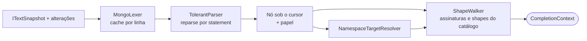

# Context Engine

## Responsabilidade

Transformar *documento + cursor + destino da aba* em um `CompletionContext` estruturado, **uma vez por versão do documento e posição**, reutilizado pelas quatro modalidades. Não consulta metadados remotos, não ranqueia e não conhece IA.

Convenção: em blocos de código, `|` marca o cursor; em tabelas, `▌`.

## Entrada

```csharp
public sealed record ContextRequest(
    ITextSnapshot Snapshot,          // imutável; versão monotônica do documento
    int Caret,
    EditorDialect Dialect,           // Console, MongoshScript, AggregationJson
    TabTarget Target,                // perfil (id, nome), banco, coleção, conectado?
    CompletionTrigger Trigger);      // Invoked, TriggerCharacter(c), Automatic
```

`ITextSnapshot` é implementado no Desktop sobre `TextDocument.CreateSnapshot()` do AvaloniaEdit (custo O(1), sem copiar o documento) e expõe `Length`, leitura por faixa, `Version` e as alterações desde uma versão anterior.

## Pipeline



Tudo roda em worker. A UI thread apenas captura o `ContextRequest`.

## Lexer compartilhado

O lexer de [`SyntaxHighlightingService`](../../src/EsilvaSoft.SlopStudio.Application/SyntaxHighlighting/SyntaxHighlightingService.cs) já é tolerante, mantém estado entre linhas e cache incremental. Ele é extraído como `MongoLexer`, produzindo tokens com tipo léxico (identificador, string com estado de fechamento, número, pontuação, comentário, regex, template). O highlighting passa a classificar sobre esses tokens e a árvore, em vez de manter um segundo lexer. A extração preserva a API `ISyntaxHighlightingService` e deve manter `SyntaxHighlightingTests` sem alteração.

## Parser tolerante

### Subconjunto gramatical

Não é um parser JavaScript completo. Cobre o que o autocomplete precisa entender e trata o resto como sequência opaca com blocos balanceados:

```ebnf
Script              = { Statement } ;
Statement           = Declaration | ExpressionStatement | OpaqueStatement ;
Declaration         = ("const" | "let" | "var") Identifier [ "=" Expression ] [ ";" ] ;
ExpressionStatement = Expression [ ";" ] ;
Expression          = Primary { Member | Index | Call } ;
Primary             = Identifier | Literal | ObjectLiteral | ArrayLiteral | "(" Expression ")" ;
Member              = "." [ Identifier ] ;
Index               = "[" [ Expression ] "]" ;
Call                = "(" [ Expression { "," Expression } [ "," ] ] ")" ;
ObjectLiteral       = "{" [ Property { "," Property } [ "," ] ] "}" ;
Property            = PropertyKey ":" Expression | Identifier | "..." Expression ;
PropertyKey         = Identifier | String | Number | "[" Expression "]" ;
ArrayLiteral        = "[" [ Expression { "," Expression } [ "," ] ] "]" ;
OpaqueStatement     = tokens até a fronteira de statement, com blocos balanceados ;
```

`if`, `for`, funções e arrow functions entram como `OpaqueStatement`, mas objetos e chamadas dentro deles continuam sendo analisados (busca de expressões internas), para que um `find` dentro de um `for` tenha contexto.

### Recuperação de erro

| Situação | Recuperação |
| --- | --- |
| `}` `]` `)` ausentes no fim do documento ou na fronteira do statement | Nó marcado `MissingClose`; spans terminam no último token válido |
| Token inesperado | Agrupado em `SkippedTokens`; análise continua no próximo token sincronizável (`,`, `}`, `]`, `)`, `;`, início de statement) |
| String não fechada | Literal `Unterminated`; cursor dentro dele tem papel de conteúdo de string |
| `Cliente.Id:` em posição de chave | Propriedade `DottedKeyRecovery` com diagnóstico "caminho com ponto exige aspas"; completion trata como caminho de campo |
| Membro vazio `db.` | `Member` com nome ausente — posição de completion |
| Vírgula sobrando / faltando entre propriedades | Aceita e marca diagnóstico |

Garantia: qualquer truncamento de um script válido produz árvore sem exceção e com spans monotônicos (teste de propriedade).

### Incrementalidade

- O documento é dividido em statements de topo delimitados pelo lexer (profundidade zero, `;` ou quebra de linha seguida de início de statement).
- Após uma edição, statements inteiramente antes da alteração são reutilizados; o statement alterado é reanalisado até ressincronizar com a árvore anterior; os seguintes são reutilizados com deslocamento (nós guardam larguras relativas, estilo *green tree*).
- `SyntaxTreeCache` mantém a última árvore por editor; uma requisição para versão antiga é descartada.

### Limites

Profundidade máxima 512 (igual ao highlighting). Acima de 64 KiB (`SyntaxHighlightingOptions.FullHighlightCharacters`), a análise completa cede lugar à análise do statement do cursor e seus vizinhos imediatos; linhas acima de `LongLineThreshold` analisam a janela visível ao redor do cursor.

## Localização do cursor

| Papel | Exemplo | Esperado típico |
| --- | --- | --- |
| `StatementStart` | `▌` | Raízes DSL, funções globais, keywords, snippets |
| `MemberAccess` | `db.▌` | Coleções e métodos do receptor |
| `IndexerString` | `db["▌` | Coleções |
| `CallArgument` | `db.c.find(▌)` | Snippet do shape do parâmetro |
| `PropertyKey` | `find({ ▌ })` | Pelas regras de chave do shape |
| `PropertyKeyString` | `find({ "Cli▌` | Caminhos de campo |
| `PropertyValue` | `find({ status: ▌ })` | Valor tipado pelo campo: construtores, literais, objeto de operadores |
| `ArrayElement` | `aggregate([ ▌ ])` | Elemento do shape (stage) |
| `StringArgument` | `getCollection("▌")` | Nome de coleção |
| `FieldReferenceString` | `{ $sum: "$▌" }` | Caminhos de campo com `$` |
| `VariableReferenceString` | `"$$▌"` | Variáveis de sistema e de `let` |
| `NonCompletable` | Comentário, corpo de regex, número | Nenhuma sugestão |

O cálculo também devolve a **faixa de substituição** (token parcial), a **faixa de inserção** (até o cursor), o **estilo de aspas** da posição e se a chave já existe no objeto.

## Resolução do alvo

Evolução de [`MongoCompletionTarget`](../../src/EsilvaSoft.SlopStudio.Application/MongoCompletionTarget.cs) sobre a árvore, preservando seus casos de teste.

| Expressão | Alvo | Confiança |
| --- | --- | --- |
| `db.orders`, `db["x-y"]`, `db.getCollection("orders")` | conexão e banco da aba, `orders` | `Explicit` |
| `db.getSiblingDB("b").orders` | conexão da aba, `b`, `orders` | `Explicit` |
| `getConnection("P").getDatabase("b").getCollection("c")` | `P`, `b`, `c` | `Explicit` |
| `ConnectionPool.P.b.c` | `P`, `b`, `c` | `Explicit` |
| `const o = db.orders; o.find({▌` | conexão e banco da aba, `orders` | `Inferred` (declaração `const` única, estática, anterior ao uso, no mesmo script) |
| `db.getCollection(nome)` com variável | desconhecido | `Unknown` — nunca herda coleção de outro statement |
| Modo Agregação | destino da aba | `TabDefault` |
| `from: "c"` em `$lookup`/`$unionWith`/`$graphLookup` | mesmo banco, coleção `c`, para `foreignField` e sub-pipeline | `Explicit` |

## Caminhada de shapes

O catálogo define **assinaturas** (receptor, método, parâmetros com shape, tipo de retorno) e **shapes** ([knowledge-catalog.md](knowledge-catalog.md#shapes)). O `ShapeWalker` parte da chamada mais interna que contém o cursor e desce pelo caminho de nós:

```text
receptor ← tipo da expressão à esquerda (Database, Collection, Cursor, Connection…)
shape    ← Assinatura(receptor, método).Parâmetros[índiceDoArgumento].Shape
para cada nó do caminho, do argumento até o cursor:
  Objeto + Propriedade(chave):
    regra ← shape.RegrasDeChave.Casar(chave)       // FieldPath, Operator, Fixed, Dynamic
    shape ← regra.ShapeDoValor                       // pode depender do tipo do campo ou do stage
    atualiza CampoPai, Stage, Variáveis, EscopoDeCampos
  Array:
    shape ← shape.ShapeDoElemento
no nó do cursor:
  papel chave → Esperado ← tipos das regras de chave (menos chaves exclusivas já presentes)
  papel valor → Esperado ← tipos de valor, tipados pelo CampoPai
```

Não há regra específica por exemplo: os casos abaixo saem apenas dos dados.

### Exemplos

```javascript
db.Clientes.find({
    |
})
```

`Collection(Clientes).find` → parâmetro 0 `Filter` → papel `PropertyKey` → **Esperado:** `Field` (escopo Clientes), `QueryOperator[logical]`, `$expr`/`$jsonSchema`/`$text`/`$comment`, `Snippet[filter]`.

```javascript
db.Clientes.find({
    Id: {
        |
    }
})
```

`Filter` → chave `Id` casa `FieldPath` → `FieldCondition` (campo `Id`: `binData/UUID`) → objeto → `OperatorObject` → **Esperado:** `QueryOperator` tipado por UUID (`$eq`, `$ne`, `$in`, `$nin`, `$exists`, `$type` à frente; `$regex`, `$size` penalizados ou removidos por tipo).

```javascript
db.|
```

`MemberAccess` sobre `Database` → **Esperado:** `Collection` do banco da aba e `DatabaseMethod` (`getCollection`, `getSiblingDB`, `getName`, `stats`, `createCollection`, `dropDatabase`).

```javascript
db.Clientes.|
```

`MemberAccess` sobre `Collection` → **Esperado:** `CollectionMethod` do dialeto (no Console: métodos expostos pelo bootstrap).

```javascript
db.Projetos.find({ "Cliente.| })
db.Projetos.find({ Cliente.| })   // recuperação: chave com ponto sem aspas
```

`Filter` → papel `PropertyKeyString` (ou `DottedKeyRecovery`) → caminho parcial `Cliente.` → **Esperado:** filhos de `Cliente` (`Id`, `Nome`). A inserção é `"Cliente.Id"` com aspas, substituindo o trecho digitado.

```javascript
db.Pedidos.aggregate([
    { $match: { | } }
])
```

`aggregate` → `Pipeline` → elemento `Stage` → chave `$match` → `Filter` com escopo de campos do stage 0 (schema da coleção).

```javascript
db.Pedidos.aggregate([
    { $group: { _id: "$clienteId", total: { | } } }
])
```

`GroupBody` → chave dinâmica `total` → `AccumulatorObject` → **Esperado:** `Accumulator` (`$sum`, `$avg`, `$push`…).

```javascript
db.Pedidos.aggregate([
    { $lookup: { from: "Clientes", localField: "clienteId", foreignField: "|" } }
])
```

`LookupBody` → `foreignField` → `FieldPathString` com escopo `SiblingCollection:from` → **Esperado:** campos de `Clientes`.

```javascript
db.Pedidos.updateOne({ _id: id }, { $set: { | } })
```

Parâmetro 1 `Update` → chave `$set` → `FieldValueMap` → **Esperado:** `Field` (inclusive caminhos novos) e posicionais quando o campo é array.

```javascript
db.Pedidos.find({}).sort({ | })
```

`Cursor.sort` → `SortSpec` → chave `FieldPath`; valor `1`, `-1` ou `{ $meta: "textScore" }`.

## CompletionContext

```csharp
public sealed record CompletionContext(
    TextSnapshotVersion Version,
    int Caret,
    EditorDialect Dialect,
    CursorRole Role,
    TextSpan ReplaceSpan,
    TextSpan InsertSpan,
    string Prefix,
    QuoteStyle Quote,
    ExpectedSymbols Expected,          // SymbolKinds + ShapeId + tipos de valor + chaves já presentes
    NamespaceTarget? Target,           // conexão, banco, coleção + Confidence
    ImmutableArray<ScopeFrame> Scopes, // cadeia do statement até o cursor
    FieldPath? ParentField,
    PipelineInfo? Pipeline,            // índice e nome do stage, estado de campos
    ImmutableArray<ScopedVariable> Variables,
    int ObjectDepth,
    ContextConfidence Confidence,
    CompletionTrigger Trigger,
    ImmutableArray<ContextDiagnostic> Diagnostics);
```

Exemplo para `db.Clientes.find({ Id: { | } })`:

```text
CompletionContext
  Version: 42 · Caret: 31 · Dialect: Console
  Role: PropertyKey · Prefix: "" · ReplaceSpan: [31, 0] · Quote: None
  Expected:
    Kinds: QueryOperator (comparison, element, evaluation, array)
    Shape: OperatorObject
    ValueTypes (campo Id): binData/UUID
  Target: servidor-alfa › Projetos › Clientes (Explicit)
  Scopes:
    Statement
    › Call Collection.find, argumento 0 (Filter)
    › Property "Id" (FieldCondition)
    › Object (OperatorObject)
  ParentField: Id · ObjectDepth: 2 · Confidence: High
```

## Pipelines de agregação

`PipelineInfo` calcula sob demanda os campos disponíveis em cada stage, de forma conservadora ([06](../06-editor-bson-e-uuid.md#pipeline-do-autocomplete)):

| Stage anterior | Efeito nos campos |
| --- | --- |
| `$match`, `$sort`, `$limit`, `$skip`, `$sample` | Mantém |
| `$project` (inclusão/exclusão), `$addFields`, `$set`, `$unset` | Adiciona/remove nomes literais; tipo de expressão calculada = desconhecido |
| `$group` | Substitui por `_id` + nomes de acumuladores (`$count`/`$sum` numérico) |
| `$lookup` | Adiciona `as` como array de documentos da coleção `from` |
| `$unwind` | O caminho passa a ter o tipo do elemento |
| `$replaceRoot`/`$replaceWith` com caminho simples | Campos do subdocumento; senão desconhecido |
| `$facet`, `$count` | Preservar inferência existente dos ramos e do campo de contagem; testes de AggregationFieldInference são requisito de paridade |
| `$search` e transformações desconhecidas | Estado Unknown, sem propagar campos antigos como certos; automático se abstém, explícito informa limite |

## Memoização e reuso

- Um contexto é mantido por chave completa de editor/documento/cursor/dialeto/alvo e revisões de catálogo, evidências e configuração; ver architecture.md. A AST é reutilizada por versão textual, independentemente do provider.
- Se a nova requisição difere apenas por caracteres digitados dentro do mesmo token (a lista está aberta), o contexto é **estreitado**: mesmo papel, shape e alvo; só `Prefix` e `ReplaceSpan` mudam — sem reparse.
- IA e preemptivo pedem o contexto ao mesmo cache; nenhum deles reinterpreta o documento.

## Não objetivos

Avaliar JavaScript, resolver valores de variáveis além de atribuições estáticas simples, analisar múltiplos arquivos, substituir a validação do servidor ou a validação sintática com Acornima.


## Revisão de implementação — 15/09/2026

Parser e contexto ainda são propostos. Reutilizar EditorDialects/CatalogScope/ShapeDefinition reais; esboços de DialectSet/ShapeId não obrigam renomear a Fase 1. Parser tolerante não substitui Acornima/Jint da execução.

Incrementos: primeiro snapshot/lexer e parser de um statement com recuperação; depois resolvedor de alvo/shapes; finalmente reutilização de statements e diferencial. Não implementar uma green tree completa antes de medir. Cache de tokens/árvore é propriedade do editor; highlighting consome snapshot imutável, nunca estado mutável de outro worker.

Fronteiras não podem ser inferidas só por newline: considerar comentários multilinha, template literal, regex versus divisão, ASI, funções, shadowing/redeclaração de aliases const e código incompleto. Bloco opaco não autoriza buscar chamadas sem escopo confiável. Fallback deve produzir Unknown, não herdar destino de outro statement.

Limitar caracteres/tokens de ressincronização, profundidade e tempo; statement de 1 MB sem delimitador não é uma janela pequena. Usar checkpoints válidos; se não houver fronteira dentro do orçamento, não inventar contexto. Unicode, CRLF e offsets UTF-16 devem coincidir com AvaloniaEdit.

Refiltro estreita só prefixo quando papel/alvo/revisões não mudam; se candidatos foram truncados ou Backspace amplia busca, reconsultar em Peek. Todo pedido tem stamp novo mesmo reutilizando árvore. Campo literal com ponto precisa identidade por segmentos/escape, distinta de caminho aninhado; criar fixtures antes de estender FieldNode.Find, que hoje divide por ponto.

Snapshot não promete custo total O(1) do evento: o binding base.Text ainda copia o documento. Medir captura isolada e evento completo. [Tarefas C21–C25 e T01](execution-plan.md).
