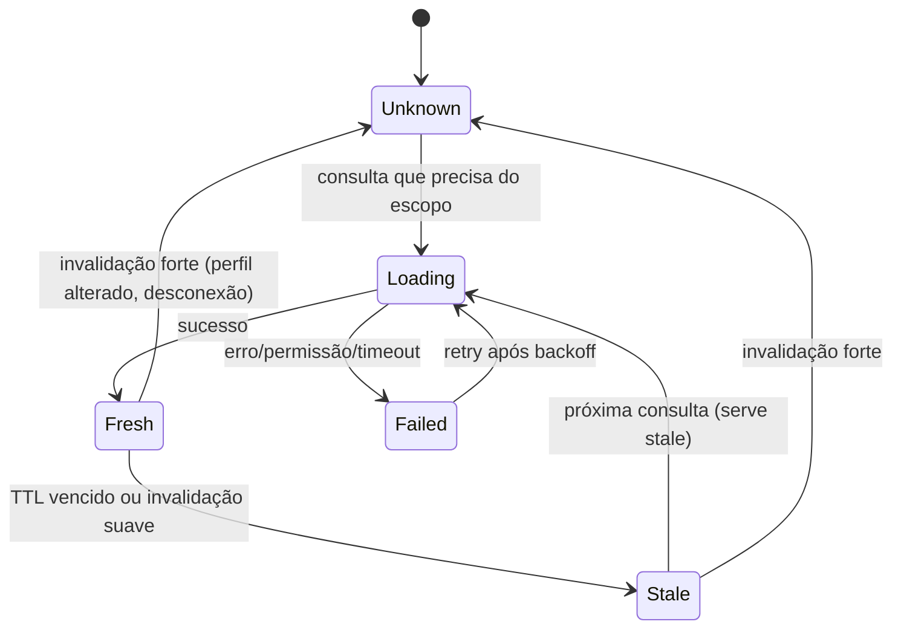

# Knowledge Catalog

## Responsabilidade

Disponibilizar, sem I/O no caminho da tecla, tudo o que a IDE sabe sobre a linguagem MongoDB e sobre as conexões do usuário, em uma estrutura consultável por **tipo de símbolo**, **escopo**, **dialeto** e **prefixo**.

Não é responsabilidade do catálogo: interpretar o cursor ([Context Engine](context-engine.md)), ordenar sugestões ([Ranking](ranking.md)) ou montar prompts ([contexto de IA](ai-context.md)).

O catálogo combina camadas:

```text
Linguagem MongoDB embutida (dados versionados, por dialeto e versão de servidor)
+ Metadados da conexão (bancos, coleções, tipos, índices)
+ Evidências de schema (validator, índices, resultados, aprendizado persistido, amostra explícita)
+ Símbolos do editor (declarações locais, chaves de ENV por nome)
+ Estatística de uso (aceites recentes, em memória)
```

## Modelo semântico

### Tipos de símbolo

| `SymbolKind` | Exemplos | Origem |
| --- | --- | --- |
| `Connection` | `servidor-alfa` | Perfis |
| `Database` | `Projetos` | Metadados |
| `Collection`, `View`, `TimeSeriesCollection` | `Clientes` | Metadados (`listCollections`) |
| `Field` | `Cliente.Id` | Evidências de schema |
| `Index` | `Cliente.Id_1` | `listIndexes` |
| `DslRoot` | `db`, `ConnectionPool`, `ENV`, `console`, `EJSON` | Linguagem (dialeto Console) |
| `ConnectionMethod`, `DatabaseMethod`, `CollectionMethod`, `CursorMethod` | `getDatabase`, `getSiblingDB`, `find`, `sort` | Linguagem |
| `GlobalFunction` / `BsonConstructor` | `getConnection`, `ObjectId`, `UUID`, `CGUUID`, `NumberLong`, `ISODate` | Linguagem |
| `BsonType` | `binData`, `string`, `objectId`, `date` | Linguagem |
| `QueryOperator` (categorias: comparison, logical, element, evaluation, array, geospatial, bitwise) | `$eq`, `$and`, `$exists`, `$regex`, `$elemMatch` | Linguagem |
| `UpdateOperator` (field, array, modifier) | `$set`, `$push`, `$each`, `$[]` | Linguagem |
| `AggregationStage` | `$match`, `$lookup`, `$search` | Linguagem |
| `ExpressionOperator` (arithmetic, array, boolean, comparison, conditional, date, string, type, set, object, variable) | `$add`, `$map`, `$cond`, `$dateToString` | Linguagem |
| `Accumulator` / `WindowOperator` | `$sum`, `$push`, `$rank` | Linguagem |
| `SystemVariable` / `ScopedVariable` | `$$ROOT`, `$$NOW`, variáveis de `let` | Linguagem + contexto |
| `SearchOperator` / `SearchOption` (MongoDB Search / Atlas Search) | `compound`, `text`, `path`, `score` | Linguagem |
| `Keyword` | `const`, `return` | Linguagem |
| `Snippet` | filtro por intervalo, `$lookup` completo | Linguagem |
| `LocalVariable` | `const pedidos = db.Pedidos` | Editor |
| `EnvironmentKey` | `ENV.get("URI_BASE")` (somente nome) | Cofre de ambientes |

`SymbolKinds` é a versão em flags para consultas.

### Símbolo

Esboço conceitual, não contrato serializado existente (o código usa IDs string, CatalogScope e EditorDialects):

```csharp
public sealed record CatalogSymbol(
    SymbolId Id,                 // estável: "lang:query-operator/$eq", "meta:{perfil}/{banco}/{coleção}/field/Cliente.Id"
    SymbolKind Kind,
    string Name,                 // texto de correspondência
    ScopeKey Scope,              // onde é visível
    DialectSet Dialects,         // Console, MongoshScript, AggregationJson, …
    SymbolDetail Detail)         // tipo/assinatura curta exibida na lista
{
    public ShapeId? ValueShape { get; init; }            // shape do valor/argumento, quando aplicável
    public BsonTypeSet ApplicableTypes { get; init; }    // tipos de campo para os quais o operador faz sentido
    public ServerVersionRange Versions { get; init; }    // desde/até; depreciação
    public SnippetId? Snippet { get; init; }
    public EvidenceSet Evidence { get; init; }           // validator, índice, amostra, resultado, histórico
    public SymbolTraits Flags { get; init; }             // Write, Deprecated, AtlasOnly, Stale
}
```

Documentação longa, exemplos e links não ficam no símbolo: são obtidos por `ResolveAsync` apenas para o item destacado.

### Escopo

```text
ScopeKey
  Language(dialeto)                              → operadores, stages, métodos
  Connection(perfil)                             → bancos
    Database(perfil, banco)                      → coleções
      Collection(perfil, banco, coleção)         → campos raiz, índices
        FieldPath(perfil, banco, coleção, caminho) → campos filhos
```

Hoje ConnectionIdentity usa Id, TargetHost e hash truncado da URI salva; MongoClientPool usa settings efetivos resolvidos. Não são equivalentes. Evoluir com geração opaca de conexão/ambiente, invalidada ao editar perfil, credenciais, roteamento ou ENV; não persistir/publicar hash da URI.

### Dialetos

| Dialeto | Modo da aba | Superfície |
| --- | --- | --- |
| `Console` | Console | Proxies de [`ConsoleBootstrap.js`](../../src/EsilvaSoft.SlopStudio.Infrastructure/ConsoleBootstrap.js) |
| `MongoshScript` | Script | API do mongosh suportada pelo runner (`getSiblingDB`, `print`, `printjson`, cursores) |
| `AggregationJson` | Agregação | Array de stages como literal JavaScript |
| `Mql` | Contexto embutido | Filtros, updates, projeções e pipelines dentro de qualquer dialeto |

### Exemplo

A estrutura sugerida na meta, no modelo proposto:

```yaml
- id: meta:alfa/connection
  kind: Connection
  name: servidor-alfa
  scope: Global
- id: meta:alfa/Projetos
  kind: Database
  name: Projetos
  scope: Connection(servidor-alfa)
- id: meta:alfa/Projetos/Clientes
  kind: Collection
  name: Clientes
  scope: Database(servidor-alfa, Projetos)
  detail: "collection · validator"
- id: meta:alfa/Projetos/Clientes/field/Id
  kind: Field
  name: Id
  scope: Collection(servidor-alfa, Projetos, Clientes)
  detail: "binData (UUID subtype 4)"
  evidence: [validator, index:Id_1]
- id: meta:alfa/Projetos/Clientes/field/Nome
  kind: Field
  name: Nome
  detail: "string · 98%"
  evidence: [sample(100)]
- id: lang:query-operator/$eq
  kind: QueryOperator
  name: $eq
  scope: Language(Mql)
  valueShape: FieldValue
  applicableTypes: any
```

## Linguagem MongoDB como dados

### Arquivo embutido

[`Application/Language/mongodb-language.v1.json`](../../src/EsilvaSoft.SlopStudio.Autocomplete.Core/mongodb-language.v1.json), recurso embutido carregado uma vez por [`LanguageDefinition`](../../src/EsilvaSoft.SlopStudio.Autocomplete.Core/LanguageDefinition.cs) e congelado (`FrozenDictionary`). Contém grupos de símbolos, assinaturas, shapes e snippets. Descrições em pt-BR; identificadores em inglês. Versão do arquivo e testes de schema garantem integridade.

O JSON abaixo é ilustrativo; **não substituir o recurso por ele**. O loader atual lê groups, snippets e shapes; preservar schema/versão ou migrar explicitamente.

```json
{
  "version": 1,
  "symbols": [
    { "id": "query-operator/$in", "kind": "QueryOperator", "category": "comparison", "name": "$in",
      "detail": "Pertence à lista", "valueShape": "ValueArray", "applicableTypes": "any", "since": "2.0" },
    { "id": "query-operator/$size", "kind": "QueryOperator", "category": "array", "name": "$size",
      "detail": "Tamanho do array", "valueShape": "NonNegativeInteger", "applicableTypes": ["array"] },
    { "id": "collection-method/find", "kind": "CollectionMethod", "name": "find", "dialects": ["Console", "MongoshScript"],
      "signature": "find(filter?, projection?)", "returns": "Cursor",
      "parameters": [ { "name": "filter", "shape": "Filter" }, { "name": "projection", "shape": "Projection" } ],
      "snippet": "find({ $1 })" },
    { "id": "collection-method/deleteMany", "kind": "CollectionMethod", "name": "deleteMany", "flags": ["Write"],
      "dialects": ["Console", "MongoshScript"], "parameters": [ { "name": "filter", "shape": "Filter" } ] },
    { "id": "stage/$lookup", "kind": "AggregationStage", "name": "$lookup", "valueShape": "LookupBody",
      "snippet": "{ \\$lookup: { from: \"${1:colecao}\", localField: \"${2}\", foreignField: \"${3}\", as: \"${4:resultado}\" } }" }
  ],
  "shapes": {
    "Filter": { "keys": [
      { "rule": "FieldPath", "value": "FieldCondition" },
      { "rule": "Operator", "category": "logical", "value": "FilterArray" },
      { "rule": "Operator", "names": ["$expr"], "value": "Expression" },
      { "rule": "Operator", "names": ["$jsonSchema", "$text", "$comment"] } ] },
    "FieldCondition": { "value": ["FieldValue", "OperatorObject"] },
    "OperatorObject": { "keys": [ { "rule": "Operator", "kinds": ["QueryOperator"], "typedBy": "ParentField" } ] },
    "LookupBody": { "keys": [
      { "rule": "Fixed", "name": "from", "value": "CollectionNameString", "required": true },
      { "rule": "Fixed", "name": "localField", "value": "FieldPathString" },
      { "rule": "Fixed", "name": "foreignField", "value": "FieldPathString", "scope": "SiblingCollection:from" },
      { "rule": "Fixed", "name": "let", "value": "VariableDeclarations" },
      { "rule": "Fixed", "name": "pipeline", "value": "Pipeline", "scope": "SiblingCollection:from" },
      { "rule": "Fixed", "name": "as", "value": "NewFieldName", "required": true } ] }
  }
}
```

### Shapes

Shapes são um mini-sistema de tipos da MQL: descrevem quais chaves e valores são válidos em cada objeto ou array, e de onde vêm os nomes. Regras de chave:

| Regra | Significado |
| --- | --- |
| `FieldPath` | Chave é caminho de campo do escopo atual (raiz da coleção, elemento de array, saída do stage anterior) |
| `Operator` | Chave é operador de um tipo/categoria; opcionalmente tipado pelo campo pai |
| `Fixed` | Chave fixa (`from`, `localField`, `path`, `score`) |
| `Dynamic` | Chave livre com shape de valor definido (saída de `$group`, `$project`) |
| `Exclusive` | Uma única chave permitida (corpo de stage) |

Regras de valor: `FieldValue` tipado pelo campo, `Expression`, `FieldPathString`, `FieldReference` (`"$campo"`), `CollectionNameString`, `Pipeline`, arrays de shape, literais enumerados (`1`/`-1` em sort), construtores BSON.

Consequência: `db.Clientes.find({ Id: { | } })` e `{ $match: { Id: { | } } }` chegam ao mesmo shape `OperatorObject`, sem regra específica para nenhum dos dois.

### Versões e depreciação

`since`/`until`/`deprecated` por símbolo. Com versão de servidor conhecida (topologia já carregada pelo Explorer), símbolos fora da faixa são filtrados; sem versão, nada é filtrado e o detalhe informa a versão mínima.

### Contrato com o runtime do Console

Teste de contrato na suíte regular: executa o bootstrap em Jint com host falso e compara as chaves expostas por `db`, coleção, cursor e conexão com os símbolos do dialeto `Console`. Divergência falha o teste — impede sugerir método que o Console não executa (situação atual com `bulkWrite`).

### Projeção para highlighting

`MongoSyntaxVocabulary` passa a ser derivado do arquivo embutido, preservando os conjuntos atuais como superconjunto (o highlighting colore também APIs do mongosh não expostas pelo Console). A troca exige `SyntaxHighlightingTests` inalterados.

## Metadados dinâmicos

### Snapshot por conexão

```text
ConnectionCatalog (imutável, por identidade de perfil)
  Databases: FreshnessBox<NameTable<DatabaseEntry>>
  DatabaseEntry
    Collections: FreshnessBox<NameTable<CollectionEntry>>     ← listCollections nameOnly + authorizedCollections
  CollectionEntry(Name, Type: collection|view|timeseries)
    Definition: FreshnessBox<CollectionMetadata>              ← listCollections filtrado pelo nome: tipo + validator (LRU)
    Indexes: FreshnessBox<IReadOnlyList<IndexInfo>>           ← listIndexes (LRU)
    Schema:  FreshnessBox<CollectionSchema>                   ← mescla de evidências
  ServerVersion?                                               ← topologia já carregada
```

`FreshnessBox<T>` guarda valor, estado, instante de carga e próximo retry.

### Schema

```csharp
public sealed record CollectionSchema(FieldNode Root, SchemaEvidenceSummary Evidence);

public sealed record FieldNode(
    string Name,
    FieldPath Path,
    BsonTypeCounts Types,              // contagem por tipo observado/declarado; subtype de binData quando conhecido
    double? Occurrence,                // fração de documentos amostrados com o campo
    FieldTraits Flags,                 // Required (validator), Indexed, Array, ArrayOfDocuments, Enum, Truncated
    NameTable<FieldNode> Children,     // campos de subdocumentos; para arrays de documentos, campos do elemento
    EvidenceSet Evidence)
{
    public IReadOnlyList<string>? EnumLiterals { get; init; } // somente de validator enum, limitado
}
```

- **Aninhados:** filhos em `Children`; o caminho usa notação de ponto.
- **Arrays:** `Flags.Array`; se os elementos forem documentos, seus campos ficam em `Children` com `ArrayOfDocuments`, pois a notação de ponto do MongoDB atravessa arrays (`itens.sku`). Operadores posicionais (`$`, `$[]`, `$[id]`) só aparecem em shapes de update.
- **Polimorfismo:** `Types` guarda todos os tipos com contagem; o detalhe mostra o predominante e "+2 tipos".
- **Limites:** profundidade 12 (igual a `InferFieldPaths`), até 10 000 nós por coleção (provisório); excedente é marcado `Truncated`.

### Evidências e mesclagem

| Evidência | Confiança | Traz |
| --- | --- | --- |
| Validator `$jsonSchema` | Alta (declarado) | Nomes, `bsonType`, `required`, `enum`, `items` |
| Índice | Alta para existência | Caminhos de chave; bônus de ranking |
| Resultados da aba | Média | Nomes e tipos dos documentos já carregados (reutiliza `InferFieldPaths`, memoizado por conjunto) |
| Amostra explícita | Média, com ocorrência | Nomes, tipos e frequência |
| Histórico de aceite | Baixa | Nomes efetivamente usados |

Mesclagem por união de nós: tipos somados por fonte, `Required` apenas do validator, ocorrência apenas da amostra. Conflito de tipo não remove o campo; aumenta a lista de tipos.

## Fontes e carregamento

| Fonte | Comando | Custo | Quando carrega | Restrições |
| --- | --- | --- | --- | --- |
| Bancos | `listDatabases` (`nameOnly`) | Baixo | Primeiro contexto que espere banco na conexão, ou escrita pelo Explorer | Somente perfil conectado da aba |
| Coleções | `listCollections` `nameOnly: true` (fallback `authorizedCollections: true`) | Baixo, sem locks no 5.0+ | Contexto esperando coleção, ou Explorer | Idem |
| Tipo e validator | `listCollections` filtrado pelo nome, **uma chamada por coleção editada** | Baixo | Contexto esperando campos da coleção | Idem; entra no LRU |
| Índices | `listIndexes` | Baixo | Contexto esperando campo/índice da coleção, ou Explorer | Idem |
| Resultados | Memória da aba | Nenhum remoto | Ao concluir execução | Somente a aba de origem |
| Amostra de schema | Pipeline de nomes/tipos no servidor | Médio/alto | **Ação explícita** ("Amostrar schema") ou opt-in por conexão | Nunca automática por padrão ([AC-05](decisions.md)) |
| Linguagem | Recurso embutido | Uma vez | Primeiro uso | — |

Regras gerais: nunca abrir conexão só para autocomplete; nunca carregar por tecla (single-flight + TTL); prioridade `Low` na barra de operações, sem poluir mensagens; token do scheduler, cancelado apenas por invalidação, desconexão ou encerramento.

### Amostragem de schema no servidor

Os valores não precisam trafegar: o pipeline devolve somente nomes e tipos. Gerado programaticamente até a profundidade configurada (padrão proposto: 4); abaixo, o exemplo com dois níveis:

```javascript
[
  { $sample: { size: 100 } },
  { $project: { _id: 0, f: { $map: { input: { $objectToArray: "$$ROOT" }, as: "p", in: {
      k: "$$p.k",
      t: { $type: "$$p.v" },
      c: { $cond: [ { $eq: [ { $type: "$$p.v" }, "object" ] },
                    { $map: { input: { $objectToArray: "$$p.v" }, as: "q", in: { k: "$$q.k", t: { $type: "$$q.v" } } } },
                    "$$REMOVE" ] }
  } } } } }
]
```

Opções: `maxTimeMS` 2000, `comment` identificando a origem, roteamento do perfil respeitado. Limites conhecidos: `$type` não informa o subtype de `binData` (UUID é refinado pelo validator ou pelos resultados via `UuidCodec`); em views, a amostra executa o pipeline da view; `$sample` pode varrer a coleção quando o tamanho pedido é grande em relação ao total. A ferramenta de validador existente (que hoje traz documentos completos) pode migrar para esse pipeline.

## Cache

### Estados de frescor



### TTL provisórios

| Escopo | TTL | Observação |
| --- | --- | --- |
| Bancos | 5 min | Mudam raramente |
| Coleções | 2 min | DDL da própria IDE invalida imediatamente |
| Definição (tipo + validator) por coleção | 10 min | Alterada pela ferramenta de validação invalida |
| Índices | 5 min | Criação/remoção pela IDE invalida |
| Amostra de schema | 30 min | Só existe após ação explícita |
| Campos de resultados | Enquanto o conjunto existir | Liberados com o resultado |

Valores iniciais para calibração com as métricas `metadata.cache.*`; não são limites de produto.

### Políticas

- **Stale-while-revalidate:** consulta devolve o valor vencido marcado `Stale` e agenda revalidação.
- **Single-flight:** um `Task` por chave; consultas concorrentes aguardam o mesmo resultado sem bloquear a UI.
- **Backoff:** falha → 30 s, 2 min, 10 min; erro de autorização em `listCollections` tenta uma vez `authorizedCollections: true`.
- **Imutabilidade:** valores publicados são snapshots; implementação atual sincroniza entradas com locks curtos. Reduzir trabalho sob lock e medir contenção, sem exigir reescrita lock-free.
- **Orçamento de memória:** definições, índices e schemas amostrados compartilham um LRU de 64 entradas por conexão; nomes de bancos e coleções não entram no LRU. Medido em 14/09/2026: **29,9 MB** retidos no cenário 1 000 coleções × 1 000 campos com validator em todas ([performance](performance.md#baseline-medida--fase-1)). A primeira implementação carregava todos os validators do banco em uma chamada e retinha 99,7 MB fora do LRU; foi substituída pela carga por coleção.
- **Persistência:** aprendizado de resultados find passa a integrar esta revisão; coleções versionadas e deltas no proprietário LiteDB atual, conforme [schema-learning.md](schema-learning.md). Metadados remotos continuam em memória; não persistir resultados/valores.

## Invalidação

| Evento | Chaves invalidadas | Tipo |
| --- | --- | --- |
| Explorer: atualizar/recarregar nó | Escopo do nó e descendentes | Forte |
| Explorer carregou nó | Escreve snapshot fresco do escopo (write-through) | — |
| `CreateCollection`, `DropCollection`, `RenameCollection`, views | Coleções do banco; schema da coleção | Forte |
| `DropDatabase`, `CreateDatabase` | Bancos da conexão | Forte |
| `CreateIndex`, `DropIndex`, visibilidade | Índices da coleção | Forte |
| Validação configurada | Definição da coleção | Forte |
| Escrita bem-sucedida (insert/update) | Nenhuma (schema amostrado vira `Stale` só se a amostra existir) | Suave |
| Métodos DDL executados pelo Console | Mesmas regras, pela operação auditada | Forte |
| Perfil editado/removido, desconexão | Todo o `ConnectionCatalog` | Forte |
| Resultado da aba descartado | Evidência de resultados daquela aba | — |
| Comando "Atualizar metadados" | Escopo escolhido | Forte |

`WorkspaceService` publica os eventos em um `IMetadataInvalidationBus` após o sucesso de cada operação; o cache assina. Change streams de DDL foram descartados (exigem replica set e privilégios, e manteriam conexões abertas).

## Indexação para busca

Cada escopo guarda uma `NameTable`: arrays paralelos ordenados por chave normalizada (ordinal, maiúsculas invariantes), com índice auxiliar de iniciais de *camel humps* e partes separadas por `_`/`.`.

| Consulta | Algoritmo | Custo |
| --- | --- | --- |
| Prefixo | Busca binária dos limites inferior e superior | O(log n + k) |
| Camel humps (`cN` → `clienteNome`) | Busca binária no índice de iniciais | O(log n + k) |
| Substring/subsequência | Varredura limitada ao escopo, só se as anteriores trouxerem menos que o máximo | O(n) com n ≤ tamanho do escopo |
| Exato | NameTable.TryGetExact usa busca binária e comparação ordinal | O(log n + colisões de caixa) |

Por que não trie ou FST: os escopos são pequenos a médios (até ~10⁴), reconstruídos por inteiro a cada carga e imutáveis; arrays ordenados são compactos, amigáveis ao cache de CPU e triviais de trocar atomicamente. Trie compensaria apenas com inserções incrementais frequentes em conjuntos muito maiores. A escolha será validada pelo benchmark da Fase 1.

Consultas só percorrem os escopos exigidos pelo contexto: se o esperado é `Field`, nenhuma tabela de conexões, bancos ou métodos é tocada.

## Contratos

Esboços de evolução: IKnowledgeCatalog atual só tem Query, sem Changed/ResolveAsync. Assinaturas compiláveis atuais estão em CatalogModel.cs/MetadataModel.cs; o evento atual identifica perfil, não escopo. Não copiar interfaces abaixo sem reconciliar esses tipos.

```csharp
public interface IKnowledgeCatalog
{
    CatalogResult Query(in CatalogQuery query, CancellationToken cancellationToken);
    ValueTask<SymbolDocumentation?> ResolveAsync(SymbolId id, CancellationToken cancellationToken);
    event EventHandler<CatalogChangedEventArgs>? Changed;
}

public readonly record struct CatalogQuery(
    SymbolKinds Kinds, DialectSet Dialect, ScopeKey Scope, string Prefix,
    ShapeId? Shape = null, FieldPath? ParentField = null, int MaximumCandidates = 200);

public sealed record CatalogResult(IReadOnlyList<CatalogCandidate> Candidates, CatalogCompleteness Completeness);
public enum CatalogCompleteness { Complete, Partial, Loading, Unavailable }

public interface ICatalogSource
{
    SymbolKinds ProvidedKinds { get; }
    void Collect(in CatalogQuery query, ICandidateSink sink, CancellationToken cancellationToken);
}

// Implementado na Fase 1 (resumo): leituras nunca bloqueiam; Peek nunca agenda carga remota.
public interface IMetadataCache
{
    event EventHandler<MetadataChangedEventArgs>? Changed;
    bool IsConnected(ConnectionIdentity connection);
    void Connect(ConnectionProfile profile);          // somente perfis conectados carregam remotamente
    void Disconnect(Guid profileId);                  // cancela cargas e remove tudo do perfil
    void SetSchemaSamplingAllowed(Guid profileId, bool allowed);
    MetadataView<IReadOnlyList<string>> GetDatabases(ConnectionIdentity connection, MetadataAccess access = MetadataAccess.LoadIfNeeded);
    MetadataView<IReadOnlyList<CollectionEntry>> GetCollections(ConnectionIdentity connection, string database, MetadataAccess access = MetadataAccess.LoadIfNeeded);
    MetadataView<CollectionMetadata> GetDefinition(ConnectionIdentity connection, string database, string collection, MetadataAccess access = MetadataAccess.LoadIfNeeded);
    MetadataView<IReadOnlyList<IndexInfo>> GetIndexes(ConnectionIdentity connection, string database, string collection, MetadataAccess access = MetadataAccess.LoadIfNeeded);
    MetadataView<CollectionSchema> GetSampledSchema(ConnectionIdentity connection, string database, string collection, MetadataAccess access = MetadataAccess.LoadIfNeeded);
    void PutDatabases(ConnectionProfile profile, IReadOnlyList<string> databases);                         // write-through do Explorer
    void PutCollections(ConnectionProfile profile, string database, IReadOnlyList<string> collections);
    void PutIndexes(ConnectionProfile profile, string database, string collection, IReadOnlyList<IndexInfo> indexes);
    Task RefreshAsync(MetadataKey key, CancellationToken cancellationToken = default);                     // força carga, ignora TTL e backoff
    Task<CollectionSchema> SampleSchemaAsync(ConnectionProfile profile, string database, string collection, SchemaSampleOptions? options = null, CancellationToken cancellationToken = default);
    void Invalidate(MetadataInvalidation invalidation);
    IReadOnlyList<MetadataNamespace> SnapshotNamespaces(int maximum);
}

public readonly record struct MetadataView<T>(T? Value, MetadataFreshness Freshness, DateTimeOffset? LoadedAt, bool IsRefreshing) where T : class;

// Infrastructure, via driver; recebe o perfil capturado, nunca a URI no contrato
public interface IMongoMetadataSource
{
    Task<IReadOnlyList<string>> ListDatabaseNamesAsync(ConnectionProfile profile, CancellationToken cancellationToken);
    Task<IReadOnlyList<string>> ListCollectionNamesAsync(ConnectionProfile profile, string database, CancellationToken cancellationToken);
    Task<CollectionDefinition?> GetCollectionDefinitionAsync(ConnectionProfile profile, string database, string collection, CancellationToken cancellationToken);
    Task<IReadOnlyList<IndexInfo>> ListIndexesAsync(ConnectionProfile profile, string database, string collection, CancellationToken cancellationToken);
    Task<SchemaSample> SampleSchemaAsync(ConnectionProfile profile, string database, string collection, SchemaSampleOptions options, CancellationToken cancellationToken);
}
```

## Integração com o código existente

| Existente | Integração |
| --- | --- |
| `IMongoWorkspaceService`/`MongoWorkspaceService` | Inalterados; [`MongoMetadataSource`](../../src/EsilvaSoft.SlopStudio.Infrastructure/MongoMetadataSource.cs) reutiliza `MongoClientPool`, `OperationEnvironment` e `ExplorerMetadataService.ParseIndex` |
| `ExplorerMetadataService.ParseIndex` | Reutilizado para `IndexInfo` |
| `ExplorerNodeViewModel` | Após carregar, escreve no cache; ao atualizar, invalida |
| `WorkspaceViewModel.KnownSyntaxNamespaces` | Passa a derivar do cache (highlighting mantém `SyntaxContext`) |
| `MqlAutocompleteService.InferFieldPaths`/`InferJsonSchema` | Núcleo do `SchemaBuilder` para resultados; wrappers preservados |
| `MongoSyntaxVocabulary` | Projeção do arquivo embutido |
| `EnvironmentVault` | Fonte de `EnvironmentKey` (somente nomes) |


## Consolidação antes de integrar os providers

Revisão de 15/09/2026. A base da Fase 1 existe; tarefas K11–K17 consolidam riscos antes do automático.

- Propagar MetadataAccess.Peek por CatalogQuery/fontes para não agendar rede no automático ou refiltro. Refresh explícito tem fila limitada (2 por conexão/4 globais iniciais), single-flight e geração própria.
- Write-through deve incrementar geração ou substituir Entry; carga que começou antes não pode sobrescrevê-lo. Amostra explícita precisa da mesma guarda contra desconexão/invalidade/opt-out. Cancelar espera de um consumidor não cancela os demais.
- Preservar tipo retornado por listCollections nameOnly sem carregar validators do banco. Hoje ListCollectionNamesAsync descarta tipo e cria Unknown; erro 13 de definição retorna Unknown, não prova schema completo.
- Cache de schema mesclado limitado por escopo/revisões e evidência local da aba; não uma única entrada singleton. Reaproveitar NameTable de perfis/nomes; impor limite conjunto de nós/profundidade/bytes depois da união, não só em cada fonte.
- Resultados Derived/PartialProjection não se tornam schema autoritativo da coleção; evidência é local à aba/versão do resultado. Amostra e índice são evidências parciais, validator também pode permitir campos adicionais. Ausência de nome não prova invalidade MongoDB.
- Complete (frescor), SearchExhausted (busca sem truncamento), Coverage (schema parcial/declarado) e Capability (suportado/desconhecido/indisponível) são dimensões diferentes. Não usar Complete como veto absoluto de campo IA ou garantia de candidato único.
- Query hoje concatena fontes até atingir limite; plano deve filtrar shape/dialeto antes do corte e reservar cotas por tipo para não deixar uma fonte ocultar todos os campos. Reportar truncamento e reconsultar ao refinar; top-2 automático só quando cobertura da busca é suficiente.
- Changed deve incluir chave/geração/estado terminal, inclusive falha; coalescer notificações no dispatcher e não repetir mensagem a cada tecla.
- Atlas/Search exige capability conhecida para ghost; versão desconhecida pode mostrar item explícito com indicação. Não sondar servidor por tecla nem confundir autocomplete do editor com operador de busca autocomplete.

Estas são mudanças propostas, não garantias já presentes. Testes de permissão/gerações/bytes/cobertura constam em [execution-plan.md](execution-plan.md).


## Aprendizado probabilístico como fonte

[Schema Learning](schema-learning.md) usa resultados find já entregues para extrair/mesclar deltas, sem consultas adicionais. Identity = ProfileId + SourceGenerationId + Database + Collection; FieldPath por segmentos para distinguir ponto literal. Fonte learned conserva presença/tipos/denominadores, arrays, FirstSeen/LastSeen e cobertura Observed. Repetição entre queries é observação, não documento único; BatchId deduplica somente entrega/retry.

Não somar contagens de validator, índice, amostra e learned como se fossem uma população. PartialProjection/Derived/Unknown só ficam na aba inicialmente; aprendido persistido participa de nomes/tipos, nunca valores. Hidratar por namespace no background, atualizar tabelas em memória por revisão. Prefixo não consulta LiteDB. Essa decisão substitui o adiamento de persistência, com tarefas L11–L16 e testes próprios.
