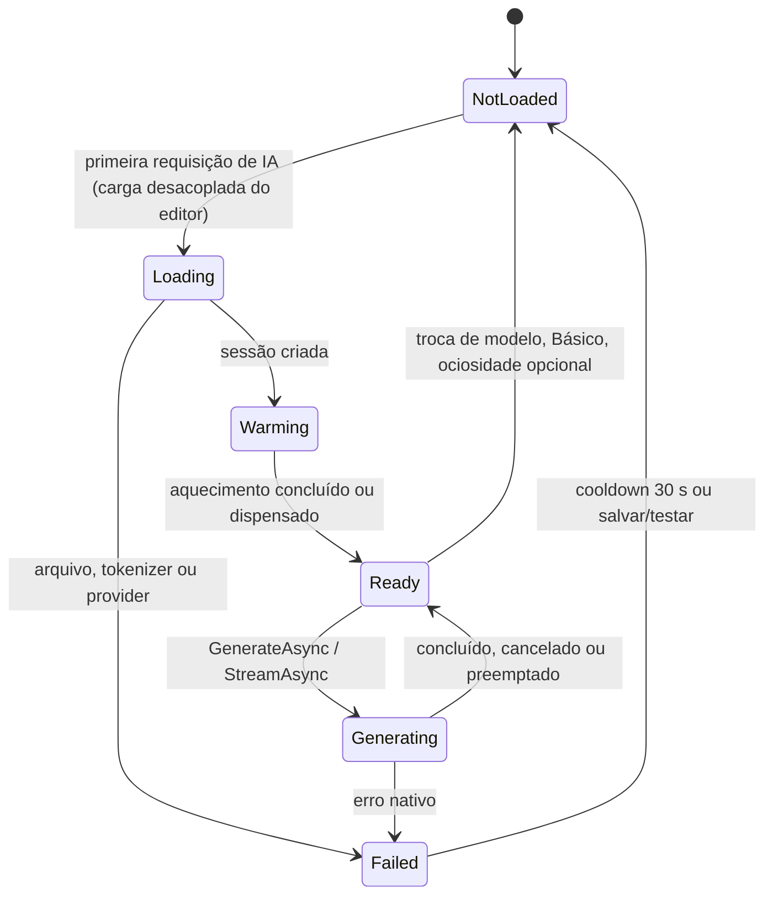

# Estratégia ONNX

A infraestrutura atual ([26 — IA local multimodelo](../26-ia-local-multimodelo.md), [23 — ONNX/SlopCoder](../23-onnx-slopcoder.md)) já resolve catálogo de modelos, adapters por família, seleção de hardware, fila e cancelamento. Esta estratégia **mantém** essa base e propõe extensões focadas em latência e contratos de contexto.

## Abstrações (nomes do projeto)

| Conceito | Tipo existente | Mudança |
| --- | --- | --- |
| Modelo | `LocalModelDefinition` + `LocalModelMetadata` | Campos opcionais de contrato e inline |
| Família/arquitetura | `IModelAdapter` (`QwenCoderModelAdapter`, `DeepSeekCoderModelAdapter`) | Declara contratos de contexto suportados |
| Tokenizer | `ITokenizer` (`OnnxModelTokenizer`, `DeepSeekModelTokenizer`) | Contagem e decodificação incremental |
| Prompt | `ICompletionPromptBuilder` | Aceita blocos pré-tokenizados; cache de marcadores |
| Runtime | `ILocalModelRuntime` (`OnnxLocalModelRuntime`) | Prompt por IDs, streaming, prefix cache |
| Serviço | `ILocalAiModelService` | Sem mudança de responsabilidade |
| Hardware | `IAiHardwareProbe`, `AiProviderSelector` | Política de latência por modalidade |

## Estrutura de modelos

Mantida: cada subpasta do diretório de modelos é um candidato.

```text
Models/
├── SlopCoder-Mongo-0.5B-ONNX-DML-FP16/
│   ├── genai_config.json
│   ├── model.onnx
│   ├── model.onnx.data
│   ├── tokenizer.json
│   ├── tokenizer_config.json
│   └── slopstudio-model.json      (opcional)
├── Qwen2.5-Coder-0.5B-onnx-int4-cpu/
└── OutroModeloQuantizado/
```

Campos propostos (todos opcionais, aditivos) em `slopstudio-model.json`:

```json
{
  "contextContract": "editor-context-v1",
  "supportsRepositoryContext": false,
  "generation": {
    "autocomplete": { "maxTokens": 64, "temperature": 0 },
    "inline": { "maxTokens": 24, "temperature": 0 },
    "chat": { "maxTokens": 256 }
  }
}
```

Ausência de `contextContract` preserva o comportamento atual. Contrato desconhecido torna a pasta `Invalid` com mensagem clara (regra de validação existente).

## Extensões do runtime

```csharp
public sealed record ModelGenerationRequest(string Prefix, string Suffix, int ContextTokens, int MaximumTokens, bool RequireFullContext = false)
{
    public double Temperature { get; init; }
    public IReadOnlyList<int>? PromptTokens { get; init; }        // novo: prompt já montado pelo builder
    public PrefixCacheMode PrefixCache { get; init; }             // novo: Disabled (padrão) | Reuse
    public IReadOnlyList<string> StopSequences { get; init; } = [];
}

public interface ILocalModelRuntime : IAsyncDisposable
{
    // existentes: InitializeAsync, GenerateAsync, RuntimeInfo
    IAsyncEnumerable<GeneratedChunk> StreamAsync(ModelGenerationRequest request, CancellationToken cancellationToken)
        => DefaultStream(request, cancellationToken);   // implementação padrão adapta GenerateAsync
}
```

A implementação padrão mantém runtimes de teste existentes compilando.

## Reuso de prefixo do KV cache

Experimento da Fase 4, desligado por padrão até medição.

```text
runtime guarda: Generator ativo + tokens do último prompt + parâmetros de busca
novo pedido com tokens P:
  lcp ← maior prefixo comum entre P e o último prompt
  se lcp ≥ mínimo (inicial: 64 tokens) e parâmetros compatíveis:
      generator.RewindTo(lcp); generator.AppendTokens(P[lcp..])
  senão:
      descarta Generator; cria novo com max_length = janela do modelo; AppendTokens(P)
invalidar: descarga/troca de modelo, troca de provider, chat (prompt diferente), erro nativo, terminate_session
```

- Em FIM, alterar o prefixo invalida tudo depois do ponto alterado (inclusive o sufixo). Por isso o builder coloca blocos estáveis no início; digitar no fim do prefixo preserva cabeçalho e código anterior.
- **Correção:** teste obrigatório — com decodificação greedy, a saída com reuso deve ser idêntica à saída sem reuso para a mesma sequência de pedidos.
- **Riscos:** memória do KV para a janela inteira; compatibilidade com captura de grafo do DirectML; estado após `terminate_session`. Qualquer falha desativa o reuso para o par modelo/provider na sessão.

## Hardware

Mantido de [26](../26-ia-local-multimodelo.md#hardware): Automático NPU → GPU → CPU entre dispositivos reportados pelo ONNX Runtime e compatíveis com o `hardware` do metadata, com fallback na carga e na geração; escolha explícita sem fallback silencioso.

Acréscimos:

| Política | Regra |
| --- | --- |
| Perfil de latência | Após cada geração, atualiza p50/p95 de TTFT e tokens/s por modelo + provider (memória da sessão) |
| Camada 1 do preemptivo | Habilitada somente se p95 de TTFT estiver dentro do orçamento inline; caso contrário, desativada com indicação discreta no status |
| IA explícita | Sempre permitida; indicador de progresso |
| Aquecimento | Após carga, prefill curto de um cabeçalho típico em segundo plano (`Background`); manter só se reduzir o primeiro TTFT medido |
| Threads | `intra_op_num_threads = 0` hoje; avaliar reservar um núcleo para a UI durante inferência de fundo, medindo quadros perdidos |
| Descarga por ociosidade | Opcional (desligada), após N minutos sem uso, para liberar memória |
| NPU | Continua não homologada: QNN/OpenVINO/VitisAI exigem exportações específicas; nenhum build atual os distribui |

Distribuições (`Cpu`, `WinML`, `Cuda`) e lockfiles permanecem inalterados.

## Ciclo de vida



## Métricas medidas

Tempo de carga, provider efetivo, fallback, working set após carga, TTFT, tokens/s, tokens de prompt e gerados, tokens reaproveitados pelo prefix cache. VRAM continua não medida (sem API do runtime).

## Matriz de homologação

| Pacote | CPU | DirectML | CUDA | NPU |
| --- | --- | --- | --- | --- |
| SlopCoder-Mongo-0.5B INT4 (CPU) | Medir | N/A (export CPU) | — | — |
| SlopCoder-Mongo-1.5B-full INT8 (CPU) | Medir | N/A | — | — |
| SlopCoder-Mongo-1.5B-full DML-FP16 | — | Medir | — | — |
| SlopCoder-Mongo-0.5B DML-FP16 | — | Medir | — | — |
| Qwen2.5-Coder-0.5B base Q4 | Medir (contratos A–E) | — | — | — |
| Pacote CUDA | — | — | Pendente de GPU NVIDIA | — |
| Pacote NPU | — | — | — | Pendente de exportação e hardware |

Cada célula medida registra modelo, hardware, build, contrato, orçamento, TTFT p50/p95, tokens/s e working set, em execução `Explicit` ([testing.md](testing.md#ia-com-modelos-reais)).


## Contrato de execução revisado — 15/09/2026

Adicionar política de carga ao serviço central: AllowLoad para explícito; LoadedOnly para automático. Validar papel/modelo/revisão sob PriorityGate imediatamente antes de usar runtime. Ready lido no editor pode ficar obsoleto. LoadedOnly também proíbe fallback que inicialize CPU, troca para modelo do autocomplete após chat e aquecimento implícito. Troca/falha retorna indisponibilidade segura; próxima ação explícita pode carregar/recuperar.

Runtime continua GenAI. OrtValue/buffers só pertencem a este agente se API medida exigir tensores; não criar sessão ORT bruta concorrente. Modelo/tokenizer são reutilizados; Generator por request continua baseline correto. Otimizar marcadores/encode/decode antes de KV cache; pooling exige ownership até conclusão/cancelamento, não devolver buffer enquanto nativo lê.

ITokenizer nativo não é publicado livremente para workers concorrentes: serviço/runtime possui lifetime e serializa acesso quando thread-safety não estiver garantida. Cache BPE obedece fronteiras verificadas; ver ai-context.md. StreamAsync deve manter gate/CTS até o consumidor concluir ou descartar enumeração; retorno antecipado libera recursos em finally, incluindo registro de cancelamento antes de Generator.Dispose.

TTFT atual exclui tokenização e criação de gerador. Medir esses trechos e fila separadamente, mais latência de ponta a ponta. Não habilitar inline só com TTFT; usar perfil completo e LoadedOnly. Warmup e descarga por ociosidade da tabela anterior são hipóteses adiadas, não parte do aceite.

RewindTo é experimento por pacote/provider/versão; verificar API no assembly fixado e equivalência greedy com sequência independente, erros, cancelamento, troca de alvo/modelo/chat. Não alterar o formato v1 para otimizar prefixo; isolá-lo por identidade de contexto. DirectML tem restrições próprias de sessão/concorrência, a validar via GenAI sem sobrepor opções indiscriminadamente.

R41–R43 no plano atribuem contratos, streaming e experimento ao agente ONNX Runtime. CPU/GPU/NPU exigem exportação compatível, build, dispositivo e evidência; capacidade detectada não conta como homologação.
