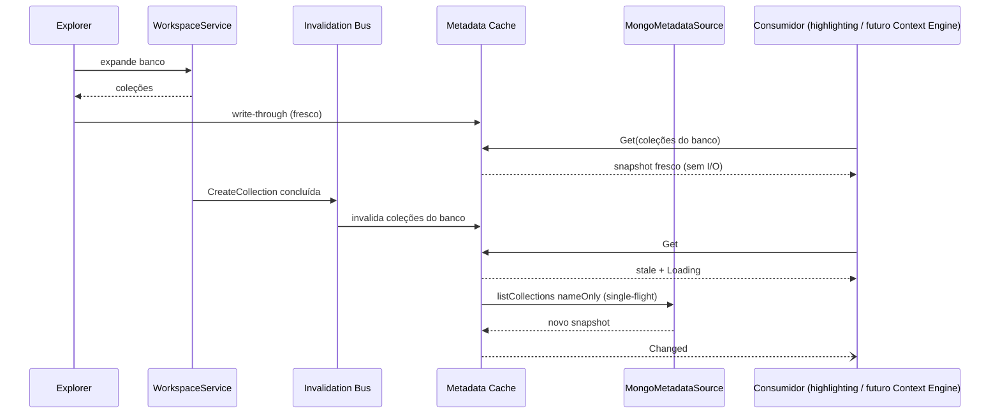

# Fase 1 — Disponibilização de dados para o autocomplete tradicional

Roadmap: v0.6.0 (EDT-02) · Depende de: nada · Habilita: Fases 2 e 3

## Estado da implementação

✅ Implementada em 14/09/2026. Nenhum comportamento visível do autocomplete mudou: ghost text e menu `Ctrl+Espaço` atuais continuam ativos até a Fase 2.

| Incremento | Estado | Implementação |
| --- | --- | --- |
| 1.1 Baseline e instrumentação | ✅ | [`tests/EsilvaSoft.SlopStudio.Benchmarks`](../../../tests/EsilvaSoft.SlopStudio.Benchmarks/) (`BaselineBenchmarks`, `CatalogQueryBenchmarks`, `MetadataStructureBenchmarks`, `MemoryScenario`); [`AutocompleteMetrics`](../../../src/EsilvaSoft.SlopStudio.Application/Language/AutocompleteMetrics.cs) gravado no caminho atual (`CompletionSession`, menu, handler do ghost, captura de contexto, `LocalAiModelService`) |
| 1.2 Linguagem embutida | ✅ | [`mongodb-language.v1.json`](../../../src/EsilvaSoft.SlopStudio.Application/Language/mongodb-language.v1.json), [`LanguageDefinition`](../../../src/EsilvaSoft.SlopStudio.Application/Language/LanguageDefinition.cs) com validação; `MongoSyntaxVocabulary` como projeção; teste de contrato com o bootstrap do Console |
| 1.3 Metadata Cache | ✅ | [`MetadataCache`](../../../src/EsilvaSoft.SlopStudio.Application/Language/MetadataCache.cs), `MetadataInvalidationBus`, [`MongoMetadataSource`](../../../src/EsilvaSoft.SlopStudio.Infrastructure/MongoMetadataSource.cs); write-through em `ExplorerNodeViewModel`; conexão e desconexão pelas raízes do `WorkspaceViewModel`; publicações em `WorkspaceService` e `ConsoleRuntime` |
| 1.4 Evidências de schema | ✅ | [`SchemaBuilder`, `CollectionSchema`, `FieldNode`](../../../src/EsilvaSoft.SlopStudio.Application/Language/CollectionSchema.cs); `InferFieldPaths` delega ao builder; campos de resultados memoizados por conjunto na aba; amostragem por `SampleSchemaAsync` ou opt-in |
| 1.5 Catálogo | ✅ | [`NameTable<T>`](../../../src/EsilvaSoft.SlopStudio.Application/Language/NameTable.cs), [`KnowledgeCatalog`, `LanguageCatalogSource`, `MetadataCatalogSource`](../../../src/EsilvaSoft.SlopStudio.Application/Language/KnowledgeCatalog.cs); highlighting e nomes do editor leem o cache sem agendar cargas |

### Desvios em relação ao plano

- **Validator por coleção, não por banco.** A primeira implementação carregava todos os validators do banco em uma chamada e retinha 99,7 MB no cenário 1 000 × 1 000. Tipo e validator passaram a ser carregados por coleção (`listCollections` filtrado pelo nome) dentro do LRU: 29,9 MB. Nomes continuam vindo de `nameOnly` + `authorizedCollections`.
- Arquivo de linguagem em `Application/Language/mongodb-language.v1.json`, sem subpastas `Catalog/Data`.
- `SymbolFlags` e `FieldFlags` foram renomeados para `SymbolTraits` e `FieldTraits` (regra CA1711 do repositório).
- O evento `ExplorerNodeViewModel.MetadataChanged` foi removido: as abas atualizam o contexto de highlighting pelo `IMetadataCache.Changed`.
- O opt-in de amostragem é persistido (`WorkspacePreferences.SchemaSamplingProfileIds`) e exposto em `WorkspaceViewModel.SetSchemaSamplingAllowedAsync`, sem controle visual; a UI pertence à Fase 2.
- A ferramenta de validador continua usando `QueryAsync` com documentos completos (item opcional desta fase, não alterado).
- `IMongoWorkspaceService` não mudou; a fonte de metadados é um serviço próprio da Infrastructure.

### Critérios de aceite

| # | Estado | Evidência |
| --- | --- | --- |
| 1 | 🚧 | Baseline dos componentes registrada em [performance](../performance.md#baseline-medida--fase-1); tempo de UI por tecla em Headless/nativo ainda não medido (instrumento `ui.autocomplete.dispatcher_time` disponível) |
| 2 | ✅ | `LanguageDefinitionTests`: integridade, cobertura do vocabulário e das sugestões atuais, contrato com as globais e proxies do Console |
| 3 | ✅ | `SyntaxHighlightingTests` e `SyntaxHighlightingUiTests` sem alteração, suíte aprovada |
| 4 | ✅ | `KnowledgeCatalogTests.MetadataIsAnsweredFromMemoryAndReportsUnavailableScopes`, `MetadataCacheTests.ConcurrentReadsShareOneLoadAndNeverBlock` |
| 5 | ✅ | 50 leituras concorrentes, 1 chamada remota |
| 6 | ✅ | `DisconnectedProfilesAndPeekNeverLoad` |
| 7 | ✅ | `WorkspaceOperationsPublishInvalidationsOnlyAfterSuccess`, `ConsoleWritesPublishInvalidationsForTheirNamespace`, `InvalidationsRemoveOrMarkExactlyTheAffectedKeys` |
| 8 | ✅ | `ExplorerLoadsWriteThroughAndFeedNamesWithoutRemoteMetadataCalls` |
| 9 | ✅ | `ResultsKeepDiscoveryOrderAndTypesButNeverValues`, pipeline de amostragem só com nomes e tipos; servidor real pendente de fixture |
| 10 | ✅ | `SchemaSamplingRequiresOptInOrAnExplicitAction` |
| 11 | ✅ | `CatalogQueryBenchmarks`: pior consulta com 10 000 campos em 0,15 ms de média, abaixo de 1 ms ([baseline](../performance.md#catálogo)); job curto, sem p95 |
| 12 | ✅ | `MemoryScenario`: 29,9 MB retidos, LRU de 64 entradas por conexão |
| 13 | 🚧 | Restore travado da solução e lockfiles das três variantes do projeto novo; build e testes executados só na variante padrão WinML |
| 14 | 🚧 | 15, 21, 24 e documentos desta pasta atualizados; ADRs ainda não promovidas para [10](../../10-decisoes-arquiteturais.md) |

Pendências: integração real de `MongoMetadataSource` (`MetadataSourceListsKindsValidatorsIndexesAndSamplesWithoutValues`, ignorado sem MongoDB portátil), medição de UI por tecla, segunda máquina de referência, builds Cpu/Cuda e Linux.

## Objetivo

Entregar uma camada de conhecimento **independente da UI**: linguagem MongoDB como dados, Metadata Cache com atualização e invalidação, evidências de schema e catálogo indexado para busca rápida. Medir o código atual antes de mudar o caminho do usuário e criar a instrumentação usada por todas as fases.

Nenhum comportamento visível muda nesta fase, exceto a origem dos nomes usados pelo highlighting (sem alteração visual).

## Situação atual

- Vocabulário duplicado em sete lugares ([current-state.md](../current-state.md#5-vocabulário-mongodb-duplicado)).
- Metadados apenas na árvore do Explorer (Desktop), sem TTL; `KnownSyntaxNamespaces`/`KnownAutocompleteNames` percorrem a árvore.
- Campos só dos resultados da aba via `InferFieldPaths`; validator e índices não alimentam sugestões.
- Sem benchmarks e sem métricas agregáveis.

## Incrementos

| # | Entrega | Resultado verificável |
| --- | --- | --- |
| 1.1 | Projeto de benchmarks, baseline do código atual, esqueleto de `Meter` | Tabela de baseline preenchida em [performance.md](../performance.md#baseline-do-código-atual-fase-1) |
| 1.2 | Linguagem embutida (`mongodb-language.v1.json`), carregador, validação, teste de contrato com o Console, projeção de `MongoSyntaxVocabulary` | Highlighting inalterado; contrato do Console verde |
| 1.3 | Metadata Cache (identidade, frescor, SWR, single-flight, backoff, LRU), barramento de invalidação, `IMongoMetadataSource`, write-through do Explorer | Testes de cache e invalidação |
| 1.4 | Evidências de schema: validator, índices, resultados memoizados, comando de amostragem de nomes/tipos | Schema mesclado sem valores |
| 1.5 | `IKnowledgeCatalog`, fontes, `NameTable`, `CatalogQuery`; highlighting passa a receber nomes do catálogo | Benchmarks de consulta na matriz de escala |

## Alterações

| Projeto | Arquivo | Alteração |
| --- | --- | --- |
| Raiz | `Directory.Packages.props`, `EsilvaSoft.SlopStudio.slnx` | BenchmarkDotNet fixado; projeto `tests/EsilvaSoft.SlopStudio.Benchmarks` com lockfiles das três variantes |
| Core | `WorkspaceSession.cs` | `ProfileSchemaSampling` (dicionário por conexão, aditivo) |
| Application | `SyntaxHighlighting/MongoSyntaxVocabulary.cs` | Derivado da linguagem embutida (superconjunto preservado) |
| Application | `MqlAutocompleteService.cs` | `InferFieldPaths`/`InferJsonSchema` delegam ao `SchemaBuilder`; assinaturas mantidas |
| Application | `WorkspaceService.cs` | Publica eventos de invalidação após DDL e alterações de validação/índices |
| Application | `AutocompleteService.cs` / diagnósticos | Instrumentos de métricas no caminho atual (baseline em produção de desenvolvimento) |
| Infrastructure | `MongoWorkspaceService.cs` ou novo `MongoMetadataSource.cs` | Listagens nameOnly com fallback `authorizedCollections`; `listCollections` com options por banco; pipeline de amostragem |
| Infrastructure | `ConsoleRuntime.cs` | Publica invalidação após DDL confirmado pelo Console |
| Infrastructure | `ServiceCollectionExtensions.cs` | Registro de cache, catálogo, fontes, barramento e `Meter` |
| Desktop | `ViewModels/ExplorerNodeViewModel.cs` | Write-through ao carregar; invalidação ao recarregar |
| Desktop | `ViewModels/WorkspaceViewModel.cs` | `KnownSyntaxNamespaces` a partir do catálogo |
| Desktop | `ViewModels/MainWindowViewModel.cs` | Ferramenta de validador pode usar o pipeline de nomes/tipos (opcional nesta fase) |

## Novos componentes

`LanguageDefinition`, `LanguageCatalogSource`, `CatalogSymbol`, `SymbolKinds`, `ScopeKey`, `DialectSet`, `ShapeDefinition`, `NameTable<T>`, `IKnowledgeCatalog`/`KnowledgeCatalog`, `ICatalogSource`, `IMetadataCache`/`MetadataCache`, `FreshnessBox<T>`, `MetadataRefreshScheduler`, `IMetadataInvalidationBus`, `IMongoMetadataSource`/`MongoMetadataSource`, `CollectionSchema`, `FieldNode`, `SchemaBuilder`, `JsonSchemaEvidenceReader`, `AutocompleteMeter`, testes de arquitetura, `SyntheticCatalogGenerator`.

Contratos em [knowledge-catalog.md](../knowledge-catalog.md#contratos).

## Fluxo

## Dependências

- Nenhuma fase anterior.
- Fixture MongoDB real existente (`SLOP_CONSOLE_MONGOD`) para integração da fonte de metadados.
- Máquinas de referência definidas para benchmarks.

## Performance

- `Query` sempre em memória; snapshots imutáveis com troca atômica.
- Chamadas remotas somente pelo scheduler, com prioridade `Low` e token próprio.
- LRU de schemas por conexão e limites de nós/profundidade.
- Medir: consulta por prefixo na matriz 10/100/1 000 coleções × 100/1 000/10 000 campos; construção de `NameTable`; memória do cenário 1 000 × 1 000; custo de mesclagem de schema.

## Testes

- Validação do arquivo de linguagem e teste de contrato com o bootstrap do Console.
- Cache: sem I/O em `Query`; single-flight; SWR; backoff com `TimeProvider` falso; LRU; conexão desconectada sem chamada.
- Invalidação por operação (WorkspaceService e Console), perfil editado e desconexão.
- Schema: validator, índices, resultados com wrappers EJSON, amostra, aninhados, arrays, polimorfismo, truncamento.
- Privacidade: snapshots sem valores das fixtures; amostra só com ação/opt-in.
- Integração `Explicit`: listagens reais, permissão restrita com `authorizedCollections`, views e time series, pipeline de amostragem.
- Arquitetura: `Application.Language.*` sem referências proibidas.
- `SyntaxHighlightingTests` e `SyntaxHighlightingUiTests` inalterados.

## Critérios de aceite

1. Baseline de todos os itens de [performance.md](../performance.md#baseline-do-código-atual-fase-1) registrada com máquina, build e data.
2. Linguagem embutida cobre todos os símbolos de `MongoSyntaxVocabulary`, `MqlAutocompleteService.Operators` e da superfície do Console; teste de contrato verde.
3. Testes de highlighting passam sem alteração de asserções ou golden files.
4. Teste com fonte falsa comprova que `IKnowledgeCatalog.Query` não executa chamada remota.
5. Cinquenta consultas concorrentes para o mesmo escopo ausente geram exatamente uma chamada remota.
6. Perfil desconectado não gera chamada remota em nenhum cenário.
7. Cada operação DDL da IDE (WorkspaceService e Console) invalida exatamente as chaves previstas na [tabela de invalidação](../knowledge-catalog.md#invalidação).
8. Após expandir um banco no Explorer, a consulta de coleções desse banco não gera chamada remota.
9. Nenhum snapshot serializado contém valores presentes nos documentos das fixtures.
10. Amostragem ocorre apenas por comando explícito ou opt-in da conexão.
11. Benchmarks da matriz executados; orçamento de consulta revisado com os dados e registrado.
12. Memória do cenário 1 000 × 1 000 medida e registrada; LRU verificado.
13. Restore travado, build e suíte regular (comandos do `AGENTS.md`) aprovados nas três variantes de backend.
14. [21](../../21-autocomplete-local.md), [24](../../24-inventario-roadmap.md) e a matriz atualizados; decisões AC-03 a AC-06 promovidas ou revisadas.

## Riscos

| Risco | Mitigação |
| --- | --- |
| Manutenção do arquivo de linguagem | Schema validado, teste de contrato, revisão por versão de servidor |
| Permissões variadas (`listCollections` negado) | Fallback `authorizedCollections`; backoff; mensagem única |
| Bancos com milhares de coleções | nameOnly, limites e LRU; medir |
| Dois estados (Explorer e cache) divergentes | Write-through e invalidação única pelo barramento |
| Custo de `$sample` em coleções grandes ou views | Só explícito; `maxTimeMS`; documentação do custo |
| Identidade de perfil sem revisão | Hash das propriedades efetivas sem segredo, alinhado a `MongoClientPool` |
| Regressão no highlighting | Superconjunto verificado por teste; sem mudança de classificação |
| Ruído na barra de operações | Prioridade `Low` e mensagens agregadas |

## Fora do escopo

Parser, Context Engine, mudanças de UI da lista, persistência do cache em LiteDB, IA.
