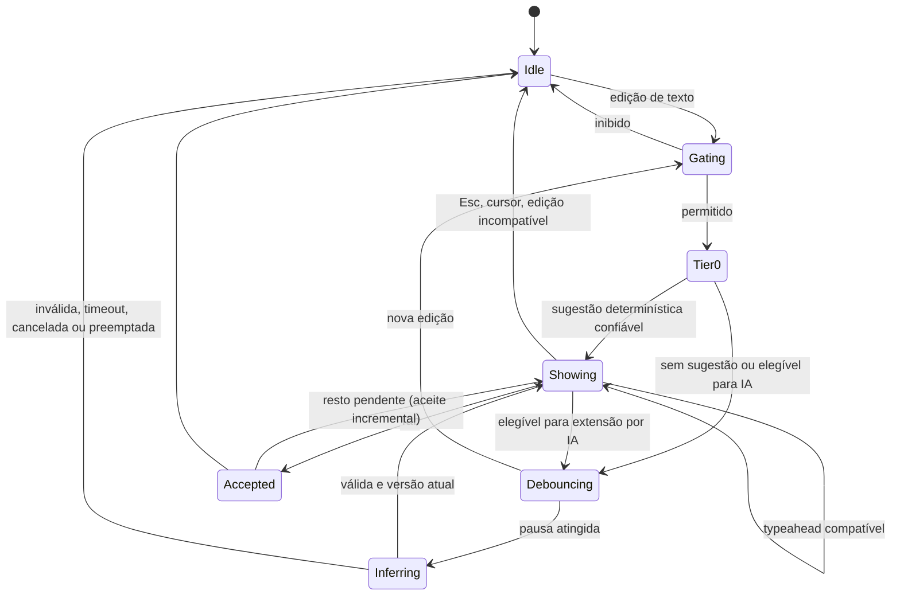

# Autocomplete preemptivo (inline)

## Definição

Sugestão exibida automaticamente como ghost text durante a digitação, sem abrir lista e sem interromper o fluxo. Distinta da lista tradicional e da IA explícita.

```javascript
db.Projects.find({ "Customer.Id": 
                                  { $eq: UUID("…") } })
                                  ───────────────────
                                       ghost text
```

(Chave com ponto entre aspas; ver [AC-09](decisions.md).)

| | Tradicional | IA explícita | Preemptivo |
| --- | --- | --- | --- |
| Disparo | `Ctrl+.` | `Ctrl+;` | Automático |
| Forma | Lista | Prévia rica | Uma sugestão inline |
| Custo aceitável | Baixo | Alto, com feedback | Muito baixo; nunca por tecla |
| Prioridade no modelo | — | `Interactive` | `Background`, preemptível |
| Falha | Mensagem | Lista + motivo | Silenciosa |

## Fluxo



Movimento de cursor **sem edição** não dispara sugestão (hoje dispara).

## Gating (inibições baratas)

Nenhuma sugestão quando:

- seleção não vazia, lista aberta, sessão de snippet ativa ou IME em composição;
- cursor em comentário, número, regex ou string que não seja caminho de campo/nome;
- cursor no meio de um identificador (há caractere de identificador imediatamente à direita);
- papel `NonCompletable` ou confiança de contexto baixa;
- documento acima do limite de análise completa e statement não localizado;
- digitação em rajada (intervalo entre teclas abaixo do limiar adaptativo);
- autocomplete desabilitado ou inline desligado nas preferências.

## Camadas

### Camada 0 — determinística

Sem debounce, em worker, orçamento de poucos milissegundos:

1. **Conclusão única do token:** o ranking devolve um candidato com margem clara sobre o segundo (limiar inicial: diferença ≥ 0,25) — ex.: único campo que começa com `Cli` → `ente`.
2. **Modelos de statement do histórico:** sequências frequentes de tokens estruturais aceitas/executadas na mesma conexão e coleção (ex.: após `find({ status: ` → `"ativo" })` apenas se o literal já existir no histórico do usuário; valores nunca vêm de resultados).
3. **Reuso de `BasicAutocompleteProvider`:** refatorado para usar tokens do lexer e o catálogo, sem regex sobre o documento.

### Camada 1 — IA

- Após debounce adaptativo, prioridade `Background`, contexto com orçamento reduzido (inicial: metade de `ContextTokens`) e `inline.maxTokens`.
- Só se o modelo estiver **carregado** (a camada inline nunca dispara a carga) e o perfil de latência permitir ([onnx-strategy.md](onnx-strategy.md#hardware)).
- Se a camada 0 já mostra algo, a IA só substitui se o texto gerado **estender** a sugestão atual com confiança maior.

## Gatilhos

Candidatos, a validar por experimento — não fixados:

| Gatilho | Hipótese |
| --- | --- |
| Pausa curta após edição | Principal sinal de intenção |
| `.` após receptor conhecido | Alta chance de membro |
| `{` em argumento/valor | Início de filtro/documento |
| `:` após chave de campo | Valor ou objeto de operadores |
| `,` em objeto | Próxima chave |
| `(` após método | Argumento |
| Nova linha dentro de objeto/array | Próxima propriedade/stage |
| Início de novo statement | Padrão do histórico |

**Experimento:** em builds de desenvolvimento, registrar por gatilho `shown`, `accepted`, `partiallyAccepted`, `dismissed`, `typedOver`, latência e camada. Um gatilho permanece se a taxa de aceite for maior que a de ruído (`shown` sem interação), com meta definida após a primeira coleta. Dados agregados e locais, sem texto.

## Debounce adaptativo

```text
intervalo ← mediana dos últimos 20 intervalos entre teclas
atraso    ← clamp(1,5 × intervalo, 75 ms, DelayMilliseconds)
```

`DelayMilliseconds` (preferência existente, padrão 150 ms) passa a ser o teto. Valores iniciais a calibrar.

## Typeahead sobre o ghost

Se o texto digitado no cursor for exatamente o início da sugestão, o ghost encolhe sem nova requisição e a sugestão é reancorada na nova versão do documento (a sugestão continua válida porque o documento é o anterior mais os caracteres aceitos). `Backspace` dentro do trecho digitado restaura a sugestão anterior se ainda estiver no cache curto (última sugestão por âncora). Hoje qualquer alteração invalida e reinicia.

## Validação

Mais estrita que a IA explícita: descartar se

- a sugestão introduz delimitador sem par além do statement;
- identificador em posição de campo/coleção/operador não existe com catálogo `Complete`;
- contém texto sensível ou marcador reservado;
- repete o sufixo existente;
- excede o limite de linhas exibidas.

## Renderização

Ghost nativo do AvaloniaEdit (elemento visual na posição do cursor; linhas seguintes como objeto inline), substituindo a sobreposição que redesenha o sufixo ([editor-integration.md](editor-integration.md#ghost-text)). Estilo `Syntax.GhostText`.

## Aceitação

- `Tab`: aceita inteiro ou incremental (preferência `IncrementalTab` existente, via `IncrementalCompletion`).
- `Ctrl+→`: próxima palavra (opcional).
- `Esc`: descarta.
- Aceitar é edição normal com uma unidade de undo; nunca executa código.

## Concorrência

- Um `EditorRequestScope` da modalidade inline por editor.
- Cada nova edição cancela a camada 1 pendente, exceto typeahead compatível.
- `Ctrl+;` e chat preemptam a geração inline pela fila do modelo; o resultado preemptado é descartado.
- A carga do modelo nunca é iniciada nem cancelada pelo inline.
- A UI aplica somente se versão, cursor, foco, seleção e destino ainda coincidirem.

## Métricas

`inline.shown`, `inline.accepted`, `inline.partially_accepted`, `inline.dismissed`, `inline.typed_over`, `inline.reverted` (desfeito em até 5 s), `inline.latency` por camada, `inline.tier`, `inline.trigger`, `inline.inference_skipped` por motivo.

## Configurações (aditivas)

| Campo | Padrão |
| --- | --- |
| `InlineEnabled` | `true` |
| `InlineUseAi` | `true` (efetivo só com modelo carregado e latência aceitável) |
| `InlineMaxLines` | 8 |
| `InlineAcceptWord` | `false` |
| `DelayMilliseconds` (existente) | 150, como teto do debounce |
| `IncrementalTab` (existente) | `true` |

## Migração

O fluxo atual (`EditorCompletionChanged` → `CompletionSession` → `AutocompleteService`) permanece até a Fase 5; então o `InlineCompletionCoordinator` o substitui integralmente. `PredictiveAutocompleteTests` e `AutocompleteUiTests` são adaptados preservando os comportamentos já garantidos (sufixo não duplicado, Tab/Esc, rejeição de resposta obsoleta, ghost não altera documento).
