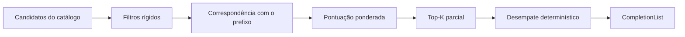

# Ranking

Objetivo: uma sugestão fortemente ligada ao contexto aparece antes de uma genérica, de forma **determinística, explicável e calibrável**.

## Etapas



## 1. Filtros rígidos

Removem candidatos inválidos **antes** de pontuar:

| Filtro | Exemplo |
| --- | --- |
| Dialeto | `bulkWrite` fora do Console |
| Papel e shape | Stage em posição de chave de filtro |
| Chave exclusiva já presente | Segundo operador de stage no mesmo objeto de stage |
| Versão do servidor conhecida | Operador introduzido em versão posterior |
| Contexto não completável | Comentário, número, corpo de regex |
| Correspondência nula | Prefixo não nulo sem nenhuma forma de correspondência |

Incompatibilidade de tipo **não** remove (o schema pode estar incompleto); penaliza.

## 2. Correspondência

| Forma | Pontuação `m` |
| --- | --- |
| Exata, mesma caixa | 1,00 |
| Exata, caixa diferente | 0,95 |
| Prefixo, mesma caixa | 0,90 |
| Prefixo, caixa diferente | 0,85 |
| Camel humps / partes (`cN` → `clienteNome`, `id` → `Cliente.Id`) | 0,70 |
| Substring | 0,40 |
| Subsequência com lacunas | 0,25 |
| Prefixo vazio | 0,50 (neutro) |

Os intervalos casados são devolvidos para destaque visual. O `$` inicial é opcional na correspondência em posição de operador (`eq` casa `$eq`).

## 3. Pontuação

```text
score = wm·m + wc·contexto + ws·escopo + we·evidência + wu·uso + wt·tipo − penalidades
```

| Sinal | Definição | Peso inicial |
| --- | --- | --- |
| `contexto` | 1 se o tipo está entre os primários do shape; 0,5 se secundário | 0,25 |
| `m` | Correspondência | 0,35 |
| `escopo` | 1 coleção alvo; 0,8 destino padrão da aba; 0,6 mesmo banco; 0,3 outra conexão | 0,10 |
| `evidência` | Campo: validator 1; índice +0,3; ocorrência na amostra; resultados 0,6; histórico 0,3. Built-in: 1 | 0,10 |
| `uso` | Frequência com decaimento exponencial por escopo e shape | 0,12 |
| `tipo` | Operador compatível com o tipo do campo (`$regex`/string, `$size`/array); 0,5 se tipo desconhecido | 0,08 |

| Penalidade | Valor inicial |
| --- | --- |
| Depreciado | −0,15 |
| Incompatível com o tipo conhecido | −0,20 |
| Operação de escrita quando o statement é leitura | −0,05 |
| Confiança do alvo `Unknown` | −0,10 em campos |

Pesos e penalidades ficam em uma tabela de dados (`RankingProfile`), não no código. São **valores iniciais** para calibração.

## 4. Ordem de tipos por shape (desempate)

| Shape / papel | Ordem |
| --- | --- |
| Chave de `Filter` | Campo › operador lógico › `$expr` › snippet |
| `OperatorObject` | Comparação › elemento › array › avaliação |
| Membro de `Database` | Coleção › método |
| Membro de `Collection` | Leitura › agregação › escrita › administração |
| Elemento de `Pipeline` | Snippet de stage › stage |
| Valor tipado | Construtor do tipo do campo › literal › objeto de operadores |

Depois: menor profundidade de caminho, rótulo mais curto, ordem ordinal. Nenhuma ordem depende de hash ou de ordem de inserção.

## 5. Uso recente

`CompletionUsageTracker` guarda, **em memória**, aceites por `(identidade da conexão, banco, coleção, shape, símbolo)`:

```text
uso = 1 − exp(−Σ e^(−Δt/τ))    τ inicial: 30 min de sessão
```

- Não persiste por padrão. Persistência futura só por opt-in, com nomes (sem valores) e respeitando os opt-outs de histórico existentes.
- Aceitar item de IA ou de ghost também alimenta o tracker.
- "Aceito e desfeito em até 5 s" registra sinal negativo (reduz o uso daquele símbolo naquela posição).

## 6. Itens de IA na lista

Quando a IA contribui para uma lista (fallback ou mescla), o item recebe `contexto = 1` apenas se o Output Processor validar identificadores contra o catálogo; caso contrário `contexto = 0,5` e selo "IA". Um item de IA nunca remove um item do catálogo com o mesmo texto; os dois são fundidos, mantendo a origem do catálogo.

## 7. Calibração

- **Conjunto-ouro:** casos de [testing.md](testing.md#fixtures-de-contexto) com item esperado e aceitáveis.
- **Métricas:** MRR, top-1 e top-5 por shape; porcentagem de casos em que um item inválido para o shape aparece no top-5 (deve ser 0).
- **Processo:** ajuste de pesos por busca em grade pequena, sem ajustar à mão para um caso isolado; mudança de pesos exige comparar métricas antes/depois no relatório da PR.
- **Explicabilidade:** modo de diagnóstico devolve a decomposição da pontuação por item (usado em testes e na janela de diagnóstico local).

## 8. Desempenho

- Pontuação sobre no máximo `MaximumCandidates` (padrão proposto 200) vindos do catálogo já limitados por escopo.
- Top-K com heap parcial: O(n log k), k = itens exibidos (padrão 100).
- Refiltrar com a lista aberta reutiliza candidatos do contexto estreitado: só recalcula `m` e reordena.
