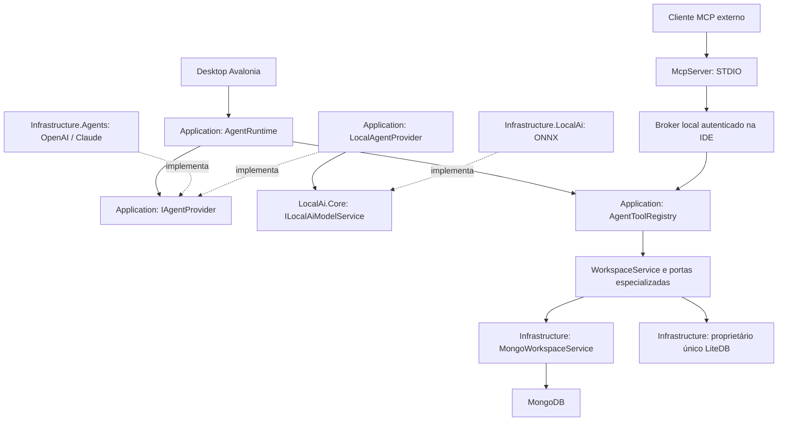

# Arquitetura da v0.11.0 — proposta para implementação

Estado: **planejado**, análise de código em 22/09/2026. Nenhum contrato ou adaptador descrito nesta fase está implementado por esta meta. Base: [arquitetura vigente](../../05-arquitetura.md), [análise dos nove projetos](13-analise-do-codigo.md) e ADRs 046–051 em [decisões arquiteturais](../../10-decisoes-arquiteturais.md).

## Decisão e fronteiras

Reutilizar as camadas existentes. O domínio não conhecerá Codex, Claude, nomes de modelos nem mensagens de um SDK. MCP expõe capacidades; o runtime coordena conversas e tarefas; os adapters traduzem protocolos de fornecedores. Uma sessão MCP não é uma conversa de agente, e um ID de sessão de provider não é identidade autenticada do usuário.

O diagrama representa fluxo de execução; dependências de código apontam para as abstrações. `Desktop` continua composition root. O broker é endpoint IPC local de aplicação, sem microserviço remoto e sem substituir o proprietário de persistência. O proxy recebe apenas DTOs permitidos; não carrega URI MongoDB, segredos Mongo/providers, `LiteDatabase` ou runtime ONNX. Possui acesso mínimo apenas à sua própria credencial IPC no cofre do SO, por `IClientTransportCredentialStore` e implementação de plataforma no McpServer. Essa porta não enumera nem resolve referências de segredo de banco/provider; não referencia Infrastructure de banco. Extrair biblioteca de plataforma compartilhada somente se o volume real justificar, sem duplicar a política de segredos.

## Projetos, namespaces e dependências

| Local | Trabalho planejado | Dependências permitidas |
| --- | --- | --- |
| `Core/Agents/` | Records/enums imutáveis, identificadores, capabilities, eventos, resultados e classificação de risco | BCL; zero NuGet e zero I/O |
| `Application/Agents/` | Portas, runtime, registry, autorização, aprovação, preparação de contexto e `LocalAgentProvider` | Core e núcleos existentes; sem SDK externo, UI, driver ou LiteDB |
| `Infrastructure/` | Cofre de plataforma, persistência aditiva, broker IPC, executor BSON literal, adapters de serviços existentes | Application; SDKs de banco continuam aqui |
| **Novo** `Infrastructure.Agents` | `OpenAiAgentProvider`, `ClaudeAgentProvider`, transporte/processos, tradução e autenticação externa | Application; bibliotecas específicas confinadas a diretórios/providers |
| **Novo** `McpServer` | Executável console, adapter MCP e cliente IPC | Application/Core; pacote MCP somente aqui; sem referência a Infrastructure de banco |
| `Infrastructure.LocalAi` | Runtime ONNX existente e registro próprio | Sem MongoDB.Driver, LiteDB ou adapters externos |
| `Desktop` | ViewModels de chat/configuração/aprovação; registro e encerramento dos serviços | Application, Infrastructure, Infrastructure.Agents e Infrastructure.LocalAi |

Não criar `Agent.Abstractions`, `Agent.Core`, `Agent.Local` ou um projeto por provider nesta fase: contratos cabem nas camadas existentes e ONNX já tem isolamento físico. Separar `Infrastructure.Agents` em assemblies por provider somente se dependências nativas, distribuição opcional ou conflitos de pacotes o justificarem. Providers continuam removíveis por registro/feature flag mesmo no assembly comum. Cada novo tipo principal terá arquivo próprio. Versões de dependências e locks serão centralizadas como no restante da solução.

## Composição e tempos de vida

`AgentToolRegistry`, catálogos de providers, serviços de política, cofre e broker são singletons sem contexto mutável de aba. `AgentRuntime` administra sessões independentes; `IAgentSession` é escopo lógico descartável por conversa. Cada turno e tool call tem CTS própria, encadeada ao encerramento da sessão e ao deadline, nunca à CTS de outra aba. Executor Mongo usa o `MongoClientPool` registrado. Facetas de persistência de agentes resolvem o mesmo `LiteDbConnectionProfileRepository`, conforme a composição já existente.

Adapters são carregados sob demanda. Nenhuma inicialização de provider é aguardada para abrir a IDE. Falha de processo Codex, indisponibilidade de Claude, ausência de modelo ONNX, de internet ou de MCP não bloqueia consultas manuais. Durante shutdown: negar novas chamadas, cancelar turnos, invalidar aprovações, encerrar adapters e IPC com prazo, finalizar auditoria local e só então descartar o proprietário LiteDB. Não usar `.Wait()`/`.Result` na UI.

## Caminho de uma operação

1. UI/MCP fornece intenção e argumentos; identidade autenticada vem do canal confiável. O modelo não escolhe `PrincipalId`, grants ou `ApprovedByUser`.
2. Runtime/broker cria envelope imutável com sessão, turno, request, alvo lógico, revisão do perfil, deadline e revisão de política. A seleção do explorer não entra novamente nessa operação.
3. Registry resolve definição e valida schema/tamanho/BSON literal; autoriza ferramenta, namespace, categorias de dados e custo. Captura configuração efetiva local antes dos awaits de execução.
4. Ações que exigem aprovação congelam alvo e argumentos em hash. Negação/timeout/revogação termina sem I/O MongoDB. Aprovação não amplia as permissões existentes.
5. Antes do despacho, revalidar revisão/política e gravar intenção de auditoria. Executor usa caso de uso existente e guarda proteções de leitura/escrita. Uma alteração de perfil invalida a requisição, em vez de redirecioná-la.
6. Converter saída ao DTO explícito, aplicar boundary de dados e limite em bytes antes da entrega; registrar desfecho sem documentos, credenciais ou argumentos completos.

## Mudanças necessárias nos serviços atuais

`WorkspaceService` já reúne consultas, mutações e invalidações de schema; não duplicar a lógica Mongo nos adapters. Porém seus métodos recebem `ConnectionProfile`, objeto que contém configuração privada. O registry resolve o perfil internamente e nunca o serializa. Criar projeções explícitas e invocações autorizadas; não expor todos os métodos por reflexão.

`MongoOperationContext` aceita construtores BSON e substituição de `ENV`; essa conveniência é da IDE confiável. Entrada externa deverá ser Extended JSON literal, sem resolução de variáveis. Introduzir uma política de parsing literal na infraestrutura que não chama `ResolveDynamicJson`; somente validar uma string na borda e depois passá-la ao parser dinâmico é insuficiente para strings literais contendo marcadores. Resolução privada da URI pode continuar usando ambiente/cofre, sem expor esses valores ao resultado.

`MongoQueryExecutor` tem limites de caracteres, e `AggregationQuery` ainda não oferece deadline configurável. Antes de publicar aggregate, propagar `MaxTimeMs` e limites do registry até o driver; limite de saída não limita trabalho de `$group`, `$sort` ou `$lookup`. `WorkspaceService` também invalida caches após mutações; ferramentas de escrita devem preservar esse caminho. Extrair um caso de uso específico se necessário, sem deslocar invalidações para o adapter MCP.

Auditoria atual é administrativa; precisa de DTO aditivo de operações de agentes, identidade e estados de certeza. Cofre de senhas de sessão existente não é secret store persistente. O chat local atual gera propostas de código; não implementa loop geral de tools. Estes são trabalhos reais da fase, não funcionalidades já entregues.

## Persistência e recuperação

Coleções novas versionadas para preferências/capabilities, grants e auditoria usam o dono atual. Guardar referências opacas de segredo; tokens do provider que ele gerencia oficialmente permanecem no armazenamento oficial dele. Conversas/payloads ficam em memória por padrão. Qualquer opt-in de histórico será separado dos snapshots do workspace, com retenção, exclusão e política por conexão; nenhuma aprovação sobrevive como autorização de execução após reinício.

Crash interrompe sessões; não reproduzir tools de escrita automaticamente. Intenção sem resultado vira `OutcomeUnknown` quando o despacho pode ter ocorrido; somente reconciliação explícita com MongoDB esclarece. Sessão local ilegível é preservada e o erro aparece ao usuário. Migrações são aditivas/versionadas, sem uma segunda abertura LiteDB ou downgrade destrutivo.

Detalhes: [runtime](03-agent-runtime.md), [MCP server](05-mcp-server.md), [tools](06-mcp-tools.md), [permissões](08-permissoes-e-aprovacoes.md) e [privacidade](09-seguranca-e-privacidade.md).
