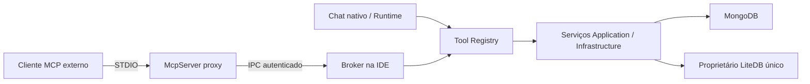

# Servidor MCP do Slop Studio

**Proposta — ADR-047.** Implementar `EsilvaSoft.SlopStudio.McpServer` como executável .NET pequeno, iniciado pelo cliente e conectado ao broker local da IDE. O broker usa o registry de Application e o proprietário LiteDB já registrado em DI. O proxy não referencia repositório LiteDB, não recebe URI MongoDB e não executa operações MongoDB diretamente.

## Processo e ciclo de vida

`SlopStudio.McpServer --stdio --workspace-id <id> --client-id <id>` é o comando **proposto**, ainda inexistente. Identificadores não são credenciais. O usuário ativa MCP na IDE, registra o cliente e autoriza conexões/escopos. Nome de cliente informado no protocolo não autentica ninguém. O provisionamento emite uma credencial local aleatória por cliente, guardada no cofre do SO; configuração exportada só contém referências. Proxy recupera sua credencial, autentica o canal e recebe identidade validada pelo broker. Não incluir segredo em argumento, URL, JSON de configuração nem logs.

Windows: named pipe restrito ao SID do usuário; Linux: Unix domain socket em diretório privado, permissões 0700/0600 e verificação de proprietário. Autenticar também o broker, vincular desafio a nonce e versão de protocolo IPC. Credenciais locais não protegem contra malware já executando como o mesmo usuário; isso é limite explícito, não motivo para dar permissão global. O IPC transmite DTOs de tools versionados, sem objetos de driver. Tamanho máximo, deadlines e correlação são obrigatórios.

IDE fechada, workspace ilegível, cofre bloqueado ou política não carregada: `HostUnavailable`/`AuthenticationRequired`, sem tentar abrir o arquivo local por outro processo. O proxy pode continuar servindo descoberta estática de protocolo, mas não dados. Reinício exige nova autenticação e invalida aprovações pendentes. EOF encerra o proxy e cancela suas leituras; uma escrita já enviada recebe resultado incerto. Fechar a IDE encerra o broker e avisa operações pendentes pela política de fechamento existente.

Atualização distribui proxy e desktop da mesma release; handshake IPC rejeita versão major incompatível com mensagem acionável. Falha do proxy não derruba a IDE; falha do broker não afeta o editor e invalida seus clientes. Backoff limitado para restabelecer transporte, sem replay automático de writes. Não iniciar várias IDEs para atender vários clientes.

## Alternativas avaliadas

| Alternativa | Avaliação |
| --- | --- |
| `slopstudio --mcp` no mesmo binário | Menos artefatos, mas mistura startup gráfico/stdout e lifecycle; pode ser alias futuro que delega ao proxy, sem segundo modo proprietário |
| Servidor independente dono de MongoDB e LiteDB | Bom para headless, mas exige transferir propriedade/políticas/segredos; rejeitado no primeiro escopo por duplicar estado e aprovação |
| Broker dentro da IDE + proxy separado | Escolhido: reutiliza serviços, autorização e diálogos, isola parsing MCP; depende da IDE aberta |
| Serviço permanente compartilhado por IDE/MCP | Evolução possível por nova ADR, fora do plano inicial; não introduzir daemon e migração de ownership apenas por antecipação |

## Revisão de protocolo e transportes

Pesquisa em 22/09/2026: `latest` aponta para **2026-07-28**, com metadados de versão/capabilities por chamada; a revisão **2025-11-25** usa handshake `initialize`. São eras distintas. Planejar adaptador dual-era via SDK oficial compatível, com fixtures separadas; não misturar mensagens, headers ou cancelamento entre elas. Fixar versão do pacote e schemas no lote 0 e registrar matriz cliente × versão × transporte. Nenhuma compatibilidade com Codex/Claude/Copilot é declarada até teste real. [Especificação atual](https://modelcontextprotocol.io/specification/2026-07-28), [versionamento](https://modelcontextprotocol.io/specification/2026-07-28/basic/versioning).

STDIO é obrigatório no primeiro incremento: stdout exclusivo do protocolo, stderr sanitizado; linhas e payloads limitados. Para a era atual, cada request carrega metadados e a descoberta usa `server/discover`; para clientes legados, o adaptador atende inicialização/capabilities da revisão selecionada. Cancelamento STDIO mapeia para o token da chamada, nunca de todas as sessões. [Transporte atual](https://modelcontextprotocol.io/specification/2026-07-28/basic/transports), [STDIO](https://modelcontextprotocol.io/specification/2026-07-28/basic/transports/stdio).

Streamable HTTP fica desligado e posterior ao gate STDIO: processo proxy pode hospedar endpoint opcional que encaminha ao mesmo broker, sem criar outro registry. Exigir autenticação por cliente, validação Origin/Host, loopback explícito IPv4/IPv6, limites de conexão e ausência de CORS amplo. Acesso remoto/TLS e autorização OAuth conforme MCP precisam de especificação e testes próprios antes de abertura fora de loopback. Token de sessão/transporte não substitui autorização da tool. Não usar um token OpenAI/Claude para autenticar MCP. Não adotar HTTP+SSE legado como novo transporte. A revisão moderna cancela HTTP ao fechar stream de resposta, enquanto a legada exige notificação explícita: o adapter deve manter essa distinção. [Transporte legado](https://modelcontextprotocol.io/specification/2025-11-25/basic/transports).

## Ferramentas, erros e aprovações

`tools/list` e `tools/call` usam os descritores do registry. A descoberta expõe nomes e schemas estáticos, sem nomes de conexões ou bases; a autorização sempre ocorre na execução. Não tornar a lista uma fonte de dados privados nem depender de filtragem por conexão para segurança. `readOnlyHint` e `destructiveHint` são dicas derivadas da classificação interna e nunca substituem políticas. DTOs de saída usam Extended JSON canônico em campos explicitamente tipados; IDs grandes não viram `double`.

JSON inválido, método desconhecido e parâmetros inválidos recebem erros de protocolo conforme revisão. Erro de domínio é resultado de tool com código estável e mensagem sanitizada (`PermissionDenied`, `ApprovalDenied`, `DeadlineExceeded`, `OutcomeUnknown`), não stack trace. Resultado limita bytes/documentos, informa truncamento e não duplica documentos em texto e structured content. [Contrato MCP de tools](https://modelcontextprotocol.io/specification/2026-07-28/server/tools).

Aprovação externa passa pela UI confiável da IDE; o cliente não pode fornecer `approved=true`. Não depender de elicitation, popup do cliente ou autoapproval do provider. Espera limitada proposta de 120 s; ao expirar, negar sem executar. Desconexão, mudança de política ou destino invalida aprovação. Extensões de tarefas duráveis são opcionais; o primeiro MCP não exige suporte a elas. A aprovação interna pode usar eventos próprios sem depender da direção de mensagens MCP.

## Gates de implementação

Validar ambas as eras com fixtures oficiais de schema e um cliente real de cada adapter escolhido; exercitar proxy sem IDE, dois clientes simultâneos, troca de perfil, revogação, timeout, payload gigante, crash antes/depois de escrita, stdout limpo e atualização incompatível. Logs, configuração e tráfego inspecionados com segredos sintéticos. Testar Windows e Linux nativos antes de declarar suporte.
