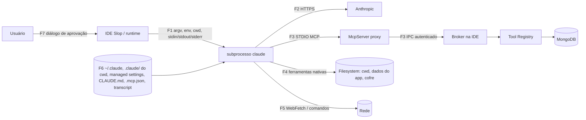

# Threat model — modo Claude Code e modos existentes

**Rascunho de 25/09/2026 (tarefa P7-CL0-02), escrito antes do spike P7-CL0-01.** Nada aqui está implementado, testado ou homologado. O documento não aprova AC nem gate: o GCL-3 do [plano 23](23-integracao-claude.md#gates) continua **pendente** até (1) o spike confirmar ou refutar as [hipóteses](#hipóteses-que-o-spike-p7-cl0-01-precisa-confirmar) — feito, ver [resultado do spike](#resultado-do-spike-p7-cl0-01-25092026-windows-11-claude-code-21268) —, (2) este texto ser revisto com os resultados do spike (parcial: ver aviso abaixo) e (3) passar por revisão independente do code-review-agent. As ferramentas nativas do Claude Code ([ADR-054](../../10-decisoes-arquiteturais.md#adr-054--ferramentas-nativas-do-claude-code-com-aprovação-por-chamada-25092026)) ficam bloqueadas enquanto isso não acontecer.

> **Riscos residuais NÃO ACEITOS pelo usuário em 25/09/2026 — escopo revertido ([ADR-054 revisada](../../10-decisoes-arquiteturais.md#revisão-de-25092026-mesma-data-decisão-posterior-do-usuário--riscos-residuais-do-threat-model-não-aceitos-escopo-revertido)).** Ao revisar os [riscos residuais](#riscos-residuais-que-exigem-decisão-do-usuário) 1 e 2 abaixo (comando aprovado roda como o usuário do SO e contorna registry/cofre/auditoria; ausência de firewall no Slop), o usuário decidiu **não aceitá-los**. Consequência: as ameaças de **execução, escrita de arquivo e rede** listadas neste documento (T-P02/T-P03/T-P05..T-P10, toda a seção [F4 — ferramentas nativas ↔ sistema de arquivos](#f4--ferramentas-nativas--sistema-de-arquivos), toda a seção [F5 — ferramentas nativas ↔ rede](#f5--ferramentas-nativas--rede), T-U01..T-U05) ficam **não aplicáveis por construção**: as ferramentas correspondentes (`Bash`, `PowerShell`, `Edit`, `Write`, `NotebookEdit`, `WebFetch`, `WebSearch`, `Agent`/subagentes) nunca são anunciadas ao modelo, por allowlist exata `--tools` no argv do turno — não há mais diálogo de aprovação por chamada para mitigar; a mitigação passa a ser ausência estrutural, não decisão do usuário por chamada. As ameaças de **leitura e exfiltração pelo modelo** continuam ativas e mitigadas como descrito (F1 método efetivo, F2 dados enviados à Anthropic, F3 canal MCP, T-F04 leitura sem pedido, T-C05 transcript): a leitura do cwd (workspace do usuário ou pasta dedicada do app) segue sendo o vetor residual real, tratado pela regra de leitura do [plano 23](23-integracao-claude.md) e do [doc 08](08-permissoes-e-aprovacoes.md#ferramentas-nativas-do-claude-code--escopo-revisado-adr-054-revisão-de-25092026). As linhas de STRIDE abaixo **não foram reescritas uma a uma** nesta revisão (ficam como registro histórico do escopo original do ADR-054); esta nota é a autoridade sobre o escopo atual até uma revisão completa das tabelas antes do GCL-3.

Base: [ADR-053](../../10-decisoes-arquiteturais.md#adr-053--claude-via-assinatura-usando-o-binário-oficial-do-claude-code-como-subprocesso-25092026), ADR-054, [08 — permissões](08-permissoes-e-aprovacoes.md), [09 — segurança](09-seguranca-e-privacidade.md), [05 — MCP](05-mcp-server.md), [07 — segredos](07-autenticacao-e-segredos.md), [19 — auditoria](19-persistencia-auditoria.md), [21 — homologação](21-homologacao-manual-login.md#casos-do-modo-claude-code-assinatura) e [23 — integração Claude](23-integracao-claude.md). Os passos `P7-CLx-nn` citados são os do plano 23. Os comportamentos da CLI marcados com **(H-xx)** são hipóteses, não fatos verificados. Incorpora os achados da revisão independente de 25/09/2026 sobre ADR-053/054 e o plano 23 (A3–A7, M4–M7), indicados entre colchetes nas linhas afetadas.

## Escopo e método

- **Foco:** modo "Claude (assinatura)", em que o `ClaudeCodeAgentProvider` executa o binário oficial `claude` com `-p` e stream-json, e as ferramentas nativas (Bash, Read, Edit, Write, WebFetch etc.) ficam liberadas somente com aprovação por chamada.
- **Resumo:** modos Anthropic API, OpenAI API, cliente MCP externo e escritas MongoDB pelo registry, que já têm controles descritos em 08/09/19 ([seção própria](#modos-existentes-resumo)).
- **Método:** STRIDE por fronteira de confiança (S = falsificação de identidade, T = adulteração, R = repúdio, I = divulgação de informação, D = negação de serviço, E = elevação de privilégio). Para cada ameaça: mitigação planejada com o passo do plano 23, teste automatizado previsto (sempre com **CLI falso** e fixtures sanitizadas, nunca conta real) e/ou caso manual do roteiro 21, e o risco residual.
- **Fora do modelo:** malware já em execução com o mesmo usuário do SO, administrador da máquina, comprometimento da infraestrutura da Anthropic e do binário distribuído por ela. Esses limites são declarados, não mitigados.

## Ativos

| ID | Ativo | Onde vive | Por que importa |
| --- | --- | --- | --- |
| A1 | Dados MongoDB (documentos, schema, nomes de namespaces, contagens, planos) | Servidores do usuário; buffers efêmeros da IDE | Confidencialidade e integridade dos dados do usuário; escritas são irreversíveis |
| A2 | Arquivos do workspace e do usuário | Pasta escolhida como cwd; qualquer caminho acessível ao usuário do SO | Ferramentas nativas podem ler, alterar, excluir e enviar esses arquivos |
| A3 | Credenciais do usuário guardadas pelo Slop (senhas/URIs MongoDB referenciadas, API Keys OpenAI/Anthropic, credencial do broker MCP) | Cofre do SO; LiteDB guarda só referências | Um comando aprovado roda como o mesmo usuário e pode consultar o cofre do SO |
| A4 | Sessão Claude Code do usuário (credencial OAuth da assinatura) | Armazenamento do próprio Claude Code (mecanismo por SO a registrar, H-16) | Regras 1–4 do plano 23: o Slop nunca lê, copia nem intermedeia |
| A5 | Prova do canal MCP (credencial/nonce que vincula o proxy à sessão do chat) | Broker da IDE; processo do McpServer | Quem possuir a prova fala com o registry e com a tool de permissão como o principal do chat |
| A6 | Auditoria e estado de aprovação | `agentAuditEvents` no proprietário LiteDB; regras "sempre nesta sessão" em memória | Rastreabilidade das decisões; regra ampla demais equivale a aprovação cega |
| A7 | Integridade do arquivo local do Slop (LiteDB, sessão, rascunhos) | Diretório de dados do app | Invariante: um único proprietário LiteDB; um shell pode abrir, corromper ou copiar o arquivo |
| A8 | Cobrança e cota da conta | Conta Anthropic do usuário | API Key no ambiente troca a cobrança sem o usuário escolher |

## Atores

| Ator | Capacidade assumida |
| --- | --- |
| Usuário legítimo | Controla a IDE, aprova ou nega; pode se enganar com um diálogo ambíguo ou cansar de aprovar |
| Conteúdo hostil | Documento MongoDB, arquivo do cwd, `CLAUDE.md`, página web ou saída de comando com instruções dirigidas ao modelo (injeção de prompt) |
| Modelo | Tratado como **não confiável**: pode ser induzido a pedir qualquer ferramenta, a disfarçar comandos ou a chamar a tool de permissão diretamente |
| Configuração herdada | Hooks, regras `permissions.allow`, plugins, MCPs e `env` em `~/.claude`, `.claude/` do cwd ou configurações gerenciadas pela organização |
| Processo local do mesmo usuário | Fora do modelo quando malicioso; considerado quando é o próprio shell aprovado lendo o ambiente ou o cofre |

## Fronteiras de confiança

| Fronteira | Descrição | Quem controla |
| --- | --- | --- |
| F1 | IDE ↔ subprocesso `claude`: caminho do binário, argumentos, ambiente herdado, cwd, JSON de entrada/saída, stderr, sinais | IDE controla o lado de entrada; a saída é dado não confiável |
| F2 | Subprocesso ↔ Anthropic | Anthropic e o binário oficial; o Slop não intercepta nem intermedeia |
| F3 | Subprocesso ↔ McpServer proxy ↔ broker: tools do produto e tool de permissão (`--permission-prompt-tool`) | Broker autentica o canal; principal vem do canal, nunca dos argumentos |
| F4 | Ferramentas nativas ↔ sistema de arquivos | CLI executa; o Slop só decide pelo diálogo |
| F5 | Ferramentas nativas ↔ rede (WebFetch, WebSearch, comandos com acesso à rede) | CLI executa; o Slop não tem firewall próprio |
| F6 | Configuração e estado do Claude Code (`~/.claude`, `.claude/` e `CLAUDE.md` do cwd e dos diretórios acima, `.mcp.json`, configurações gerenciadas, transcript em `~/.claude/projects`) | Usuário, organização ou qualquer conteúdo gravado no cwd; o Slop não lê `~/.claude` |
| F7 | Diálogo de aprovação ↔ usuário | IDE apresenta; o usuário decide |

## Premissas de projeto usadas pelas mitigações

1. **Um processo por turno** (P7-CL3-01). Cada turno revalida binário, ambiente efetivo e `system/init` antes de aceitar eventos.
2. **Mensagem do usuário só por stdin** em stream-json serializado por biblioteca, nunca por argv (evita injeção de argumentos e exposição da mensagem em `ps`). **Bloqueio preventivo antes do prompt [A6]:** o `system/init` pode chegar depois de a CLI já ter lido o stdin (H-21). Por isso o método efetivo é verificado **antes** de escrever a mensagem, com `claude auth status` executado com o mesmo binário, ambiente, flags de configuração e cwd do turno. O `init` é verificação posterior: divergência encerra o turno e é exibida, sem presumir que nada foi cobrado.
3. **Diálogo mostra exatamente o que será devolvido à CLI.** A resposta da tool de permissão devolve como `updatedInput` o input aprovado, idêntico byte a byte ao exibido e comparado pelo hash canônico mantido só em memória (H-06) [M4]. Qualquer divergência nega.
4. **Correlação entre canais.** Um pedido de permissão só abre diálogo se corresponder a um bloco `tool_use` já observado no stdout do mesmo turno, com mesmo nome e input (H-07). Pedido sem correspondência é negado sem diálogo.
5. **Regras "sempre nesta sessão" ficam só no Slop**, em memória da aba. A resposta à CLI nunca contém `updatedPermissions` nem qualquer instrução que grave regra em arquivos de configuração da CLI (H-08).
6. **Nada é removido do ambiente do usuário** (regra 4/6 do plano 23): divergência de autenticação bloqueia, não "corrige".
7. **cwd padrão é uma pasta dedicada e vazia** criada pelo Slop fora do diretório de dados, do cofre e de `~/.claude`; usar a pasta do workspace é opt-in explícito por sessão [M6] (P7-CL5-01).
8. **Somente executável nativo** (`claude.exe` no Windows, binário ELF no Linux). Shims `.cmd`/`.bat`/`.ps1` são recusados, porque passam por `cmd.exe`/PowerShell e reabrem injeção de argumentos [A7] (P7-CL1-01).
9. **O único controle sobre ferramentas nativas é o diálogo, reforçado por regras `deny` determinísticas** [A3]. Um comando aprovado roda como o usuário do SO e não passa pelo registry, pela proteção read-only da conexão, pelos grants, pela auditoria de operações MongoDB, pelo cofre nem pelo proprietário LiteDB. O Slop passa por `--settings` (arquivo próprio, H-24) regras `deny` para o diretório de dados do app, o arquivo LiteDB, `~/.claude`, `~/.ssh` e caminhos de cofre conhecidos. O diálogo sempre exibe o texto de risco "este comando roda com o seu usuário do SO e pode acessar tudo o que você acessa, inclusive credenciais".

## STRIDE por fronteira — modo Claude Code

Colunas: **Mitigação** com o passo do plano 23; **Automatizado** descreve o teste previsto com CLI falso (P7-CL6-01 consolida); **Manual** aponta caso do roteiro 21 ou proposta `CP-nn` ([lista](#casos-manuais-propostos-para-o-roteiro-21)); **Residual** é o que sobra mesmo com a mitigação.

### F1 — IDE ↔ subprocesso `claude`

| ID | STRIDE | Ameaça | Mitigação (passo) | Automatizado | Manual | Residual |
| --- | --- | --- | --- | --- | --- | --- |
| T-P01 | S | Binário falso no PATH ou substituído (instalação em pasta gravável pelo usuário) | Caminho absoluto resolvido, validado e exibido; sem shell; versão/tamanho/data registrados na detecção e revalidados antes de cada turno; mudança força nova detecção (CL1-01) | CLI falso em caminho relativo, symlink para fora e arquivo trocado entre turnos → recusa/nova detecção | C-01, C-02 | Substituição por processo do mesmo usuário fica fora do modelo; o Slop não verifica assinatura digital da Anthropic (H-15) |
| T-P02 | T | Injeção de argumentos ou quebra do stream-json pela mensagem do usuário | Mensagem só por stdin, serialização por biblioteca; argv fixo e montado por lista (CL3-01) | Mensagem com quebras de linha, `"`, `\u0000`, JSON parcial e texto `--dangerously…` não altera argv nem gera segundo comando | — | Nenhum relevante |
| T-P10 | T/E | [A7] No Windows, o `claude` resolvido é um shim `claude.cmd`/`.bat` que passa por `cmd.exe`; argumentos com metacaracteres permitem injeção de comando (classe "BatBadBut") | Aceitar só executável nativo (premissa 8); shim → status "instalação não suportada" com orientação; nunca `UseShellExecute` (CL1-01) | CLI falso publicado como `.cmd`, `.bat` e `.ps1` → recusado; argv com `&`, `%`, `^`, `"` não chega a `cmd.exe` | CP-07 | Instalações que só oferecem shim ficam indisponíveis até haver executável nativo (H-25) |
| T-P11 | I/S | [A6] Detecção do método efetivo feita com ambiente, flags ou cwd diferentes dos do turno dá resultado falso de "assinatura" | `auth status` executado com o mesmo binário, ambiente herdado, `--settings`/`--setting-sources` e cwd do turno, imediatamente antes de escrever o prompt (premissa 2) (CL1-03) | CLI falso que responde método diferente conforme variável ou cwd → divergência detectada no mesmo contexto do turno | C-06 | Janela entre `auth status` e o turno (alteração concorrente de configuração pelo usuário) |
| T-P12 | D | [M7] **Logout é global**: `claude auth logout` encerra também a sessão do Claude Code que o usuário usa no terminal e em outros apps | Confirmação explícita antes do logout com o texto "encerra o login do Claude Code nesta conta do SO, inclusive fora do KapibaraStudio"; sem logout automático em troca de modo, erro ou fechamento do app (CL1-02, CL5-02) | Nenhum caminho de código chama logout sem confirmação; trocar de modo não chama logout | C-04, CP-06 | Efeito global inerente ao fluxo oficial, salvo diretório de configuração dedicado (H-23, com custo de GCL-1) |
| T-P03 | E | Modo de permissão permissivo por argumento, configuração ou flag esquecida (`bypassPermissions`, `acceptEdits`, `auto`, `dontAsk`) | Argv sempre com `--permission-mode default`; `system/init` precisa informar modo `default`, lista de tools e servidores MCP esperados, senão o turno é abortado antes de qualquer ferramenta (CL3-01, CL5-01) | Fixture de `init` com modo diferente, MCP extra ou tool inesperada → turno abortado com erro tipado | C-15 | Depende do `init` reportar esses campos (H-04) |
| T-P04 | E | Slop executado como administrador/root: ferramentas nativas herdam privilégio elevado | Recusar o modo Claude Code quando o processo estiver elevado, com explicação (CL5-01) | Porta de detecção de elevação simulada → modo indisponível | CP-05 | Usuário pode executar o `claude` elevado fora do Slop; fora do escopo |
| T-P05 | I | Ambiente herdado do Slop expõe segredos ao subprocesso (e daí ao Bash e ao modelo) | O Slop nunca coloca API Key, URI MongoDB ou credencial do broker no próprio ambiente nem no do filho; a API Key do modo API só vai ao cliente HTTP (CL2-02, CL4-02) | CLI falso despeja o ambiente recebido; canários de cofre, URI e API Key ausentes | C-14 | Variáveis que o próprio usuário definiu continuam visíveis ao subprocesso |
| T-P06 | I | stderr, saída de `auth status` ou mensagens de erro com e-mail, caminhos pessoais ou tokens vazam para logs, auditoria, UI ou PNGs | Leitura de `auth status` por allowlist de campos (sem e-mail completo); stderr limitado em memória, nunca persistido cru; erros mapeados a códigos tipados; logs sem argv completo (CL1-03, CL3-01, CL5-03) | Fixtures com e-mail, token canário e caminho de perfil em stdout/stderr → ausentes de logs, LiteDB, eventos e textos de UI | C-14 | Diagnóstico mais pobre; logs do próprio Claude Code fora do controle do Slop |
| T-P07 | D | Saída infinita, frame gigante, JSON inválido, stderr em rajada, processo que não termina | Limites de frame, fila, bytes de stderr, deadline de turno e `--max-turns`; frame acima do limite encerra o turno com erro (CL3-01, CL3-02) | Stream infinito, frame de 50 MiB, lixo binário, consumidor lento e processo mudo → término limitado sem travar a UI | C-12 | Custo de cota já consumido não volta |
| T-P08 | T/R | SIGTERM ou kill deixa o turno inacabado, comando filho órfão ou escrita em andamento sem desfecho; [A7] matar só o `claude` não mata os filhos do Bash | Interrupt documentado ou SIGINT; o subprocesso nasce dentro de um Job Object com `KILL_ON_JOB_CLOSE` (Windows) ou de um grupo de processos próprio (Linux), e o encerramento forçado atinge o grupo inteiro; tool em andamento vira `OutcomeUnknown`; evento tardio descartado (CL3-04) | Cancelar durante stream, durante diálogo e durante comando longo do CLI falso; nenhum processo residual; aba B intacta | C-12 | Efeito externo do comando já iniciado não é desfeito; sem promessa de rollback |
| T-P09 | T | `--resume` usa `session_id` de outra aba ou sessão adulterada | `session_id` do `init` guardado só na memória da aba; nunca vindo de texto do modelo; divergência no `init` do turno seguinte aborta (CL3-03) | Resume A/B isolado; `init` com outro `session_id` → erro; ID inválido/expirado → nova sessão explícita | C-13 | Transcript em `~/.claude/projects` pode ser alterado por processo do mesmo usuário e reinjetado no contexto (fora do modelo) |

### F2 — subprocesso ↔ Anthropic

| ID | STRIDE | Ameaça | Mitigação (passo) | Automatizado | Manual | Residual |
| --- | --- | --- | --- | --- | --- | --- |
| T-A01 | S/E | API Key no ambiente (`ANTHROPIC_API_KEY`, `ANTHROPIC_AUTH_TOKEN`), `apiKeyHelper`, `env` em settings ou variáveis de nuvem trocam a cobrança para API | Método efetivo verificado **antes** do prompt por `auth status` no contexto do turno (premissa 2, T-P11) e depois pelo `init`; divergência do modo escolhido **bloqueia** com orientação; o Slop não remove nem injeta variáveis; `--bare` proibido (CL1-03, CL5-03) | Fixtures: `auth status` com método API, `init` com origem de chave não OAuth, variável sintética no ambiente → envio bloqueado, nenhuma mensagem escrita no stdin; `init` divergente após o prompt → turno encerrado e aviso de possível cobrança | C-06, C-17 | Se `auth status`/`init` não expuserem a origem (H-02, H-03), o bloqueio depende de inspecionar nomes de variáveis sem ler valores. Se o `init` só vier depois do stdin (H-21) e divergir do `auth status`, uma mensagem pode já ter sido cobrada |
| T-A05 | S | [A6] `CLAUDE_CODE_OAUTH_TOKEN` no ambiente: token de longa duração da assinatura, visível ao Bash aprovado e fora do fluxo interativo | Classificado como método distinto ("token OAuth no ambiente"), exibido como tal; **bloqueia por padrão** até decisão do usuário, sem ler nem registrar o valor (CL1-03) | Variável sintética presente → classificação e bloqueio; valor ausente de logs/eventos | C-06 | Decisão pendente do usuário; a variável continua acessível a comandos aprovados |
| T-A06 | E | [A6] `--setting-sources` sem `user` também desativa `apiKeyHelper` e `env` do usuário; isso pode ser lido como "restringir métodos de autenticação embutidos" (condição dos termos, GCL-1) | Não adotar a restrição até a análise GCL-1 registrada; alternativa: manter a fonte `user` e neutralizar com `--settings` próprio (regras `deny`/`ask`, `disableAllHooks`, H-24) e bloqueio do método efetivo, sem desativar métodos (CL5-01, com architecture-agent) | Argv gerado corresponde à decisão registrada (teste de contrato) | C-06, C-15 | Se a fonte `user` ficar ativa, regras `allow` e hooks do usuário voltam a ser exceções visíveis (T-C01, T-C02) |
| T-A02 | I | Dados MongoDB e arquivos aprovados vão à Anthropic e ficam retidos conforme a conta | Consentimento de contexto e grants do registry (09) inalterados; prévia informa destino "Anthropic via Claude Code"; UI não promete retenção zero (CL4-03, CL5-02) | Tool de produto sem grant não entrega dado; saída respeita escopo | H-08 intenção, C-07 | Retenção do fornecedor fora do controle do Slop |
| T-A03 | D | Limite da assinatura ou erro de cobrança leva a loop de tentativas ou migração silenciosa para API | Erros `rate_limit`/`billing_error`/`authentication_failed` tipados; sem retry automático do Slop além do que a CLI já faz; sem fallback (CL5-03) | Fixtures de `system/api_retry` e erro final → um único erro visível, nenhum outro provider chamado | C-05, C-18 | Retentativas internas da CLI consomem cota |
| T-A04 | R | Uso não individual ou distribuição ampla fora das condições dos termos | Texto de UI "usa o Claude Code", conta própria, sem intermediação (CL5-02) | — | C-03 | Garantia formal depende de contato comercial (GCL-1 parcial) |

### F3 — canal MCP: proxy, broker, tool de permissão e tools do produto

| ID | STRIDE | Ameaça | Mitigação (passo) | Automatizado | Manual | Residual |
| --- | --- | --- | --- | --- | --- | --- |
| T-M01 | S | Outro processo se passa pelo proxy do chat e usa o principal da sessão. [A5] O McpServer é iniciado pela CLI via `--mcp-config`: JSON inline fica visível na linha de comando (`ps`, `/proc`, Gerenciador de Tarefas) e um arquivo temporário pode ser lido pelo Bash aprovado | Credencial de canal efêmera por turno, aleatória, com **escopo mínimo** (só as tools do produto concedidas àquela sessão e a tool de permissão), **consumida na primeira conexão**, vinculada a sessão/turno/aba e expirada no fim do turno. Nunca em JSON inline no argv nem em log. Se for arquivo, fica em diretório temporário privado (ACL/0700 do usuário), **fora do cwd**, e é apagado ao fim do turno, inclusive em crash/cancelamento. Pipe/socket com ACL do usuário (CL4-02, conforme 05) | Segunda conexão com a mesma credencial, credencial de outro turno ou expirada e conexão sem credencial → negadas; argv gerado sem segredo; arquivo ausente após término normal, cancelamento e crash do CLI falso | CP-04 | Processo do mesmo usuário que leia o arquivo ou o ambiente antes da primeira conexão fica fora do modelo; transporte depende de H-11 |
| T-M08 | E | [A5] Posse da credencial do canal usada como autorização | A credencial **nunca aprova nada**: só identifica o canal. A decisão de permissão vem apenas do gesto humano no diálogo; tools de escrita continuam exigindo aprovação do registry (CL4-01, CL4-02) | Chamada com credencial válida e argumento `approved=true` ou decisão embutida → ignorado, diálogo exigido | C-10 | Nenhum além de T-M01 |
| T-M02 | E | O Bash aprovado lê a prova do canal no ambiente herdado e fala direto com o broker | Prova de uso único já consumida pelo proxy; broker aceita um único canal por prova; chamadas diretas continuam passando pelo registry com o mesmo principal (sem privilégio extra) (CL4-02) | CLI falso reutiliza a prova após o proxy conectar → negado e auditado | CP-04 | Se a CLI iniciar o proxy tarde (H-11), a janela entre emissão e consumo precisa ser medida |
| T-M03 | S/E | O modelo chama a tool de permissão como tool comum para abrir diálogos falsos ou registrar "sempre" | Tool de permissão excluída das tools visíveis ao modelo quando possível (H-05); correlação obrigatória com `tool_use` observado no stdout (premissa 4); `tool_use` cujo nome seja a própria tool de permissão é negado sem diálogo (CL4-02) | CLI falso emite chamada direta da tool de permissão e pedido de permissão sem `tool_use` correspondente → negado, nenhum diálogo | C-10 | Se a CLI não expuser `tool_use_id` no pedido (H-07), a correlação usa nome+hash do input e fica sujeita a colisão com chamadas idênticas simultâneas (tratar como uma só) |
| T-M04 | T | Input exibido difere do executado (normalização, campo extra, `updatedInput` alterado) | Resposta devolve `updatedInput` igual ao input canônico exibido; campos desconhecidos → negar; hash canônico só em memória (premissa 3; CL4-01) | Pedido com campo extra, input alterado entre exibição e resposta, Unicode confundível → negado ou exibido com escape visível | C-08 | Semântica do shell continua fora do texto (ver T-U02) |
| T-M05 | D/E | Timeout da CLI ou do broker; decisão tardia aplicada a outro pedido; broker indisponível; [M4] timeout MCP da CLI com o diálogo ainda aberto | Cada decisão vinculada ao ID do pedido; timeout, cancelamento, fechamento e broker indisponível **negam**; quando a CLI desiste da chamada, o diálogo é fechado e registrado como negado, e um clique posterior em Permitir não tem efeito; decisão tardia descartada (CL4-01, CL4-02) | Diálogo aberto após o CLI desistir; resposta dupla; broker derrubado durante pedido → negação única | C-10, C-12 | Prazo interno da CLI para tools MCP desconhecido (H-10) |
| T-M06 | E | Tools do produto contornam grants, aprovação de escrita ou saída | `--mcp-config` + `--strict-mcp-config` só com o McpServer Slop; registry único, grants e aprovação sem "sempre" para escrita (CL4-03, ver 08) | Mesmas suítes de registry; tool fora do catálogo → negada; nenhuma tool fora do registry toca MongoDB | H-08 intenção | Os do registry (08/09) |
| T-M07 | R | Decisão de permissão sem rastro, ou rastro com conteúdo sensível | Evento de auditoria por decisão: sessão, turno, categoria, ferramenta, risco, decisão, motivo, origem ("diálogo", "sempre nesta sessão", "negado por política"), sem comando, caminho completo, conteúdo ou saída; falha de append nega a chamada (CL4-01, ver 19) | Auditoria indisponível → negação; canário de comando/arquivo ausente do ledger | C-14 | Auditoria local não é prova inviolável contra o administrador |

### F4 — ferramentas nativas ↔ sistema de arquivos

| ID | STRIDE | Ameaça | Mitigação (passo) | Automatizado | Manual | Residual |
| --- | --- | --- | --- | --- | --- | --- |
| T-F01 | E | Injeção de prompt vinda de documento MongoDB, arquivo do cwd ou `CLAUDE.md` induz comando destrutivo (`rm -rf`, `git push --force`, `DROP`) | Dados nunca aprovam; toda chamada nativa elegível passa pelo diálogo; destrutivas sem "sempre" automático; classificação conservadora (T-U02); registry intacto para MongoDB (CL4-01, CL4-03) | Fixture hostil em documento e em `CLAUDE.md` faz o CLI falso pedir `rm -rf ~` → diálogo destrutivo; sem decisão, nada executa | C-10, C-11, CP-01 | O usuário ainda pode aprovar um comando destrutivo; o diálogo mitiga, não impede |
| T-F02 | I/T | Shell aprovado lê ou altera o diretório de dados do Slop, o LiteDB (segunda conexão, corrupção), `~/.claude`, `~/.ssh` ou o cofre do SO (`secret-tool`, `cmdkey`, Credential Manager, Keychain) | [A3] Regras `deny` determinísticas no `--settings` do Slop para diretório de dados, LiteDB, `~/.claude`, `~/.ssh` e caminhos de cofre conhecidos, aplicadas pela CLI antes de qualquer pedido (premissa 9, H-24); cwd nunca no diretório de dados; alvos que citam esses locais ou utilitários de cofre são destacados como **sensíveis/destrutivos** e nunca entram em "sempre"; texto de risco fixo no diálogo (CL4-01, CL5-01) | Argv/arquivo de settings gerado contém as regras `deny` esperadas por SO; pedidos com esses alvos (absolutos, relativos, com `~`, variáveis e aspas) → classificados sensíveis, sem "sempre" | CP-04 | **Um comando aprovado pode ler o cofre do SO do mesmo usuário**: regras `deny` de Bash casam texto, não efeito (`cat $(echo …)`, cópia via interpretador). Exige aceite explícito do usuário (ver [riscos residuais](#riscos-residuais-que-exigem-decisão-do-usuário)) |
| T-F06 | E | [A3] Bash aprovado contorna o registry: usa `mongosh`/driver com credencial lida do cofre ou de arquivo e escreve em conexão marcada read-only, sem grants, aprovação de escrita nem auditoria MongoDB | Não mitigável tecnicamente pelo Slop; `mongosh`, `mongo`, `mongodump`/`mongorestore`/`mongoimport` e interpretadores com driver são classificados destrutivos e marcados "acessa MongoDB fora das proteções do KapibaraStudio"; nunca entram em "sempre" (CL4-01) | Tabela de comandos → classificação e texto de aviso esperados | CP-04 | Qualquer programa aprovado pode falar com o MongoDB se obtiver credencial; a proteção read-only da conexão **não vale** para ferramentas nativas |
| T-F03 | T | Caminho relativo, `..`, link simbólico ou junção faz um alvo "dentro do cwd" apontar para fora | Exibir e classificar pelo caminho canônico (links resolvidos) além do literal; alvo fora do cwd após canonização é tratado como externo; escrita externa é destrutiva (CL4-01) | CLI falso pede escrita em `cwd/link` → `~/.bashrc` e `cwd/../x` → classificado externo/destrutivo | CP-03 | Troca do link entre aprovação e execução (TOCTOU) não é controlável pelo Slop |
| T-F04 | I | [A4] `--permission-prompt-tool` só é chamado quando a CLI pediria permissão: Read/Grep/Glob dentro do cwd (e outras tools consideradas seguras pela CLI) podem executar sem diálogo. **Leitura sem pedido é envio de dados à Anthropic** | Regras `ask`/`deny` no `--settings` do Slop para forçar pedido ou negar (H-09, H-24); cwd padrão dedicado e vazio (premissa 7); lista de tools que dispensam pedido **enumerada por versão** no spike e exibida nas configurações; nunca afirmar que toda leitura é aprovada (CL5-01, CL5-02) | Teste de contrato: settings gerado contém as regras `ask`/`deny`; fixture de turno com Read sem pedido → evento registrado e exceção exibida | C-15, CP-08 | Se a CLI não permitir `ask` para leituras no cwd, o conteúdo do cwd pode chegar à Anthropic sem diálogo; mitigado apenas pela pasta dedicada |
| T-F05 | D | Escrita em massa, disco cheio, fork bomb ou comando interminável aprovado | Deadline de turno, cancelamento pela árvore de processos, limite de pedidos pendentes por turno (T-U05) (CL3-04) | Comando longo do CLI falso cancelado sem processo residual | C-12 | Um comando aprovado pode consumir recursos até ser cancelado |

### F5 — ferramentas nativas ↔ rede

| ID | STRIDE | Ameaça | Mitigação (passo) | Automatizado | Manual | Residual |
| --- | --- | --- | --- | --- | --- | --- |
| T-N01 | I | Exfiltração por WebFetch/WebSearch com dados na URL ou no corpo | Categoria `Network`; diálogo mostra domínio e URL completa com parâmetros escapados; "sempre" por host exato, sem curinga de subdomínio; URL com dados longos ou codificados é destacada (CL4-01) | Pedido WebFetch com canário na query → diálogo mostra o canário; "sempre" para `a.com` não cobre `b.a.com` | CP-02 | Redirecionamento para outro domínio depende do comportamento da CLI (H-13) |
| T-N02 | I | Exfiltração por comando (`curl`, `wget`, `nc`, `ssh`, `scp`, `git push`, `npm publish`, `python -c`, DNS) | Comandos com binários de rede conhecidos recebem categoria `Network` além de `ExecuteCommand`; interpretadores e comandos não classificáveis são destrutivos e sem "sempre" automático (CL4-01) | Tabela de comandos de rede e interpretadores → classificação esperada | CP-02 | Não há firewall no Slop: qualquer comando aprovado pode abrir conexão. Sandbox de rede da CLI é opção a avaliar (H-14) |

### F6 — configuração e estado do Claude Code

| ID | STRIDE | Ameaça | Mitigação (passo) | Automatizado | Manual | Residual |
| --- | --- | --- | --- | --- | --- | --- |
| T-C01 | E | Regras `permissions.allow` do usuário ou do projeto aprovam chamadas sem passar pelo diálogo | `--setting-sources` sem `user`, `project` e `local` quando isso não afetar a autenticação (H-01) e após a análise GCL-1 de T-A06; se não for possível excluir, listar a existência de regras apenas pelo que o `init`/CLI reportar e exibir como exceção; o Slop não abre `~/.claude` (CL5-01, CL5-02) | Fixture de `init` com fonte de regra ativa → exceção exibida; argv contém fontes restritas | C-15 | Configurações gerenciadas (organização) não são excluíveis: exibidas se detectáveis (H-12) |
| T-C02 | E | Hooks do usuário/projeto (`PreToolUse` aprovando, `SessionStart` executando comando) rodam em `-p` sem diálogo de confiança | Mesmas fontes restritas (sujeito a T-A06); [M6] avaliar `disableAllHooks` no `--settings` do Slop (H-24) e `CLAUDE_CONFIG_DIR` dedicado (H-23; muda o local da credencial e exige análise GCL-1); cwd dedicado; aviso quando a pasta escolhida contém `.claude/` (CL5-01) | Argv/fixture; teste de que o cwd de dados do app é rejeitado | C-15 | Hooks gerenciados e comportamento exato das fontes dependem de H-01/H-12 |
| T-C03 | E | `.mcp.json` do cwd, MCPs e plugins do usuário acrescentam tools fora do registry | `--strict-mcp-config`; `init` com servidor MCP além do Slop aborta o turno; tool sem categoria é negada (CL4-03, CL5-01) | Fixture de `init` com MCP extra → turno abortado | C-15 | Plugins que não aparecem no `init` (H-04) |
| T-C04 | T | `CLAUDE.md` do cwd ou de diretórios acima, comandos `.claude/commands`, agentes e skills de projeto injetam instruções | Dados não elevam política; aviso quando o cwd ou seus ancestrais contêm `CLAUDE.md`/`.claude/`; subagentes e ferramentas sem categoria negados (CL5-01, CL4-01) | Fixture de ferramenta de subagente → negada | CP-01 | Instruções carregadas ainda influenciam o modelo; a barreira é o diálogo |
| T-C05 | I | [M5] Transcript em `~/.claude/projects` guarda prompts, **resultados de tools (documentos MongoDB retornados pelo registry)** e conteúdo de arquivos em texto no disco | Limitação aceita (regra 8); aviso explícito nas configurações **e** no consentimento de dados de que resultados de tools ficam gravados pelo Claude Code; avaliar `--no-session-persistence` (H-22) como opção do usuário, ciente de que desativa `--resume`; o Slop não lê nem apaga (CL5-02, CL3-03) | Teste de UI do aviso nos dois pontos; argv com a opção quando escolhida; monitor de arquivos do Slop sem acesso a `~/.claude` | C-14, C-16 | Com persistência ativa, dados aprovados ficam no disco fora da política de retenção do Slop |
| T-C07 | E | [A4] Task/subagentes nativos, skills ou outras tools executam sem passar pelo diálogo, ou abrem contexto próprio de ferramentas | Negar subagentes e tools sem categoria já na invocação por `--tools`/`--disallowedTools` (H-20) e por regras `deny` no `--settings`; negação também na tool de permissão; `init` com tool inesperada aborta (CL3-01, CL4-01) | Argv contém a lista de negação; fixture com `tool_use` de subagente → negado; `init` com tool fora da lista → turno abortado | CP-08 | Tools novas de versões futuras dependem da enumeração por versão (H-19, H-20) |
| T-C06 | I | Tentação de ler `~/.claude` para diagnóstico expõe a credencial da assinatura | Proibição explícita; detecção só por `claude --version` e `claude auth status` (CL1-01, CL1-03) | Porta de filesystem de teste falha o teste se qualquer caminho sob `~/.claude` for aberto | C-14 | Nenhum além do armazenamento próprio da CLI (GCL-4, H-16) |

### F7 — diálogo de aprovação ↔ usuário

| ID | STRIDE | Ameaça | Mitigação (passo) | Automatizado | Manual | Residual |
| --- | --- | --- | --- | --- | --- | --- |
| T-U01 | S | Diálogo enganoso: texto longo, quebras de linha, caracteres de controle, bidi/confundíveis, comando escondido após muitos espaços | Comando exibido integralmente em fonte monoespaçada, com escape de controle/bidi, quebra visível e rolagem; categoria, cwd e risco sempre acima do comando; foco inicial em **Negar** (CL4-01, CL5-02) | Inputs com `\r`, U+202E, zero-width e 10 KiB de espaços → escapes visíveis na view model | C-08, C-10 | Leitura humana de comando complexo continua falível |
| T-U02 | T/E | Comando exibido ≠ efeito real: encadeamento (`&&`, `;`, `\|\|`, `\|`), substituição (`$(…)`, crases), redirecionamento, `eval`, `bash -c`, `xargs`, `find -exec`, aliases/funções do perfil do shell, `git`/`npm`/`make` executando código do projeto | Classificador conservador: só comandos simples de allowlist, sem metacaracteres, são "não destrutivos"; todo o resto é destrutivo, sem "sempre" automático; executores indiretos marcados "executa código do projeto"; aviso quando a CLI usar perfil do shell do usuário (H-17) (CL4-01) | Tabela de casos: `ls && rm -rf x`, `echo $(curl …)`, `cat a > ~/.bashrc`, `npm test`, `git -c alias.x=… x` → destrutivos; `git status` simples → não destrutivo | C-11, CP-01 | Alias/função do usuário muda o significado de comando "simples"; o Slop não reimplementa um shell |
| T-U03 | E | "Sempre nesta sessão" amplo demais (curinga de caminho, prefixo de comando, domínio pai) ou vazando para outra aba/modo | Escopo exato: `ExecuteCommand` = string canônica idêntica; `ReadFile` = ferramenta + prefixo canônico **dentro do cwd**; `WriteFile` só dentro do cwd; `Network` = host exato; destrutivas só após confirmação específica do alvo; memória da aba, apagada ao fechar aba/sessão, trocar modo, logout ou reiniciar; nunca persistida nem enviada à CLI como regra (premissa 5; CL4-01) | Regra da aba A não vale na B; nenhum `updatedPermissions` na resposta; prefixo fora do cwd recusado; reinício limpa | C-09 | Um prefixo de leitura aprovado cobre arquivos criados depois no mesmo diretório |
| T-U04 | S | Texto do modelo ou resposta de tool se apresenta como aprovação ("o usuário já autorizou") | Só o gesto no diálogo aprova; conteúdo do chat nunca altera estado de aprovação (CL4-01) | Mensagem do assistente com "approved=true" não muda estado | C-10 | Nenhum |
| T-U05 | D | Fadiga de aprovação: rajada de pedidos para induzir clique automático | Um diálogo por vez por aba; limite de pedidos por turno (acima dele, negação automática e turno interrompido); sem atalho "aprovar todos" (CL4-01) | CLI falso emite 100 pedidos → limite aplicado, negação registrada | CP-01 | Usuário ainda pode aprovar sem ler |

## Reuso da infraestrutura de aprovação [M4]

O plano 23 (P7-CL4-01) manda reutilizar `AgentWriteApprovalCoordinator`, `AgentRuntimeWriteApprovalBridge` e `AgentApprovalWindow`. O coordenador atual foi desenhado para escrita MongoDB de uso único: proposta imutável, ticket consumido uma vez e execução feita pelo próprio Slop após a aprovação. O modo Claude Code difere em dois pontos: há "sempre nesta sessão" e a execução é da CLI, não do Slop. Proposta de fronteira, a estabilizar pelo architecture-agent antes de CL4-01:

| Elemento | Reutilizado | Novo ou diferente no modo Claude Code |
| --- | --- | --- |
| Autoridade de interação (só gesto humano aprova), roteamento para a aba de origem, janela/diálogo, foco inicial em Negar, negação por Escape/fechar/timeout/cancelamento | Sim | Conteúdo do diálogo: categoria, ferramenta, comando/alvo canônico, cwd e texto de risco (premissa 9) |
| Pedido imutável com hash canônico, validade e uso único por pedido | Sim, por pedido de permissão | A decisão é **resposta à CLI** (`allow` + `updatedInput` idêntico, ou `deny`); o Slop não executa nem verifica precondição |
| Regras "sempre nesta sessão" | Não existe no coordenador (escrita não tem "sempre") | Armazenamento em memória por aba, com escopo exato (T-U03), consultado **antes** de abrir o diálogo; nunca aplicado a tools do produto nem a escrita MongoDB |
| Auditoria | Mesmo ledger (19), fechando em falha | Tipo de evento próprio para decisão nativa, sem comando, caminho ou saída (T-M07) |
| Resultado da execução | Coordenador registra desfecho da escrita | O Slop só observa `tool_result` no stream; desfecho de comando cancelado é `OutcomeUnknown` |

Teste previsto: a aprovação "sempre" de um comando nativo nunca satisfaz um pedido de escrita do registry, e vice-versa (isolamento de autoridades).

## Casos manuais propostos para o roteiro 21

**Propostas; não inseridas no roteiro 21** (arquivo fora do recorte desta tarefa). O documentation-agent/coordenador decide incluí-las.

| ID | Cenário | Resultado esperado |
| --- | --- | --- |
| CP-01 | Documento MongoDB sintético e `CLAUDE.md` no cwd com instrução hostil para excluir arquivos e aprovar sozinho; comando encadeado `ls && rm` | Diálogo classificado destrutivo mostrando a cadeia inteira; nada executa sem **Permitir**; sem "sempre" automático |
| CP-02 | Pedir que o Claude envie um canário a um domínio de teste por WebFetch e por `curl` | Diálogo `Network` com domínio e URL completos; negar impede a saída (monitor de rede) |
| CP-03 | Link simbólico no cwd apontando para arquivo sintético fora dele; pedir edição via link | Alvo canônico externo exibido; classificado destrutivo |
| CP-04 | Pedir leitura do diretório de dados do Slop e consulta ao cofre do SO; tentar reutilizar a prova do canal | Destaque sensível, sem "sempre"; reutilização negada e auditada |
| CP-05 | Executar o Slop elevado (administrador/root) | Modo Claude Code indisponível com explicação |
| CP-06 | Com o Claude Code logado também num terminal, acionar **Logout** no Slop | Confirmação avisa que o logout é global; após confirmar, o terminal também fica deslogado (efeito esperado e informado); cancelar a confirmação não desloga |
| CP-07 | (Windows) Instalação em que o `claude` resolvido é `claude.cmd` | Status "instalação não suportada" com orientação; nada executado por `cmd.exe` |
| CP-08 | Na pasta dedicada, pedir leitura de arquivo sintético com canário e pedir uso de subagente | Leitura pede aprovação ou aparece como exceção registrada (conforme H-09); subagente negado |

## Hipóteses que o spike P7-CL0-01 precisa confirmar

Cada hipótese muda uma mitigação acima. Resultado negativo exige revisar a linha correspondente antes do GCL-3.

| ID | Hipótese | Ameaças afetadas | Se falsa |
| --- | --- | --- | --- |
| H-01 | `--setting-sources` pode excluir `user`, `project` e `local` sem afetar a autenticação por assinatura, e a exclusão desativa hooks, regras `permissions.allow`, `env`, `apiKeyHelper` e plugins dessas fontes | T-C01, T-C02, T-A01 | Exibir cada exceção; avaliar se o GCL-5 é atingível; decisão do usuário |
| H-02 | `claude auth status` informa o método efetivo (assinatura vs. API Key/token/nuvem) e o tipo de conta sem exigir leitura de arquivos | T-A01 | Detectar por nomes de variáveis (sem ler valores) e por `init` |
| H-03 | `system/init` informa a origem da chave/método, o modelo, o modo de permissão, as tools e os servidores MCP | T-A01, T-P03, T-C03 | Validação do turno fica parcial; registrar limitação |
| H-04 | Tools vindas de plugins/skills aparecem no `init` | T-C03 | Negar por categoria desconhecida no pedido de permissão, sem validação prévia |
| H-05 | A tool indicada em `--permission-prompt-tool` pode ser ocultada do modelo (por `--disallowedTools` ou similar) sem deixar de ser usada pela CLI para pedidos | T-M03 | Manter apenas a correlação por `tool_use` e a negação por nome |
| H-06 | A resposta da tool de permissão aceita `updatedInput` e a CLI executa exatamente esse input | T-M04 | Devolver só `allow`/`deny` e comparar o input do pedido com o `tool_use` observado |
| H-07 | O pedido de permissão contém `tool_use_id` (ou equivalente) e o `tool_use` correspondente aparece no stdout antes ou junto do pedido | T-M03 | Correlação por nome + hash com janela de espera limitada |
| H-08 | A CLI não grava regra de permissão persistente quando a resposta não contém `updatedPermissions` | T-U03 | Bloquear "sempre" até entender a persistência |
| H-09 | Read/Grep/Glob dentro do cwd dispensam pedido no modo `default`, e uma regra `ask` num arquivo de configuração passado pelo Slop força o pedido | T-F04 | Exceção visível; cwd dedicado obrigatório |
| H-10 | Prazo da CLI para chamada de tool MCP e comportamento no estouro (nega ou erro) | T-M05 | Ajustar o prazo do diálogo abaixo do limite da CLI |
| H-11 | Como a CLI passa ambiente ao McpServer iniciado por `--mcp-config` e quando o inicia (antes do primeiro pedido?) | T-M01, T-M02 | Outro transporte da prova de canal; revisar com mcp-integration-agent |
| H-12 | Configurações gerenciadas são detectáveis pelo `init` ou por caminho de sistema fora de `~/.claude` | T-C01, T-C02 | Aviso genérico permanente |
| H-13 | WebFetch segue redirecionamento para outro domínio sem novo pedido | T-N01 | "Sempre por domínio" fica indisponível |
| H-14 | Sandbox de comandos/rede da CLI é configurável por flag ou arquivo do Slop sem remover métodos de autenticação | T-N02, T-F02 | Risco residual de rede e cofre permanece |
| H-15 | Existe forma documentada de verificar a integridade/assinatura do binário | T-P01 | Só caminho/versão/tamanho |
| H-16 | Mecanismo de armazenamento da credencial da assinatura por SO (cofre do SO ou arquivo), registrado sem ler conteúdo | A4, GCL-4 | Decisão explícita do usuário por SO |
| H-17 | O Bash da CLI carrega aliases/funções do perfil do shell do usuário; no Windows, qual shell é usado | T-U02 | Aviso fixo reforçado; classificar todos os comandos como dependentes do perfil |
| H-18 | Interrupt por stream-json ou SIGINT encerra o turno e os filhos; alternativa no Windows | T-P08 | Kill da árvore com `OutcomeUnknown` como caminho normal |
| H-19 | Versão mínima de cada flag usada | T-P01, T-P03 | "Atualize o Claude Code" |
| H-20 | `--tools`/`--disallowedTools` removem Task/subagentes, skills e outras tools do contexto do modelo; lista de tools que **dispensam pedido de permissão** enumerada por versão | T-C07, T-F04 | Negação só na tool de permissão, sujeita a H-09 |
| H-21 | Ordem entre `system/init` e a leitura do primeiro stdin em `--input-format stream-json` (o `init` vem antes de a mensagem ser consumida?) | T-A01, T-P11 | Se vier antes, escrever o prompt só após validar o `init`; se vier depois, vale o bloqueio preventivo por `auth status` e o residual de T-A01 |
| H-22 | `--no-session-persistence` existe, impede o transcript em `~/.claude/projects` e incompatibiliza `--resume` | T-C05 | Transcript é limitação sem opção |
| H-23 | `CLAUDE_CONFIG_DIR` dedicado isola hooks, regras e plugins do usuário e muda o local da credencial (login separado, logout local); compatível com os termos (GCL-1) | T-C02, T-P12, T-A06 | Isolamento só por `--settings`/`--setting-sources` |
| H-24 | `--settings <arquivo>` do Slop aceita regras `deny`/`ask` e `disableAllHooks` com precedência sobre `allow` do usuário, sem alterar métodos de autenticação | T-F02, T-F04, T-C02, T-C07 | Regras `deny` passam a ser só classificação no diálogo; residual A3 aumenta |
| H-25 | Distribuição oficial oferece executável nativo no Windows (não só shim `.cmd`) | T-P10 | Modo indisponível no Windows ou decisão explícita |

### Resultado do spike P7-CL0-01 (25/09/2026, Windows 11, Claude Code 2.1.268)

Evidência, transcripts sanitizados e harness em [`eng/spikes/phase-07/claude-code/`](../../../eng/spikes/phase-07/claude-code/README.md); 25 execuções `-p` com `haiku`. Linux não executado. **As tabelas STRIDE acima ainda não foram revistas com estes resultados** (condição 1 do GCL-3 continua aberta).

| ID | Resultado | Consequência para as mitigações |
| --- | --- | --- |
| H-01 | Parcial | `--setting-sources user`/`""` exclui hooks e `apiKeyHelper` de projeto sem afetar a assinatura; `permissions.allow` de projeto já é ignorado em `-p`. Efeito sobre a fonte `user` real não testado. Skills, agentes, auto memória e conectores claude.ai continuam (conectores saem com `--strict-mcp-config`) |
| H-02 | Parcial | Discriminar por `apiKeySource` e `subscriptionType`: com `ANTHROPIC_API_KEY`, `authMethod` continua `claude.ai`. `ANTHROPIC_AUTH_TOKEN` e `CLAUDE_CODE_OAUTH_TOKEN` saem ambos `oauth_token` (só o nome da variável separa). `auth status` reflete `--settings`/`--setting-sources`/env/cwd |
| H-03 | Confirmada com ressalva | `init` traz `apiKeySource` (`none` na assinatura), `model`, `permissionMode`, `tools`, `mcp_servers`, `plugins`, `capabilities`; não traz fontes de configuração, hooks nem managed settings |
| H-04 | Parcial | `init` lista `skills`, `agents`, `plugins` e tools MCP; sem plugin instalado para testar |
| H-05 | Confirmada | A tool de permissão fica fora de `init.tools` e invisível ao modelo |
| H-06 | Confirmada | A CLI executa exatamente o `updatedInput` devolvido |
| H-07 | Confirmada com ajuste | Pedido traz `tool_name`, `input`, `tool_use_id`; o `assistant` completo chega ~1 ms **depois** do pedido (o parcial antes): correlacionar com espera curta |
| H-08 | Confirmada no cwd | Sem `updatedPermissions` nada é criado; `destination: session` vale só no processo |
| H-09 | Confirmada | Read/Glob/Grep no cwd dispensam pedido; `ask` via `--settings` força pedido; `deny` nega e filtra resultados do Glob |
| H-10 | Confirmada | `MCP_TOOL_TIMEOUT` controla; estouro vira erro de tool e nada executa; sem a variável a CLI esperou ≥ 75 s |
| H-11 | Confirmada | MCP iniciado no startup, antes da primeira mensagem; herda o ambiente e recebe `CLAUDE_CODE_MESSAGING_SOCKET/TOKEN`, `CLAUDE_PROJECT_DIR` |
| H-12 | Refutada para o `init` | Detecção só por caminhos/registro documentados (`C:\Program Files\ClaudeCode\`, `HKLM`/`HKCU\SOFTWARE\Policies\ClaudeCode`, `/etc/claude-code/`), por existência |
| H-13 | Não testada | Exige rede externa |
| H-14 | Refutada no Windows | Sandbox da CLI só macOS/Linux/WSL2 (documentação); Linux pendente |
| H-15 | Parcial | Authenticode válido (Anthropic, PBC) verificável pelo SO; Linux pendente |
| H-16 | Confirmada por documentação | Windows/Linux: `~/.claude/.credentials.json` (não é cofre do SO); macOS Keychain. Arquivo não aberto |
| H-17 | Confirmada | Windows usa Git Bash (perfil do shell carregado, segundo a documentação) e expõe também a tool `PowerShell` |
| H-18 | Parcial | `control_request` `interrupt` encerra o turno e o filho, mas o formato não é documentado para uso direto; fechar stdin não cancela; kill só do `claude.exe` deixa filho órfão; kill da árvore e Job Object `KILL_ON_JOB_CLOSE` encerram tudo |
| H-19 | Parcial | Versões mínimas documentadas por flag registradas no README do spike; somente 2.1.268 testada |
| H-20 | Confirmada | `--tools` restringe exatamente a lista. Sem pedido: Read/Glob/Grep, Bash somente leitura, `Agent`, `SendMessage`, `Cron*`, `RemoteTrigger`, `PushNotification`, `TaskCreate`… (observado + documentação). `--restricted` mantém `Agent` |
| H-21 | Confirmada: `init` depois | Nada é emitido antes da primeira mensagem; `init` e a requisição ao modelo ficam a milissegundos. Vale o bloqueio preventivo por `auth status` e o residual de T-A01 |
| H-22 | Confirmada | Flag existe (só `-p`); `--resume` da sessão falha antes do modelo, sem custo |
| H-23 | Não executada | Documentação: muda o local de `.credentials.json` (login separado). Decisão pendente (GCL-1) |
| H-24 | Confirmada | `--settings` aceita `ask`/`deny`/`disableAllHooks`; deny prevalece sobre allow de qualquer fonte |
| H-25 | Confirmada | WinGet instala `claude.exe` nativo |

Riscos novos (detalhes no README do spike): `authMethod` enganoso com API Key; Slop iniciado dentro de outra sessão Claude Code herda `CLAUDECODE`/`CLAUDE_CODE_*`/`ANTHROPIC_BASE_URL`; comandos aprovados e o MCP recebem `CLAUDE_CODE_MESSAGING_TOKEN`; tools sem pedido incluem `Agent`, `SendMessage`, `CronCreate`, `RemoteTrigger`; `--setting-sources ""` não remove skills, agentes e auto memória; espera indefinida sem `MCP_TOOL_TIMEOUT`.

## Riscos residuais que exigem decisão do usuário

Estes riscos não são eliminados pelas mitigações e precisam de aceite explícito registrado antes do GCL-3 (não presumido por este documento).

**Decisão do usuário em 25/09/2026: riscos 1 e 2 NÃO ACEITOS.** Ver [ADR-054 revisada](../../10-decisoes-arquiteturais.md#revisão-de-25092026-mesma-data-decisão-posterior-do-usuário--riscos-residuais-do-threat-model-não-aceitos-escopo-revertido) e a nota no topo deste documento. Consequência: as ferramentas que geravam esses riscos (`Bash`, `PowerShell`, `Edit`, `Write`, `NotebookEdit`, `WebFetch`, `WebSearch`, `Agent`) ficam ausentes por construção no modo Claude Code, não apenas atrás de um diálogo de aprovação. Riscos 3–8 continuam registrados; risco 3 (semântica do shell) deixa de se aplicar por não haver mais `Bash` disponível.

1. ~~Comando aprovado roda com o usuário do SO~~ [A3]: risco eliminado pela ausência da ferramenta, não apenas mitigado — não há mais `Bash`/`PowerShell`/`Edit`/`Write` para ler o cofre do SO, o LiteDB ou contornar registry/grants/auditoria (T-F02, T-F06 tornam-se não aplicáveis).
2. ~~Sem firewall no Slop~~: risco eliminado pela ausência de `WebFetch`/`WebSearch`/`Bash` com acesso a rede (T-N01/T-N02 tornam-se não aplicáveis).
3. **Semântica do shell** (aliases, funções, scripts de projeto) pode divergir do texto exibido (T-U02).
4. **Transcript em disco** com dados MongoDB aprovados (T-C05), já aceito pela regra 8 do plano 23.
5. **Exceções que a CLI não submete ao diálogo** (configurações gerenciadas, leituras sem pedido, tools consideradas seguras) conforme o resultado de H-01, H-09, H-12 e H-20; leitura sem pedido equivale a envio à Anthropic [A4].
6. **Restringir fontes de configuração versus termos** [A6]: excluir a fonte `user` ou usar `CLAUDE_CONFIG_DIR` dedicado pode contar como restringir métodos de autenticação embutidos (GCL-1). Requer análise registrada e decisão antes de P7-CL5-01.
7. **`CLAUDE_CODE_OAUTH_TOKEN` no ambiente** [A6]: aceitar como assinatura ou bloquear (padrão proposto: bloquear).
8. **Logout global** [M7]: aceitar o efeito sobre o Claude Code do terminal, ou adotar diretório de configuração dedicado (item 6).

## Modos existentes (resumo)

| Modo | Ameaças principais | Controles e evidência | Referência |
| --- | --- | --- | --- |
| Anthropic API (`ClaudeAgentProvider`, API Key) | Chave vazada em log/trace; exfiltração por tool; injeção de prompt; custo sem limite; chave recusada presa até reiniciar | Chave só no cofre e no cliente HTTP; tools apenas pelo registry; sem ferramentas nativas; orçamento e erros tipados; reset da chave em P7-CL5-03 | [07](07-autenticacao-e-segredos.md), [09](09-seguranca-e-privacidade.md#ameaças-e-mitigação-verificável) |
| OpenAI API (e Codex 7B condicional) | Iguais ao modo Anthropic API; no Codex, confinamento e keyring | Mesmos controles; ferramentas nativas do Codex continuam proibidas (a exceção do ADR-054 vale só para Claude Code) | [07](07-autenticacao-e-segredos.md#login-por-conta-decisão-de-25092026), [08](08-permissoes-e-aprovacoes.md#riscos-e-controles-adicionais) |
| Cliente MCP externo | Spoof de cliente, confused deputy, cursor/concessão de outro cliente, saturação | Credencial local por cliente no cofre, IPC com ACL, principal do canal, grants por destino, `Busy` sob saturação | [05](05-mcp-server.md), [08](08-permissoes-e-aprovacoes.md#decisão-efetiva) |
| Escritas MongoDB pelo registry | TOCTOU, aprovação reutilizada, escrita oculta em aggregate, replay após crash, auditoria indisponível | Proposta imutável, ticket de uso único, precondição atômica, validação recursiva de pipeline, intenção durável antes de executar, `OutcomeUnknown`, auditoria fecha em falha | [08](08-permissoes-e-aprovacoes.md#aprovação-vinculada-à-proposta), [09](09-seguranca-e-privacidade.md), [19](19-persistencia-auditoria.md) |

Nenhum desses modos ganha ferramentas nativas por causa deste documento. Qualquer ampliação exige nova decisão e revisão deste threat model.

## Condições para propor o GCL-3

1. Spike P7-CL0-01 concluído e hipóteses H-01..H-25 marcadas como confirmadas, refutadas ou não aplicáveis, com a revisão correspondente das tabelas.
2. Riscos residuais da seção anterior aceitos ou rejeitados pelo usuário, com data.
3. Revisão independente do code-review-agent sobre este documento e, depois, sobre o diff dos passos CL4/CL5.
4. Testes automatizados listados acima existentes e verdes com CLI falso (P7-CL6-01); casos manuais C-08..C-12, C-14, C-15 e propostas CP aceitas executados pelo usuário (GCL-8, separado).

Estado em 25/09/2026: **GCL-3 pendente**; nenhuma dessas condições foi cumprida. O spike P7-CL0-01 foi executado no Windows e marcou H-01..H-25 ([resultado](#resultado-do-spike-p7-cl0-01-25092026-windows-11-claude-code-21268)), mas as tabelas ainda não foram revistas e H-13/H-23 e Linux seguem abertos.
